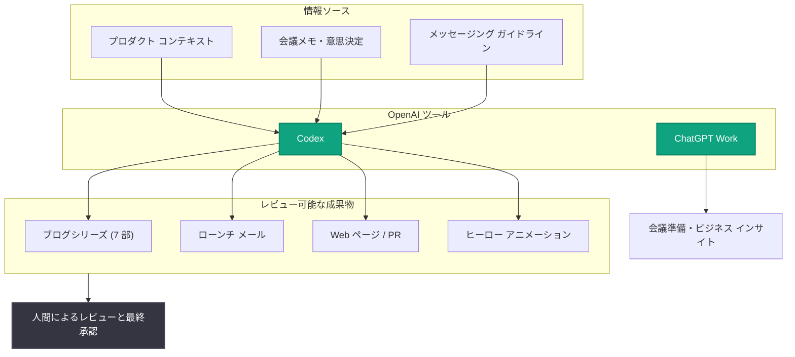

# Stampli、ChatGPT Work と Codex でローンチ作業時間を 68% 削減

## メタデータ

| 項目 | 内容 |
|------|------|
| 発表日 | 2026-08-20 |
| ソース | OpenAI News/Blog (顧客事例 / Story) |
| カテゴリ | 顧客事例 |
| 公式リンク | https://openai.com/index/stampli |

## 概要

インテリジェントな Procure-to-Pay (調達から支払いまで) プラットフォームを提供する Stampli が、ChatGPT Work と Codex を活用して新製品「Deep Finance™」のローンチ制作作業を大幅に効率化した事例が公開された。固定された締め切りとデザインリソースが他の優先事項に割り当てられている状況下で、同社のマーケティングチームは推定 243 時間分の制作作業を約 77 時間に圧縮した。これは約 166 時間 (68%) の削減、3.16 倍の制作スピード向上に相当する。

このローンチは単発の成功事例ではなく、Stampli のプロダクトマーケティングチームが日常的に実践しているパターン、すなわち ChatGPT Work と Codex を組み合わせて製品ナレッジを最新に保ち、ビジネスインサイトを引き出し、アイデアを迅速に市場へ届ける取り組みの最も明確な例として紹介されている。

## 主な内容

### Deep Finance ローンチの背景

Stampli は調達、買掛金 (AP)、ベンダー管理、支払い、従業員経費を接続するプラットフォームを提供している。新製品 Deep Finance™ は、プラットフォームを流れるデータを CFO や VP などのビジネスリーダー向けの経営支出インテリジェンスに変換する製品である。

そのローンチには、製品開発、ポジショニング、デザイン、コミュニケーション、イネーブルメント、オペレーションのすべてを固定スケジュールで並行して進める必要があった。しかも、デザインリソースと外部コントラクターはすでに他の優先事項にコミットしていた。

### 68% 削減の内訳: 243 時間から 77 時間へ

マーケティングチームは Codex を使い、製品コンテキスト、会議メモ、意思決定、メッセージングガイドラインを共有システムに接続した。Deep Finance の GTM (Go-to-Market) およびコンテンツ制作ワークフロー全体で、次の成果を達成した。

| 指標 | 数値 |
|------|------|
| Codex なしの場合の推定作業時間 | 約 243 時間 (モデル化されたアクティブロール時間) |
| Codex ありでの実作業時間 | 約 77 時間 |
| 削減時間 | 約 166 時間 (約 68%) |
| 制作スピード | 3.16 倍 |

制作された成果物には以下が含まれる。

- 7 部構成のブログシリーズ
- ローンチ告知メール
- ウェビナーとその補助資料 (デッキ)
- ソーシャルおよび広告クリエイティブ
- PR Newswire プレスリリース
- Deep Finance の Web ページ
- セールスイネーブルメント資料

さらに、ローンチのヒーローアニメーション制作でも Codex が探索、イテレーション、パッケージングを担い、仕上げ作業の約 90% を処理した。最終的にコントラクターがオープニングシーンと最終フォーマットを仕上げた。なお、顧客向けのすべての成果物については人間によるレビューと最終承認を維持している。

### プロトタイプからローンチまで 6 週間

Deep Finance は、初期プロトタイプのデモから公開 GTM ローンチおよび最初の製品出荷まで約 6 週間で到達した。プロダクトマーケティングディレクターの Melad Zahedi 氏によると、OpenAI ツールがなければこのプロセスは数か月から数四半期かかっていたという。CEO 兼共同創業者の Eyal Feldman 氏は「Codex は顧客のニーズ、チームの対応、実際の利用から得られる学びの間の距離を縮める。技術的な能力をすべてのチームに拡張することで、要件からデプロイ可能なソリューションまで 10 倍速く進める」と述べている。

### ローンチ専用ではない、日常業務のためのシステム

Deep Finance ローンチを支えたインフラは、プロダクトマーケティングチームが日々利用しているものと同一である。従来、製品資料を最新に保つには、プロダクトマネージャーへのインタビュー、Jira チケットの読み込み、GitHub のレビュー、会議メモの整理が必要で、その情報をヘルプセンター記事、プレゼンテーション、ワンページャーなどに変換する作業も発生していた。

Stampli はこのプロセスの多くを GPT を活用したシステムで自動化した。プロダクトシステムと会議メモから情報を収集し、資料を最新に保つ。同じ自動化により、会社の「信頼できる唯一の情報源 (source of truth)」に接続されたエージェントが Web サイトやソーシャルチャネル向けのコンテンツを生成する。Zahedi 氏によれば「小さなチームのアウトプットが 10 倍になり、以前は週に数本だったコンテンツが、週に数百本規模になった」という。

### 必要なときにインサイトを引き出す

ChatGPT Work は、重要な意思決定の場に関連するビジネスコンテキストを持ち込む手段としても機能している。Zahedi 氏は GPT を活用した自動化を「第二の脳」として使い、連続する会議のスケジュールの中で情報を整理している。

象徴的なエピソードとして、ある経営会議で HubSpot などのシステムに保存されたメトリクスに関する質問が出た際、従業員が会議中に Codex に依頼して関連データを取得・分析した例が挙げられている。「FP&A チームがレポートをまとめ、モデルを作り、確信の持てる回答を出すのに半日かかっていたことを、誰かが 20 秒のキー入力で実現した」と Zahedi 氏は語る。

### 戦略のための時間を生み出す

削減された時間により、プロダクトマーケティングはコンテキストの再構築に費やす時間を減らし、製品戦略や企業戦略についてリーダーに助言する時間を増やした。VP や C レベルのリーダーへの戦略アドバイスにもより深く関与するようになった。また、ChatGPT Work は思考のパートナーとしても使われており、従業員は知識を深め、アイデアをブレインストーミングし、ステークホルダーのペルソナを作成し、リーダーシップに提案する前に推奨案を検証している。

### 今後の展開

Deep Finance ローンチは、より接続され AI に支えられた製品サイクルの姿を Stampli に示した。現在、同社はこのアプローチをより多くの製品、ワークフロー、GTM プログラムに適用する方法を模索している。Zahedi 氏は「好奇心を持って『何ができるか』を問い、まず ChatGPT ですべて試してみることが、組織と自分自身の中に眠っていた潜在能力を解き放つ」と述べている。

## ワークフロー概要

## 企業・開発者への影響

- **小規模チームのアウトプット拡大**: 信頼できる唯一の情報源に接続されたエージェントにより、少人数チームのコンテンツ制作量を 10 倍に拡大できる可能性を示した
- **技術力の民主化**: Codex がマーケティングなど非エンジニアリング部門にも技術的な能力を拡張し、要件からソリューションまでの速度を高める事例となった
- **人間のレビューを前提とした運用**: 顧客向け成果物には人間のレビューと最終承認を残しており、AI 活用と品質管理を両立する現実的なガバナンスモデルを提示している
- **定量的な効果測定**: 「モデル化されたアクティブロール時間」で 243 時間から 77 時間 (68% 削減、3.16 倍高速化) という具体的な指標を示しており、AI 導入の ROI 測定の参考になる
- **意思決定の高速化**: FP&A チームが半日かけていたデータ分析を会議中の 20 秒で完了するなど、業務システム (HubSpot など) と連携したリアルタイムのインサイト取得が可能になる

## 関連リンク

- [Stampli cuts launch hours by 68% using ChatGPT Work (元記事)](https://openai.com/index/stampli)
- [OpenAI News](https://openai.com/news)
- [ChatGPT for Work](https://openai.com/chatgpt/enterprise/)
- [Codex](https://openai.com/codex/)

## まとめ

Stampli の事例は、ChatGPT Work と Codex を組み合わせることで、固定された締め切りとリソース制約の中でも製品ローンチの制作作業を 68% 削減 (243 時間 → 77 時間、3.16 倍高速化) できることを示した。プロトタイプから GTM ローンチまでを約 6 週間で完了し、従来の数か月から数四半期というリードタイムを大幅に短縮している。ローンチ専用の仕組みではなく日常業務と同じインフラを使っている点、そして人間によるレビューと最終承認を維持している点が、他社が参考にできる実践的なポイントである。
