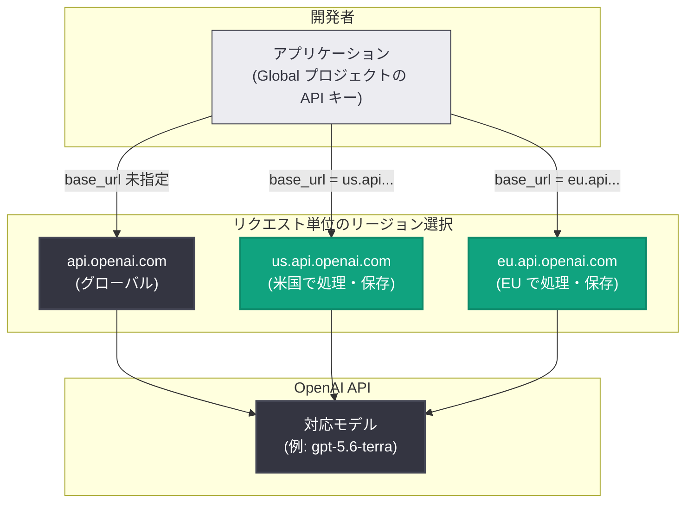

# API アップデート: リクエスト単位のリージョン処理選択と GPT-5.6 Sol の値下げ

## メタデータ

| 項目 | 内容 |
|------|------|
| 発表日 | 2026-08-21 |
| ソース | OpenAI API Changelog |
| カテゴリ | API 更新 / 価格改定 |
| 公式リンク | https://developers.openai.com/api/docs/changelog |

## 概要

2026 年 8 月 21 日、OpenAI API Changelog に 2 件の更新が追加された。1 件目は、**Global ジオグラフィのプロジェクト**の API キーで、プレフィックス付きドメイン (例: `us.api.openai.com`、`eu.api.openai.com`) を使うことにより、**リクエスト単位でリージョン処理 (regional processing) を選択できる**ようになった機能追加である。これまでのようにリージョン専用プロジェクトを分けて作成する必要がなく、単一のプロジェクトからリクエストごとに処理リージョンを切り替えられる。

2 件目は、**GPT-5.6 Sol の価格改定**である。入力トークンが $4/100 万トークン (20% 減)、出力トークンが $20/100 万トークン (33% 減) に値下げされた。このプロモーション価格は少なくとも 2026 年 11 月 21 日まで提供される。

## 主な内容

### 1. Global ジオグラフィでのリクエスト単位のリージョン処理選択 (Feature)

Changelog では "API customers can now select regional processing for an individual request by using a prefixed domain with an API key" と説明されている。Global ジオグラフィに設定されたプロジェクトの API キーを、リージョンプレフィックス付きドメインに対して使用することで、そのリクエストのみを指定リージョンで処理・保存できる。

ポイントは以下のとおり。

- **単一プロジェクトでの切り替え**: リージョンごとにプロジェクトや API キーを分ける必要がなく、`base_url` の変更だけでリクエスト単位にリージョンを選択できる
- **既存要件の継続適用**: "Existing eligibility, data retention control, endpoint, and model support requirements continue to apply." とあるとおり、利用資格、データ保持コントロール (ZDR / Modified Abuse Monitoring など)、エンドポイント、モデルの各対応要件は従来どおり適用される
- **エンドポイントとモデルの両方が対象リージョンの regional processing に対応している必要がある**

#### リージョン別ドメインプレフィックス

公式のデータコントロールガイドに記載されているリージョン別ドメインは以下のとおり (2026 年 8 月時点)。

| リージョン | ドメイン | Regional processing |
|-----------|---------|---------------------|
| グローバル (デフォルト) | `api.openai.com` | - |
| 米国 | `us.api.openai.com` | 対応 |
| 欧州 (EEA + スイス) | `eu.api.openai.com` | 対応 |
| UAE | `ae.api.openai.com` | 対応 (特定スナップショットのみ) |
| オーストラリア | `au.api.openai.com` | 非対応 (保存のみ) |
| カナダ | `ca.api.openai.com` | 非対応 |
| 日本 | `jp.api.openai.com` | 非対応 |
| インド | `in.api.openai.com` | 非対応 |
| シンガポール | `sg.api.openai.com` | 非対応 |
| 韓国 | `kr.api.openai.com` | 非対応 |
| 英国 | `gb.api.openai.com` | 非対応 |

リクエスト単位のリージョン選択は「処理 (processing)」の対応が前提のため、現時点で実質的に有効なのは米国・欧州・UAE (UAE は `gpt-5.6-luna` など特定スナップショットに限定) である。なお、`us.api.openai.com` と `eu.api.openai.com` 宛のリクエストは、Cloudflare Regional Services により TLS 終端も選択リージョン内で行われる。

### 2. GPT-5.6 Sol の価格改定 (Update)

GPT-5.6 Sol の API 価格が値下げされた。Changelog では "GPT-5.6 Sol's promotional pricing is available at least through November 21, 2026." と記載されており、プロモーション価格として少なくとも 2026 年 11 月 21 日まで適用される。

#### Before / After 比較

| 項目 | 改定前 | 改定後 | 値下げ幅 |
|------|--------|--------|---------|
| 入力トークン | $5 / 100 万トークン | **$4 / 100 万トークン** | 20% 減 |
| 出力トークン | $30 / 100 万トークン | **$20 / 100 万トークン** | 33% 減 |

(改定前の価格は Changelog に明記されていないが、値下げ率からの逆算による)

## 技術的な詳細

### コードサンプル

公式ガイドの例に沿った、単一クライアントでリクエストごとにリージョンを切り替える例を示す。API キーは Global ジオグラフィのプロジェクトのものを使用する。

```python
from openai import OpenAI

# Global ジオグラフィのプロジェクトの API キーを使用
client = OpenAI()

# 1. リージョン制約なし (グローバル、デフォルトの api.openai.com)
resp_global = client.responses.create(
    model="gpt-5.6-terra",
    input="Hello from anywhere!",
)

# 2. 米国で処理・保存
resp_us = client.with_options(
    base_url="https://us.api.openai.com/v1"
).responses.create(
    model="gpt-5.6-terra",
    input="Hello from the US region!",
)

# 3. EU で処理・保存
resp_eu = client.with_options(
    base_url="https://eu.api.openai.com/v1"
).responses.create(
    model="gpt-5.6-terra",
    input="Hello from the EU region!",
)
```

### アーキテクチャ



## 開発者への影響

- **データレジデンシー対応の簡素化**: 従来はリージョン処理を利用するためにリージョン専用プロジェクトを作成する必要があったが、Global ジオグラフィのプロジェクト 1 つで、リクエストごとに処理リージョンを選択できるようになった。ユーザーの所在地に応じて US / EU を動的に振り分けるマルチリージョンアプリの実装が容易になる
- **導入コストが低い**: SDK の `base_url` (Python なら `client.with_options(base_url=...)`) を切り替えるだけで利用でき、キー管理やプロジェクト構成の変更は不要
- **要件の事前確認が必要**: 利用資格・データ保持コントロール・エンドポイント・モデルの各対応要件は従来どおり適用されるため、使用するモデルとエンドポイントが対象リージョンの regional processing に対応しているかをガイドの対応表で確認する必要がある
- **GPT-5.6 Sol のコスト削減**: 入力 20% 減・出力 33% 減により、特に出力トークンの多いワークロード (長文生成、エージェント用途など) でコストメリットが大きい。既存利用者は変更なしで自動的に新価格が適用される
- **プロモーション価格の期限に留意**: 新価格は「少なくとも 2026 年 11 月 21 日まで」のプロモーション価格であり、それ以降の価格は保証されていない。長期のコスト見積もりでは変動の可能性を考慮したい

## 関連リンク

- [OpenAI API Changelog](https://developers.openai.com/api/docs/changelog)
- [データコントロールガイド (Select a processing region per request)](https://developers.openai.com/api/docs/guides/your-data#select-a-processing-region-per-request)
- [OpenAI API 料金](https://developers.openai.com/api/docs/pricing)

## まとめ

今回の更新は、コンプライアンスとコストの両面で開発者に恩恵をもたらす。リクエスト単位のリージョン処理選択により、Global ジオグラフィのプロジェクト 1 つで `us.api.openai.com` / `eu.api.openai.com` などのプレフィックス付きドメインを使い分け、データレジデンシー要件に柔軟に対応できるようになった。GPT-5.6 Sol は入力 $4 / 出力 $20 (100 万トークンあたり) へ値下げされ、少なくとも 2026 年 11 月 21 日までプロモーション価格が適用される。
