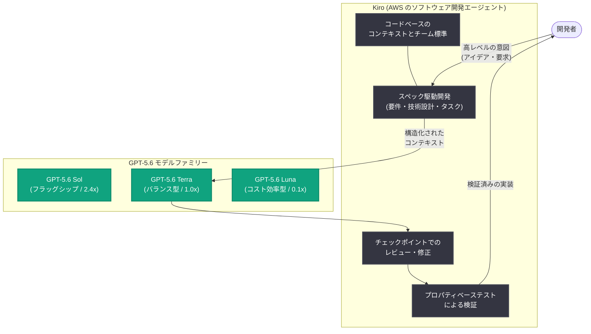

# GPT-5.6 が Kiro で利用可能に: 開発者向け価格性能比の向上

## メタデータ

| 項目 | 内容 |
|------|------|
| 発表日 | 2026-08-24 |
| ソース | OpenAI News |
| カテゴリ | 新機能 (パートナーシップ / 開発者ツール) |
| 公式リンク | https://openai.com/index/gpt-5-6-in-kiro |

## 概要

OpenAI の最新フラッグシップモデルファミリーである GPT-5.6 (Sol、Terra、Luna) が、AWS のソフトウェア開発エージェント「Kiro」で利用可能になった。Kiro は、AI ネイティブなコーディングにエンジニアリングの厳密さと品質をもたらす開発エージェントであり、チームがソフトウェアを計画・構築・レビュー・テストする開発ワークフロー全体で GPT-5.6 を活用できるようになる。

GPT-5.6 は、すべてのトークンからより有用な成果を引き出し、ドルあたりの性能が強化され、複雑なタスクに対してはオンデマンドで高い能力を発揮する。OpenAI と AWS の共同最適化により、Terminal-Bench 2.1 では GPT-5.6 Terra が Kiro 上でタスクを完了する際のコストを約 82% 削減できたと報告されており、開発者はより少ないイテレーションで高品質なコードを、より優れたトークンあたりの価値で得られる。

## 主な内容

### Kiro とは

Kiro は AWS が提供するソフトウェア開発エージェントで、高レベルの意図 (プロダクトのアイデアや要求) を、明確な要件・技術設計・実行可能なタスクへと変換する「スペック駆動開発 (spec-driven development)」を特徴とする。この構造化されたコンテキストにより、GPT-5.6 は以下を正確に理解した上で作業できる。

- チームが何を構築しようとしているか
- システムがどのように動作すべきか
- 最終的な実装が何を達成する必要があるか

### GPT-5.6 で開発者ができること

Kiro 上で GPT-5.6 を利用することで、開発者は以下が可能になる。

- プロダクトのアイデアや要求を、構造化された実装計画へ変換する
- 複雑でマルチステップなコーディングタスクを、より高い一貫性で完了する
- スペック駆動開発により、AI コーディングに構造をもたらす
- コードベース全体のコンテキストと、確立されたチーム標準に基づいて作業する
- 変更が適用される前に、重要なチェックポイントでモデルの成果物をレビュー・修正する
- プロパティベーステスト (property-based testing) により実装の正しさを検証する

### OpenAI と AWS による共同最適化: 約 82% のコスト削減

OpenAI と AWS は、Kiro の実行環境と OpenAI モデルの双方を最適化するために協業している。その成果として、Terminal-Bench 2.1 でのテストにおいて、GPT-5.6 Terra は Kiro 上で成功タスクを約 82% のコスト削減で完了した。

Kiro のスペック駆動アプローチは、明確な要件・技術設計・タスクコンテキストに最初からモデルをグラウンディングさせるため、モデルはより少ない手戻りで、より速く動作するソリューションに到達できる。開発者にとっては、完成する仕事が増え、無駄な労力が減り、コーディングセッションごとの価値が向上することを意味する。

### GPT-5.6 モデルファミリーの構成

Kiro では、性能とコストのバランスが異なる 3 つのモデルが提供される (Kiro 公式ブログより)。

| モデル | 位置づけ | クレジット倍率 | 特徴 |
|--------|---------|--------------|------|
| GPT-5.6 Sol | フラッグシップ | 2.4x | 長期のリファクタリングや複雑なターミナル作業など、最も難易度の高いタスク向け |
| GPT-5.6 Terra | バランス型 | 1.0x (当初 1.2x から引き下げ) | 日常的なエージェント作業向け。性能とコストのバランスに優れる |
| GPT-5.6 Luna | コスト効率型 | 0.1x (当初 0.6x から引き下げ) | 軽量タスク向け。大幅に低いコストで実用的な性能を発揮 |

3 モデルとも 272K のコンテキストウィンドウを持ち、Kiro の IDE・CLI・Web のすべてで利用できる。2026 年 7 月末には OpenAI による Terra および Luna の価格引き下げを受けて、Kiro のクレジット倍率も引き下げられており、価格性能比は継続的に改善されている。

### 提供条件

- **対象プラン**: Kiro Pro、Pro+、Pro Max、Power (実験的サポートとして段階的にロールアウト)
- **提供リージョン**: AWS US-East-1 (北バージニア) および AWS Europe (フランクフルト)。クロスリージョン推論に対応
- **注意事項**: GPT-5.6 は非表示の chain-of-thought 推論を使用するため、内部の推論ステップは表示されず、最終出力のみが表示される (想定どおりの挙動で品質への影響はない)

## アーキテクチャ

## 開発者への影響

- **大幅なコスト効率の改善**: Terminal-Bench 2.1 での約 82% のコスト削減が示すとおり、スペック駆動のコンテキストとモデルの共同最適化により、同じタスクをより少ないコストで完了できる
- **タスクに応じたモデル選択**: Sol / Terra / Luna の 3 階層により、難易度の高いリファクタリングから日常的な軽量タスクまで、コストと性能を最適化した使い分けが可能になる
- **AI コーディングの構造化**: 曖昧なプロンプトではなく、要件・設計・タスクという構造化されたスペックにモデルをグラウンディングさせるアプローチは、大規模チームでの AI 活用における品質担保のモデルケースとなる
- **検証プロセスの組み込み**: チェックポイントでのレビューとプロパティベーステストにより、AI が生成したコードの正しさを開発フローの中で担保できる
- **マルチベンダー化の進展**: AWS 製の開発エージェントに OpenAI モデルが搭載されたことは、開発ツールにおけるモデル選択肢の拡大を示している

## 関連リンク

- [OpenAI 公式記事: Advancing price-performance for developers with GPT-5.6 in Kiro](https://openai.com/index/gpt-5-6-in-kiro)
- [Kiro 公式ブログ: GPT-5.6 is now available in Kiro](https://kiro.dev/blog/gpt-5-6/)
- [Kiro 公式ブログ: GPT-5.6 update: lower credit multipliers for Terra and Luna](https://kiro.dev/blog/gpt-5-6-pricing/)
- [Kiro](https://kiro.dev)
- [OpenAI News](https://openai.com/news)

## まとめ

GPT-5.6 モデルファミリー (Sol、Terra、Luna) が AWS のソフトウェア開発エージェント Kiro で利用可能になった。Kiro のスペック駆動開発が提供する構造化されたコンテキストと、OpenAI・AWS 両社による環境最適化の組み合わせにより、Terminal-Bench 2.1 では約 82% のコスト削減が確認されている。3 階層のモデル構成とクレジット倍率の引き下げにより、開発者はタスクの難易度に応じてコストと性能を最適化でき、計画から実装・レビュー・テストまでのソフトウェア開発ライフサイクル全体で、より優れた価格性能比の AI 支援を受けられるようになった。
