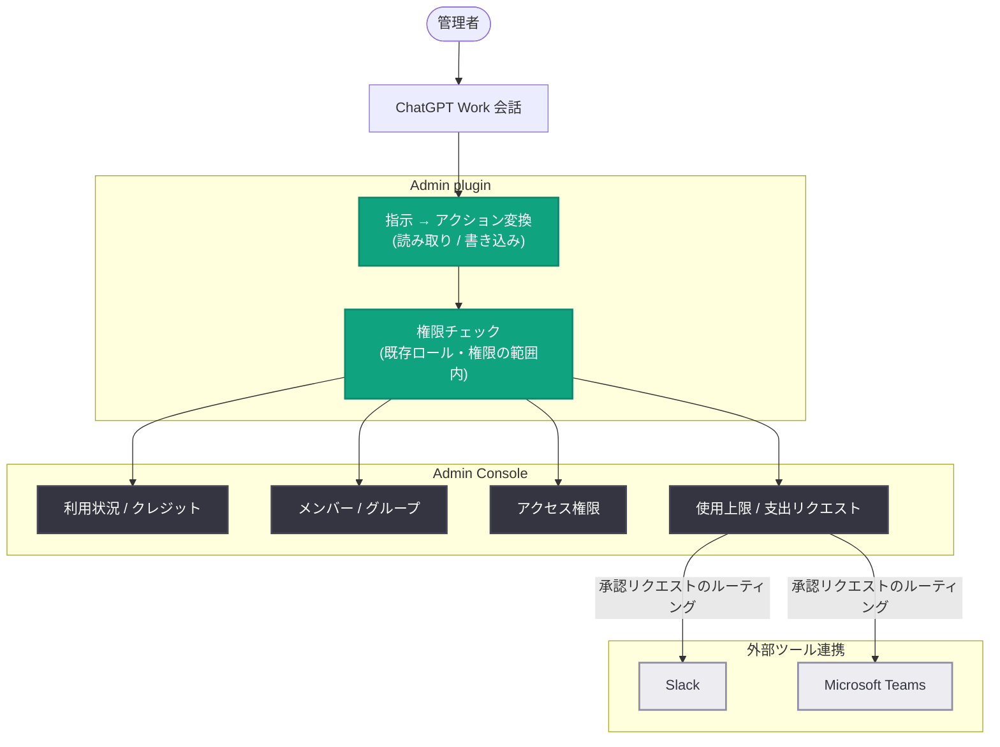

# ChatGPT Work と Codex 向け Admin plugin の発表 - 会話だけでワークスペース管理を完結

## メタデータ

| 項目 | 内容 |
|------|------|
| 発表日 | 2026-08-25 |
| ソース | OpenAI News |
| カテゴリ | AI Adoption (新機能) |
| 公式リンク | https://openai.com/index/introducing-admin-plugin |

## 概要

OpenAI は 2026 年 8 月 25 日、ChatGPT Work と Codex 向けの「Admin plugin」を発表した。管理者はワークスペースの利用状況の分析、メンバーと権限の管理、利用上限の調整、管理リクエストへの対応といった業務を、複雑なプロンプトを書いたりツール間を行き来したりすることなく、1 つの会話の中で完結できる。

このプラグインは Admin Console の機能を権限対応ツールとして会話型インターフェースに提供するもので、各ユーザーの既存のロールと権限の範囲内でのみ動作する。Slack や Microsoft Teams との連携による承認ワークフローの自動化にも対応しており、拡大する AI ワークスペースの管理負荷を軽減することを狙いとしている。

## 主な内容

### 拡大するワークスペースの管理を支援

組織内での ChatGPT Work や Codex の利用が拡大するにつれて、管理者の作業負荷 (メンバー管理、権限設定、利用上限の調整、リクエスト対応) も増加する。Admin plugin は、これらの業務を自然言語での指示によって処理できるようにする。主な機能は以下の 4 つ。

1. **利用状況の把握**: ChatGPT Work と Codex 全体のアクティビティやクレジット使用状況を確認し、クレジット上限に近づいているメンバーやグループを特定できる
2. **メンバー・グループ管理**: メンバーの追加・削除、グループの更新など、オンボーディング、オフボーディング、チーム変更に伴う定型作業を実行できる
3. **アクセス権限の管理**: 有効な権限の確認やアクセス問題の診断を行い、ロールやグループ単位で機能・モデルへのアクセスを制御できる
4. **使用上限と支出リクエストの管理**: メンバー、グループ、ワークスペースの上限を調整し、現在の使用状況と照らし合わせてリクエストを承認・却下できる

### 定型的な管理ワークフローの自動化

カスタムエンジニアリングを必要とせずに、定期チェックや大量のリクエスト処理を自動化できる。

- 保留中の使用リクエストを Slack や Microsoft Teams にルーティングし、承認者がそれらのツール内で直接承認・却下できる
- 事前定義された条件を満たす機能アクセスリクエストを自動承認し、例外のみをレビューに回せる
- 各ワークフローは変更適用時に確認通知を行うため、適用内容を追跡できる

### 既存の統制を維持したままスケール

Admin plugin はセキュリティとガバナンスを前提に設計されている。

- プラグインは各ユーザーの既存のロールと権限の範囲内で動作し、より広いアクセス権を付与しない
- 管理者の指示を適切な読み取り / 書き込みアクションにマッピングし、構造化された結果を返す
- ワークスペースのポリシーと承認要件を尊重する
- 各変更について、リクエスト内容、完了状況、変更点を確認できる
- 影響範囲の大きいアクションは適用前にレビューできる

### OpenAI 社内 IT チームでの活用事例

OpenAI のグローバル IT 責任者 Kunal Malik 氏のチームは、このプラグインを社内で活用している。

- Slack 上の ChatGPT Work エージェントが従業員の IT リクエストを処理し、発表時点でチケット量の約 45% を解決
- サポートチケットのデータを運用ダッシュボード化してバックログを解消。サポート量が約 2 倍になっても、ライブデータに基づく優先順位付けと需要予測を実現

## 技術的な詳細

Admin plugin は、Admin Console が提供する管理機能を「権限対応ツール (permission-aware tools)」として ChatGPT Work の会話に公開する仕組みである。管理者の自然言語による指示は、読み取り系 (利用状況の照会、権限の確認) または書き込み系 (メンバー追加、上限変更) のアクションにマッピングされ、実行結果は構造化された形式で返される。

**インストール手順:**

1. ChatGPT ワークスペース設定でプラグインを有効化する
2. ChatGPT Work (Web 版またはデスクトップアプリ) の Plugins ディレクトリからインストールする

なお、対象プランの詳細 (Team / Enterprise の区別)、提供スケジュール、追加費用の有無については記事内に明記されていない。

## アーキテクチャ

## 管理者・組織への影響

- **管理業務の効率化**: Admin Console の画面操作を会話に置き換えることで、メンバー管理や上限調整などの定型作業を短時間で処理できる
- **承認フローの自動化**: Slack / Microsoft Teams 連携と条件ベースの自動承認により、カスタム開発なしで承認ワークフローを構築できる
- **ガバナンスの維持**: 既存のロール・権限を超えるアクセスは付与されず、変更履歴の確認や適用前レビューも可能なため、統制を維持したまま導入できる
- **導入拡大の支えとなる実績**: OpenAI 社内では IT チケットの約 45% を自動解決しており、大規模組織での AI 管理業務の自動化事例として参考になる

## 関連リンク

- [Introducing the Admin plugin for ChatGPT Work and Codex (公式発表)](https://openai.com/index/introducing-admin-plugin)
- [OpenAI News](https://openai.com/news)
- [OpenAI ヘルプセンター](https://help.openai.com/)

## まとめ

Admin plugin は、ChatGPT Work と Codex のワークスペース管理を会話型インターフェースで完結させる管理者向けプラグインである。利用状況の分析、メンバー・権限管理、上限調整、リクエスト対応の 4 領域をカバーし、Slack / Microsoft Teams 連携による承認自動化にも対応する。既存のロールと権限の範囲内でのみ動作する設計により、ガバナンスを損なわずに管理業務をスケールできる点が特徴で、OpenAI 社内でも IT チケットの約 45% を自動解決する成果を上げている。
