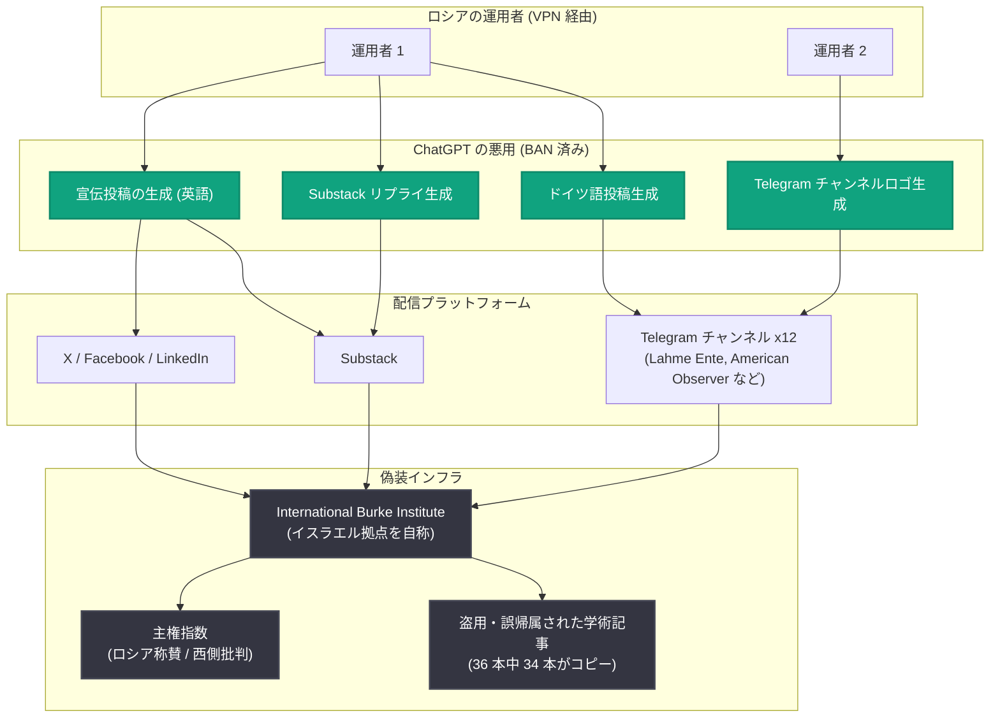

# ロシア発の新たな秘密影響工作を阻止 — 偽シンクタンク「International Burke Institute」を利用したキャンペーン

## メタデータ

| 項目 | 内容 |
|------|------|
| 発表日 | 2026-08-25 |
| ソース | OpenAI News |
| カテゴリ | Global Affairs (脅威インテリジェンス) |
| 公式リンク | https://openai.com/index/disrupting-malicious-uses-of-ai-influence-campaign-russia |

## 概要

OpenAI は、ロシアを発信源とする ChatGPT アカウント群を BAN し、新たな秘密影響工作 (covert influence operation) を阻止したと発表した。このキャンペーンは、イスラエル拠点を自称する偽の「専門家コミュニティ」である International Burke Institute (IBI) を宣伝するもので、ロシアを称賛し西側諸国を批判する独自の「主権指数 (sovereignty index)」を中核に据えていた。

AI 生成のソーシャルメディア投稿の調査から始まった今回の調査は、コピーされ誤って帰属された学術論文を掲載するウェブサイト、ロシア起源を隠蔽する工作など、はるかに大規模な影響工作の全容解明につながった。到達したオーディエンスは比較的小規模だったものの、その手の込んだ構造は、ウクライナ戦争開始以降に OpenAI が阻止してきた他のロシア関連影響工作とは一線を画すものであり、これほど精巧な手法を用いたロシア関連の影響工作を阻止したのは初めてだとしている。

## 主な内容

### 攻撃者 (Actor)

- **発信源**: ロシア国内から発信された可能性が非常に高い ChatGPT アカウント群。OpenAI はロシアからのモデルへのアクセスを許可していないため、運用者は VPN を使用してプラットフォームにアクセスしていた
- **手口**: ロシア語でプロンプトを入力し、主に英語のソーシャルメディアコメントを生成。Substack、Telegram、X、Facebook、LinkedIn に投稿された
- **偽装工作**: 運用者は ChatGPT に対し、自分たちがロシア人であることを示す言語的な手がかりを隠すよう指示していた
- **IBI ブランド**: 2025 年 2 月に登録されたウェブサイトと関連付けられ、イスラエル拠点を自称。サイト上の記事は OpenAI のモデルで生成されたものではなく、多くは実在の学術論文からのコピーで、時に誤った著者に帰属されていた。一部はスラブ語話者が起草して機械翻訳したとみられる (例: ドイツの「信号機連立 (Ampelkoalition)」を「the Svetofor coalition」と表記。「svetofor (светофор)」はロシア語などスラブ諸語で「信号機」を意味し、機械翻訳の痕跡と判断された)

### AI の利用実態 (AI activity)

- **宣伝投稿の生成**: ChatGPT の主な用途は、IBI ウェブサイトの記事を宣伝するソーシャルメディア投稿の生成。IBI の名前とロゴを掲げたアカウントのほか、IBI 記事の投稿を主な活動とする一般ユーザーを装った (非正規とみられる) アカウントからも投稿された
- **リプライの生成**: 実在の Substack ユーザーの投稿への返信も生成。これらの返信には IBI チャンネルのフォローを促す文言が含まれていた
- **ドイツ語プロパガンダ**: 運用者の 1 人は「Lahme Ente (レームダック)」という Telegram チャンネル向けにドイツ語投稿を生成。ウクライナ、EU、ドイツ政府を常態的に批判し、対ロシア関係の改善を主張する内容だった
- **チャンネル用ロゴの生成**: 別の運用者は、ドイツ、米国、フランス、ポーランド、トルコに焦点を当てた 12 の Telegram チャンネル (Lahme Ente を含む) のロゴを生成。米国メディアを装ったチャンネル「American Observer」のプロフィール画像も生成し、これらのチャンネルの活動についてロシア語での要約を繰り返し要求していた

### AI を使わない活動 (Non-AI activity)

- **偽の専門家リスト**: IBI ウェブサイトは 2026 年 7 月 17 日時点で、フランシス・フクヤマやノーム・チョムスキーといった著名人を含む幅広い世界的専門家を擁すると主張していた
- **記事の盗用**: 2025 年 9 月から 2026 年 5 月に公開され専門家に紐付けられた記事のサンプル 36 本を調査した結果、34 本がインターネット上の他所からコピーされたものだった
- **誤帰属の例**: 中国・パキスタン経済回廊に関する記事は Cambridge University Press の原典からコピーされたとみられるが、南アジア政治を専門とするノッティンガム大学教授に誤って帰属。移民ガバナンスに関する記事は Migration Policy Institute からコピーされたが、オーストラリアの食品科学教授に誤帰属されていた
- **「主権指数」レポート**: ロシアのウクライナ侵攻を批判する国々 (フランス、ドイツ、EU、米国など) を標的とした批判的・論争的なレポートを掲載。例として「マクロンの 10 年でフランスは金庫のように開けられ、切り売りされている」(フランス)、「ドイツの主権は雲散霧消した」(ドイツ) など
- **実在人物の関与の可能性**: イスラエルの少数の実在の個人が、記事投稿やカンファレンスで IBI を代表していた形跡もあるが、これらの個人と IBI、ロシアの運用者との関係は特定できていないとしている

### 影響評価 (Impact)

- **直接的な影響は限定的**: 典型的なソーシャルメディア投稿の閲覧数は低く、公式 IBI アカウントの購読者数も少なかった。Telegram チャンネルは各 1〜2 万人程度のフォロワーを獲得
- **Breakout Scale 評価**: Brookings の Breakout Scale (影響工作の影響度測定フレームワーク) では、**カテゴリー 3 の下限** (複数プラットフォームに展開し、本物のオーディエンスへの一部波及の兆候あり) と評価
- **本質的な脅威はインフラ**: この工作の重要性は到達オーディエンスよりも、構築されたインフラにある。ChatGPT で生成されたのは散発的な宣伝投稿にすぎないが、それらの投稿は、偽の専門家、転載された学術論文、独自のリスク指数を備えた一見信頼できそうな「機関」へと誘導するものだった

## 工作の構造

## 開発者・社会への影響

今回の発表は API や製品の変更ではなく、AI プラットフォームの安全性と情報空間の健全性に関わるものである。

- **AI は「権威の捏造」の補助ツールに**: 影響工作の実行者は、AI を単体の兵器としてではなく、権威の捏造、ナラティブの出所の隠蔽、時間をかけて拡大可能な資産の構築という、より広範な取り組みの補助ツールとして利用し得ることが示された
- **AI 利用が工作全体の露見につながる**: 一方で、ChatGPT の補助的な利用が手がかりとなり、より広範な工作全体が暴露され得ることも示された。AI 生成投稿の調査が、偽シンクタンクという工作の中核の解明につながった
- **プラットフォームの検出能力**: OpenAI は AGI が全人類に利益をもたらすというミッションの一環として、秘密影響工作を検出・調査・阻止・公開するツールを構築しており、地域制限 (ロシアからのアクセス禁止) と組み合わせた継続的な監視体制が機能した事例となった
- **情報の受け手への示唆**: 一見「シンクタンク」や「専門家コミュニティ」を名乗る組織であっても、記事の原典・著者の帰属・言語的な不自然さ (機械翻訳の痕跡など) を確認することの重要性が改めて浮き彫りになった

## 関連リンク

- [発表記事: Disrupting a new covert influence campaign from Russia](https://openai.com/index/disrupting-malicious-uses-of-ai-influence-campaign-russia)
- [脅威インテリジェンスレポート (2024 年 5 月)](https://cdn.openai.com/threat-intelligence-reports/threat-intel-report-may-2024.pdf)
- [Influence and cyber operations: an update (2024 年 10 月)](https://cdn.openai.com/threat-intelligence-reports/influence-and-cyber-operations-an-update_October-2024.pdf)
- [Disrupting malicious uses of AI (2025 年 6 月)](https://cdn.openai.com/threat-intelligence-reports/5f73af09-a3a3-4a55-992e-069237681620/disrupting-malicious-uses-of-ai-june-2025.pdf)
- [Brookings: The Breakout Scale](https://www.brookings.edu/articles/the-breakout-scale-measuring-the-impact-of-influence-operations/)
- [OpenAI News](https://openai.com/news)

## まとめ

OpenAI は、偽シンクタンク「International Burke Institute」を中心とするロシア発の新たな秘密影響工作を阻止し、関連する ChatGPT アカウント群を BAN した。この工作は、盗用した学術記事と独自の「主権指数」で権威を装い、ChatGPT で生成した多言語のソーシャルメディア投稿で西側批判・ロシア称賛のナラティブを拡散するという、これまで OpenAI が阻止してきたロシア関連工作の中で最も手の込んだものだった。直接的な影響は Breakout Scale でカテゴリー 3 下限と限定的だったが、AI を補助ツールとして「信頼できそうな機関」を築き上げる新しい手口と、AI の利用痕跡が工作全体の露見につながるという両面を示した重要な事例である。
