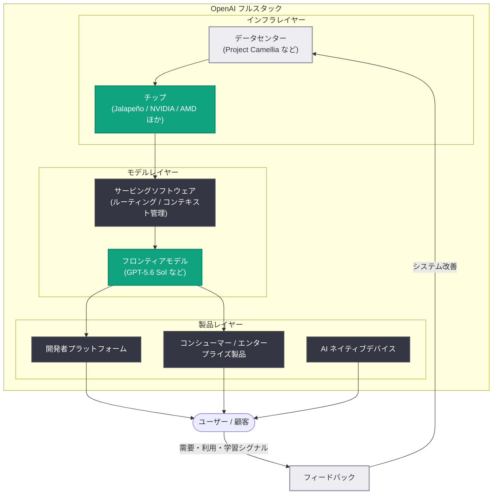

# 潤沢なインテリジェンスを支えるフルスタック : OpenAI CFO が語るコンピュート戦略

## メタデータ

| 項目 | 内容 |
|------|------|
| 発表日 | 2026-08-25 |
| ソース | OpenAI News |
| カテゴリ | Company (企業戦略) |
| 著者 | Sarah Friar (OpenAI CFO) |
| 公式リンク | https://openai.com/index/the-full-stack-behind-abundant-intelligence |

## 概要

OpenAI の CFO である Sarah Friar 氏が、同社のコンピュート戦略を「フルスタックの統合システム」として解説する記事を公開した。データセンターとチップ、フロンティアモデル、開発者プラットフォーム、コンシューマー / エンタープライズ製品、AI ネイティブデバイスまでを 1 つの統合システムと捉え、各レイヤーの改善が相互に強化し合うことで、より有用なインテリジェンスをより大規模かつ低コストで提供できると論じている。

同日には、OpenAI 初の自社製推論チップ「Jalapeño」の初の実測パフォーマンス結果も公開された。公開ベンチマーク InferenceX (GPT-OSS 120B 使用) において、Jalapeño は比較対象の商用システムを上回るキロワットあたりピークスループットと、より低いトークンレイテンシを達成した。ソフトウェア、ハードウェア、モデル、製品の進歩が複利的に積み重なる「compounding advantage (複利的優位性)」が本記事の中心テーマである。

## 主な内容

### 統合システムとしてのコンピュート戦略

Friar 氏は、AI の進歩はシステム全体が同時に改善されるときに最も速く複利的に進むと述べる。具体的には以下のフィードバックループが機能する。

- より優れたソフトウェアがハードウェアの生産性を高める
- 自社ワークロード向けに設計されたハードウェアが速度と効率を改善する
- より高性能なモデルがより良い製品を生み、需要・利用・学習を増やす
- それらのシグナルがシステムに還流し、さらなる改善につながる

### 自社製推論チップ「Jalapeño」の初の実測結果

OpenAI 初のカスタム推論チップ Jalapeño について、公開ベンチマークでの実測結果が発表された。

- **ベンチマーク**: InferenceX (GPT-OSS 120B を使用した公開ベンチマーク)
- **結果**: 比較対象の商用システムより高いキロワットあたりピークスループットと低いトークンレイテンシを実現
- **汎用性**: DeepSeek R1 や Kimi K2 でも強い性能を示し、性能向上がモデルファミリーを超えて有効であることを実証
- **TBT**: 従来最速の TBT (Time Between Tokens) に対してもリードを拡大

Jalapeño の意義は、モデル、サービングソフトウェア、チップ、メモリ、ネットワークを一体で開発することで、スループット、レイテンシ、エネルギー効率、コストを 1 つのシステムとして改善できる点にある。他社パートナーのアクセラレータと並ぶ「信頼できるファーストパーティの選択肢」となり、各ワークロードを最適な経済性で最強のシステムに割り当てる能力を拡大する。次世代チップの開発もすでに進行中である。

### Build for breadth, own for leverage (幅広く構築し、レバレッジのために所有する)

ワークロードごとに要件は異なる。フロンティアモデルの学習、大量の推論、常時稼働エージェントは、チップ、ソフトウェア、ネットワーク、電力、レイテンシに対して異なる要求を持つ。OpenAI の目標は、能力・速度・信頼性・効率・コストの最適な組み合わせを常に追求する「パレートフロンティア」に留まり続けることである。

**コンピュートポートフォリオ**: Microsoft のコンピュートと NVIDIA のチップが OpenAI の成長の基盤であり、現在のポートフォリオには AWS、AMD、Broadcom、Cerebras、CoreWeave、Oracle、SB Energy、SoftBank が含まれる。各社はクラウドインフラ、アクセラレーテッドコンピューティング、低レイテンシ推論、データセンター開発、エネルギー供給といった異なる強みを持つ。

**ポートフォリオ管理の方針**は次のとおり。

- 能力が最重要の場面ではプレミアムなシステムを使い、規模とコストが重要な場面では効率を最適化する
- プロバイダー、ハードウェア、デプロイモデル間で信頼できる選択肢を維持し、ドルあたり性能が最も高い先へ需要を振り向ける
- 市場環境の変化に応じて価格規律を維持し、より強い技術が登場すればフロンティアとともに移行する
- エコシステムが速度を上げる場面ではパートナーと組み、共同設計が大きな優位を生む場面では自社構築する

**データセンター**: ジョージア州の Project Camellia は、顧客ワークロードに合わせた施設設計に加え、雇用創出、地元企業の支援、インフラ / エネルギーコストの負担、閉ループシステムによる水資源の節約、年次の独立公開監査といった地域へのコミットメントを示す事例である。

### 効率を経済価値へ転換する

このシステムの価値は「コンピュート 1 単位あたりに生み出される有用なインテリジェンスの量」で測られる。

- より良いモデルは、より少ない試行で正解に到達する
- スマートなルーティングとコンテキスト管理が無駄な処理を減らす
- 最適化されたソフトウェアと専用ハードウェアが速度とエネルギー効率を高める

具体例として、Artificial Analysis Coding Agent Index において、GPT-5.6 Sol (max reasoning) は他のリーディングモデルより **54% 少ない出力トークン**で過去最高スコアを達成した。顧客にとってこれは、より速い結果、より信頼できる製品、リトライの減少、より長いワークフローを完遂できるエージェント、成功する作業あたりの総コスト低減を意味する。

さらに Friar 氏は「ジェボンズのパラドックス」に言及する。効率の向上はより多くの用途を経済的に成立させ、消費を拡大し、新たな経済活動 (完了する仕事の増加、より良い意思決定、製品投入の増加、収益の増加) を生み出す。全顧客へのカスタマイズ分析、全契約書のレビュー、リアルタイムの財務シナリオ実行などが経済的に実用となる。

### 複利的優位性 (A compounding advantage)

より生産的なコンピュートと、より競争的なサプライ基盤により、OpenAI はより多くの顧客に低コストでサービスを提供し、効率向上分をユーザーに還元できる。成長は研究、インフラ、安全性への継続投資の原資となる。「より良い技術がより良い経済性を生み、より良い経済性が次の進歩に資金を供給し、あらゆる改善がシステム全体を強くする」というのが OpenAI の複利的優位性である。

## アーキテクチャ

OpenAI のフルスタック戦略における各レイヤーとフィードバックループを図示する。

### 複利ループの構造

## 開発者への影響

本記事は企業戦略の解説であり直接的な API 変更はないが、開発者にとって以下の示唆がある。

- **推論コストの継続的な低下**: Jalapeño などの自社シリコンとマルチベンダー戦略により、効率向上分が API 価格やサービス品質としてユーザーに還元される方針が明示された
- **トークン効率の重視**: GPT-5.6 Sol が 54% 少ない出力トークンで最高スコアを達成した例のとおり、「有用なインテリジェンス / ドル」が最適化指標となっており、エージェントの長いワークフローやリトライ削減に直結する
- **供給の安定性**: Microsoft、NVIDIA に加え AWS、AMD、Broadcom、Cerebras、CoreWeave、Oracle などへ供給基盤が多様化しており、ワークロードに応じた最適配置によりキャパシティと価格規律の維持が期待できる
- **オープンモデルとの互換性**: Jalapeño のベンチマークに GPT-OSS 120B、DeepSeek R1、Kimi K2 が使われており、性能向上が特定モデルに限定されないことが示された

## 関連リンク

- [The full stack behind abundant intelligence (原文)](https://openai.com/index/the-full-stack-behind-abundant-intelligence)
- [Jalapeño の初の実測結果 (同日公開の関連記事)](https://openai.com/index/jalapeno-first-results)
- [OpenAI News](https://openai.com/news)
- [OpenAI 公式ドキュメント](https://platform.openai.com/docs)

## まとめ

- OpenAI CFO の Sarah Friar 氏が、チップからデバイスまでを 1 つの統合システムとして改善する「フルスタック」コンピュート戦略を解説した
- OpenAI 初の自社製推論チップ Jalapeño が、公開ベンチマーク InferenceX でキロワットあたりスループットとトークンレイテンシで商用システムを上回る初の実測結果を示した
- Microsoft / NVIDIA を基盤に AWS、AMD、Broadcom、Cerebras、CoreWeave、Oracle、SB Energy、SoftBank を含む多様なポートフォリオで「パレートフロンティア」上の最適配置を追求する
- GPT-5.6 Sol は 54% 少ない出力トークンで Artificial Analysis Coding Agent Index の最高スコアを達成し、「有用なインテリジェンス / ドル」の改善を示した
- 効率向上が用途拡大を生む「ジェボンズのパラドックス」により、技術 → 経済性 → 再投資の複利的優位性が OpenAI の成長エンジンであると位置づけた
