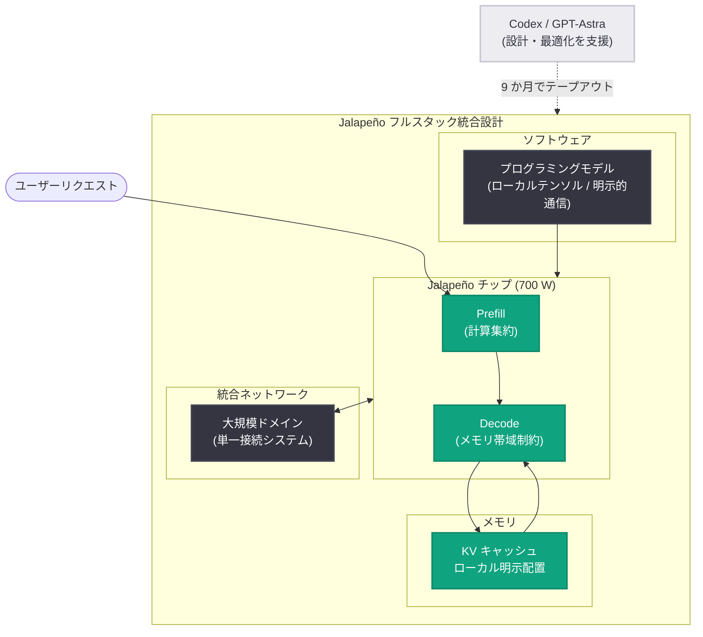

# Jalapeño 初の実測結果: AI 推論で業界最高水準の速度と電力効率を実証

## メタデータ

| 項目 | 内容 |
|------|------|
| 発表日 | 2026-08-25 |
| ソース | OpenAI News |
| カテゴリ | Engineering (カスタムチップ / 推論インフラ) |
| 公式リンク | https://openai.com/index/jalapeno-first-results |

## 概要

OpenAI は、自社開発のカスタム推論チップ「Jalapeño」の初の実測結果を公開した。SemiAnalysis が提供する公開ベンチマーク「InferenceX」を用いた測定で、GPT-OSS 120B、DeepSeek R1 670B、Kimi K2.5 1T の 3 つのオープンウェイトモデルにおいて、NVIDIA GB200/GB300 システムと比較してワット当たり性能で 1.5〜1.9 倍、エンドツーエンドレイテンシで 1.7〜3.6 倍の低減を達成し、高スループットと低レイテンシを単一アーキテクチャで両立できることを示した。

注目すべきは開発スピードで、AI (Codex および GPT-Astra) の支援により初期設計からテープアウトまでを 9 か月で完了した点である。Jalapeño は年末までに OpenAI のコンピュートインフラへの展開が開始される予定で、Gen 2 の開発も本格化している。

## 主な内容

### フルスタック統合設計 (co-design) のアプローチ

Jalapeño は単体のチップではなく、チップ・メモリ・ネットワーク・ソフトウェア・ラック規模システムを一体で設計したフルスタックシステムである。設計上の特徴は以下のとおり。

- **推論フェーズへの最適化**: 言語モデル推論は、計算集約型の prefill (プロンプト処理) とメモリ帯域幅に制約される decode (トークン生成) という性質の異なる 2 つのフェーズで構成される。Jalapeño は両フェーズに優れ、そのバランスの変化にも適応するよう設計されている
- **KV キャッシュのローカル明示配置**: 応答生成中の KV キャッシュを含むモデル状態を明示的に配置してローカルに保持し、データ移動と通信遅延を最小化する
- **大規模ネットワークドメイン**: ネットワークがアーキテクチャに統合されており、ワークロード全体を単一の接続システム内に収めることができる
- **AI と人間の双方が扱いやすいプログラミングモデル**: ローカルテンソル、明示的通信、予測可能な同期という構造により、人間だけでなく AI によるプログラミングの対象として設計されている

### ベンチマーク結果 (InferenceX)

測定は SemiAnalysis の公開ベンチマーク InferenceX (入力約 8,000 / 出力約 1,000 トークン) で実施され、電力は各アクセラレータの公称チップ電力定格 (package TDP) で正規化されている。Jalapeño の定格は 700 W (テスト時の実測持続電力は 550 W 以下) で、比較対象の GB200 は 1,200 W、GB300 は 1,400 W である。

#### ピーク電力効率 (スループット / 電力)

| モデル | Jalapeño (700 W) | 比較対象 | 改善率 |
|--------|------------------|----------|--------|
| GPT-OSS 120B | 85,448 mixed tok/s/kW | 44,960 (GB200、1,200 W) | 約 1.9 倍 |
| DeepSeek R1 670B | 19,641 mixed tok/s/kW | 11,781 (GB300、1,400 W) | 約 1.7 倍 |
| Kimi K2.5 1T | 18,195 mixed tok/s/kW | 11,862 (GB300、1,400 W) | 約 1.5 倍 |

#### エンドツーエンドレイテンシ

| モデル | Jalapeño | 比較対象 | 低減率 |
|--------|----------|----------|--------|
| GPT-OSS 120B | 1.03 秒 | 1.80 秒 (GB200) | 約 1.7 倍 |
| DeepSeek R1 670B | 1.65 秒 | 5.99 秒 (GB300) | 約 3.6 倍 |
| Kimi K2.5 1T | 1.56 秒 | 5.31 秒 (GB300) | 約 3.4 倍 |

#### 最小 TBT (トークン生成間隔) と対話性能

TBT (time between tokens) は decode 時の 1 トークン当たりの生成間隔で、値が小さいほど対話的な応答が速い。

| モデル | Jalapeño 最小 TBT | 比較対象 | ユーザー当たり速度 | 改善率 |
|--------|-------------------|----------|--------------------|--------|
| GPT-OSS 120B | 0.69 ms | 1.87 ms | 1,459 vs 535 tok/s/user | 約 2.7 倍 |
| DeepSeek R1 670B | 1.43 ms | 5.90 ms | 700 vs 169 tok/s/user | 約 4.1 倍 |
| Kimi K2.5 1T | 1.44 ms | 5.48 ms | 694 vs 182 tok/s/user | 約 3.8 倍 |

さらに、従来システムの最良 TBT と同じ動作点で比較すると、スループットの差は劇的に拡大する。

| モデル | 動作点 (従来最良 TBT) | Jalapeño | 比較対象 | 改善率 |
|--------|----------------------|----------|----------|--------|
| GPT-OSS 120B | 535.28 tok/s/user | 22,935 mixed tok/s/kW | 427 | 約 53.7 倍 |
| DeepSeek R1 670B | 169.41 tok/s/user | 12,258 mixed tok/s/kW | 118 | 約 104.3 倍 |
| Kimi K2.5 1T | 182.46 tok/s/user | 6,744 mixed tok/s/kW | 120 | 約 56.1 倍 |

OpenAI によると、社内テストでは自社のフロンティアモデルにおいてこれらの優位性がさらに拡大するという。

### AI がチップを作り、チップが AI を速くする

Jalapeño の開発自体に AI が深く関与している点も大きな特徴である。

- 旧世代のモデルが設計とブリングアップ (立ち上げ) を支援し、最新モデルが最適化とプログラミングを加速した
- 初期設計からテープアウトまでの期間は 9 か月と、業界水準に比べて極めて短い
- Codex と GPT-Astra を用いて、当初計画になかった 3 つのオープンウェイトモデルをわずか 2 か月で高性能に動作させた
- GPT-OSS の一部の attention ブロックと MoE ブロックでは、AI が生成した実装が人間の専門家による実装よりも 1.5〜1.8 倍高速だった

## アーキテクチャ

## 開発者への影響

- **推論コストの低下余地**: ワット当たり性能 1.5〜1.9 倍の改善は、データセンターの電力制約が課題となる中で推論コストの構造的な低下につながる可能性がある
- **高インタラクティブ用途の拡大**: 最小 TBT が 2.7〜4.1 倍改善されることで、音声エージェントやリアルタイムコーディング支援など、低レイテンシが必須のアプリケーションの実現性が高まる
- **NVIDIA との併用継続**: OpenAI は NVIDIA などパートナーのアクセラレータも訓練・推論の両方で引き続き広範に展開すると明言しており、Jalapeño は置き換えではなく補完の位置づけである
- **AI によるハードウェア開発の加速**: 設計からテープアウトまで 9 か月という開発サイクルは、AI 支援によるチップ開発の新しい水準を示しており、ハードウェア進化のペースそのものが速まる可能性がある

## 今後の計画

- 年末までに OpenAI のコンピュートインフラへの展開を開始
- 展開に向けて、量産品質の検証、ソフトウェアの成熟、スケール運用の準備、追加モデルでの性能検証を継続中
- Gen 2 は開発が本格化しており、Gen 3 も構想段階にあるという複数世代ロードマップを推進

## 関連リンク

- [Jalapeño's first results (OpenAI 公式)](https://openai.com/index/jalapeno-first-results)
- [OpenAI News](https://openai.com/news)
- [SemiAnalysis](https://semianalysis.com/) (InferenceX ベンチマーク提供元)

## まとめ

Jalapeño の初の実測結果は、OpenAI が推論ワークロードに特化したフルスタック統合設計により、高スループットと低レイテンシのトレードオフを大きく改善できることを示した。InferenceX ベンチマークでは NVIDIA GB200/GB300 比でワット当たり性能 1.5〜1.9 倍、レイテンシ 1.7〜3.6 倍低減、高インタラクティブな動作点では最大 100 倍超のスループット差を記録した。AI 支援による 9 か月でのテープアウトと Gen 2/Gen 3 のロードマップは、モデルとハードウェアが相互に加速し合う新しい開発サイクルの始まりを示している。
