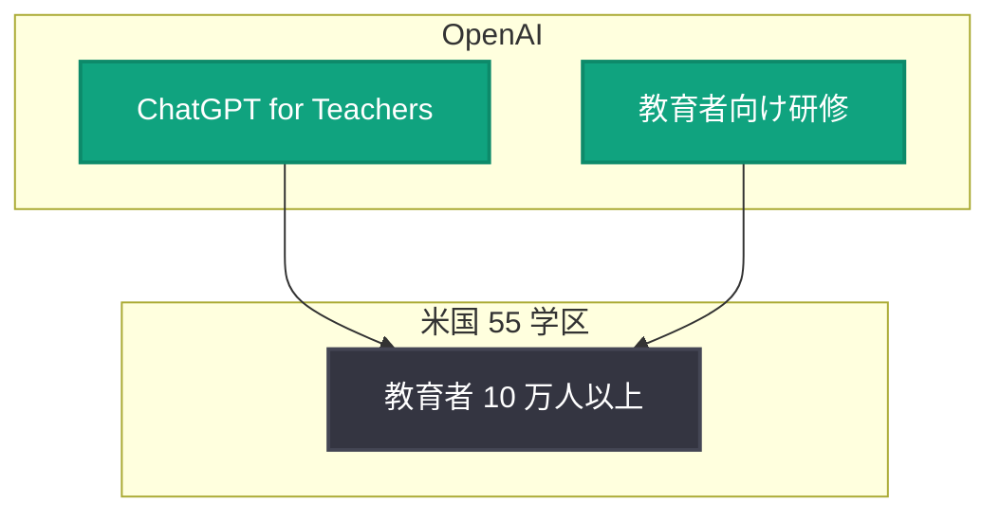

# ChatGPT for Teachers、米国のより多くの学区へ拡大

## メタデータ

| 項目 | 内容 |
|------|------|
| 発表日 | 2026-08-26 |
| ソース | OpenAI News |
| カテゴリ | 教育 / 製品展開 |
| 公式リンク | https://openai.com/index/bringing-chatgpt-for-teachers-to-more-us-school-districts |

> **注記**: 本レポートは公式発表の概要情報 (RSS フィード) に基づいて作成しています。詳細ページの取得ができなかったため (HTTP 403)、確認できた情報のみを記載しています。

## 概要

OpenAI は 2026 年 8 月 26 日、教育者向けサービス「ChatGPT for Teachers」を米国の 55 学区に拡大すると発表した。この拡大により、10 万人以上の教育者に AI ツールと研修が提供される。

本発表は、OpenAI が教育分野への AI 導入を組織単位 (学区単位) で推進していることを示すものであり、個々の教師によるツール利用にとどまらず、研修を含めた体系的な導入支援を行う点が特徴である。

## 主な内容

### 対象規模

公式発表の概要によると、今回の拡大の規模は以下の通り。

- **対象学区**: 米国の 55 学区
- **対象教育者**: 10 万人以上
- **提供内容**: AI ツール (ChatGPT for Teachers) および研修

### ChatGPT for Teachers とは

ChatGPT for Teachers は、OpenAI が教育者向けに提供する ChatGPT のサービスである。今回の発表では、ツールの提供に加えて教育者向けの研修 (トレーニング) がセットで提供されることが示されている。

なお、今回の拡大における具体的な学区名、提供機能の詳細、料金体系などは、本レポート作成時点の取得情報からは確認できなかった。詳細は公式ページを参照されたい。

## 展開の構図

## 影響

### 教育者への影響

- 55 学区に所属する 10 万人以上の教育者が、ChatGPT for Teachers を利用できるようになる
- ツール提供と併せて研修が実施されるため、AI 活用スキルを体系的に習得する機会が得られる
- 学区単位での導入により、個人契約ではなく組織的なサポートのもとで AI を利用できる

### 開発者への影響

- 教育分野における AI 導入が学区単位で進むことで、教育向け AI アプリケーションやインテグレーションの需要拡大が見込まれる
- OpenAI が特定業種 (教育) 向けの専用サービスを拡大していることは、業種特化型の製品展開戦略の一例として参考になる

## 関連リンク

- [公式発表: Bringing ChatGPT for Teachers to more U.S. school districts](https://openai.com/index/bringing-chatgpt-for-teachers-to-more-us-school-districts)
- [OpenAI News](https://openai.com/news)

## まとめ

OpenAI は ChatGPT for Teachers を米国の 55 学区に拡大し、10 万人以上の教育者に AI ツールと研修を提供する。ツール提供と研修を組み合わせた学区単位の展開であり、教育分野への組織的な AI 導入を推進する動きといえる。具体的な学区名や機能詳細は今回の取得情報からは確認できなかったため、公式ページでの確認を推奨する。
