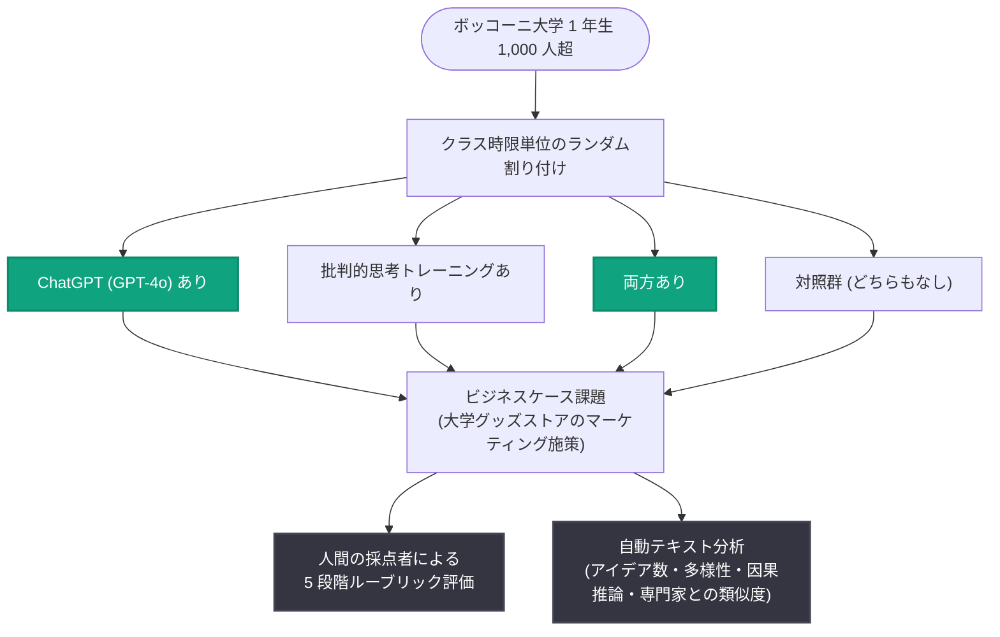

# Better answers, broader thinking: ChatGPT と批判的思考トレーニングが学生にもたらすもの

## メタデータ

| 項目 | 内容 |
|------|------|
| 発表日 | 2026-08-27 |
| ソース | OpenAI Research |
| カテゴリ | 研究成果 |
| 公式リンク | https://openai.com/index/what-students-gain-from-chatgpt-critical-thinking-training |

## 概要

OpenAI Economic Research とボッコーニ大学 (Bocconi University) の研究者が、1,000 人超の大学 1 年生を対象に、ChatGPT へのアクセスと批判的思考トレーニングが実際の大学課題の成果に与える影響を検証したランダム化比較研究を発表した。学生は「ChatGPT あり」「批判的思考トレーニングあり」「両方あり」「どちらもなし (対照群)」の 4 群にランダムに割り付けられ、実践的なビジネスケース課題に取り組んだ。

結果は明快で相補的だった。ChatGPT を使った学生は 5 段階評価でほぼ 1 点分高いスコアを獲得し、回答の質が向上した。一方、批判的思考トレーニングを受けた学生は、より幅広く独自性の高いアイデアを生み出した。記事の要点は「AI は回答をより良くし、批判的思考トレーニングはアイデアをより広くする (AI helped students make their answers better. Critical-thinking training helped make their ideas broader.)」であり、AI 利用と自力思考は二者択一ではなく補完関係にあることを示している。

## 主な内容

### 研究デザイン (ランダム化比較試験)

- **参加者**: ボッコーニ大学の 1 年生、1,000 人超
- **課題**: 大学のグッズストアのマーケティング施策を提案する実践的なビジネスケース
- **割り付け**: クラスの時限単位で以下の 4 群にランダムに配置
  1. ChatGPT (GPT-4o) へのアクセスあり
  2. 批判的思考 (因果推論) トレーニングあり
  3. 両方あり
  4. どちらもなし (対照群)
- **評価方法**:
  - 訓練を受けた人間の採点者による 5 段階ルーブリック評価
  - 自動テキスト分析による、アイデアの数と多様性、因果推論の兆候、専門家 3 名の提案との類似度の測定

ランダム化デザインにより、AI アクセス・トレーニング・その組み合わせの効果を分離して分析できた点が本研究の貢献である。

### 批判的思考トレーニングの内容

トレーニングは因果推論 (原因と結果を結びつけ、ある解決策がなぜ機能する / しないかを説明する思考) を扱うもので、AI とは無関係の内容だった。ゲーム、例示、質問、フィードバックを含む演習形式で実施された。

### 主要な結果

**ChatGPT アクセス群:**

- 5 段階ルーブリック評価でほぼ 1 点分高いスコアを獲得
- アイデア数が多く、論理が明確で、専門家の回答に近い内容
- 学生は課題を丸投げしておらず、質問の設計、回答の評価、採用内容の選択を自ら行っていた

**批判的思考トレーニング群:**

- アイデアが機能する条件・失敗する条件をより明確に説明
- ルーブリックスコア自体は向上しなかった (ルーブリックが「認知度向上」「利用促進」という標準的目標のみを測定していたため)
- テキスト分析では、より幅広く、他の学生と重複しない独自性の高いアイデアを産出

**併用群 (ChatGPT + トレーニング):**

- 両方の効果を示し、最も広範な指標で改善
- アイデアの多様性はトレーニングのみの群と同等
- ルーブリックスコアとアイデア数は ChatGPT のみの群と同等
- 論理的一貫性が強く、説明の探索や前提を疑う姿勢の証拠がより多く見られた

### 結果の比較表

| 指標 | ChatGPT のみ | トレーニングのみ | 併用 |
|------|-------------|----------------|------|
| ルーブリックスコア | 約 +1 点 (5 段階) | 変化なし | ChatGPT 群と同等 |
| アイデアの数 | 増加 | - | ChatGPT 群と同等 |
| アイデアの独自性・多様性 | - | 高い | トレーニング群と同等 |
| 論理的一貫性 | 明確 | 条件の説明が明確 | 最も強い |

## 実験構成

## 独創性 (Originality) に関する知見

本研究の重要な発見は、AI は回答を洗練させるが、独創性を高めるのは批判的思考トレーニングだったという点である。

- 従来型のルーブリックは、構造化された明快な回答を高く評価する一方で、他の誰も思いつかなかった独自のアイデアを見落とす可能性がある
- AI によって洗練された成果物が容易に作れる時代には、最終成果物だけを見ても学生の理解度は測りにくい

## 教育への影響

- **AI と自力思考は補完的**: 「AI を使うか、自分で考えるか」の二者択一ではなく、併用群が最も広範な指標で改善を示した
- **評価方法の見直し**: 学校側は、独創性、推論、多様なアプローチの検討を評価する課題設計・評価方法への転換が必要
- **AI 時代の学習設計**: ChatGPT へのアクセスは成果物の質を高めるが、思考の幅を広げるには批判的思考の指導が不可欠であり、教育カリキュラムに両者を組み込む意義を示す証拠となる
- **学生の主体性**: ChatGPT 利用群の学生は課題を丸投げせず、質問の設計や回答の取捨選択を自ら行っており、AI が思考を代替するのではなく支援するツールとして機能していた

## 関連リンク

- [Better answers, broader thinking (OpenAI 公式)](https://openai.com/index/what-students-gain-from-chatgpt-critical-thinking-training)
- [OpenAI Research](https://openai.com/research)
- [OpenAI News](https://openai.com/news)

## まとめ

本研究は、1,000 人超の学生を対象としたランダム化比較試験により、ChatGPT アクセスと批判的思考トレーニングの効果を分離して検証した。ChatGPT は回答の質を 5 段階評価でほぼ 1 点分向上させ、批判的思考トレーニングはアイデアの独自性と多様性を高めた。両者を併用した学生が最も広範な指標で改善を示したことから、AI 利用と批判的思考の育成は対立するものではなく補完的であることが実証された。AI 時代の教育においては、最終成果物の完成度だけでなく、独創性や推論プロセスを評価する仕組みへの転換が求められる。

なお、具体的な効果量 (標準化された値)、統計的有意性、各群の正確な人数、研究者の個人名は記事本文には記載されていない。
