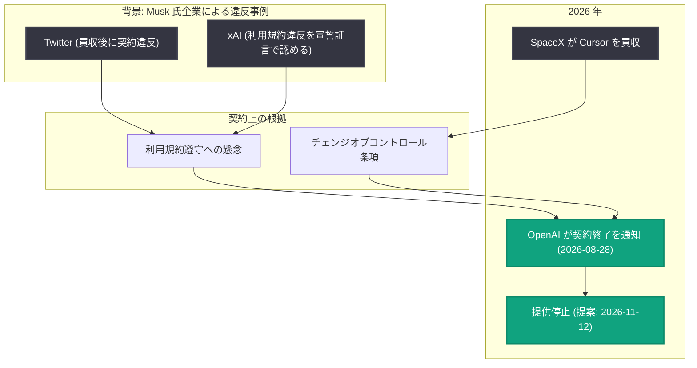

# SpaceX による買収を受けた Cursor に関する OpenAI の決定: モデル提供契約の終了

## メタデータ

| 項目 | 内容 |
|------|------|
| 発表日 | 2026-08-28 |
| ソース | OpenAI News |
| カテゴリ | 企業方針 / パートナーシップ / 利用規約 |
| 公式リンク | https://openai.com/index/our-decision-on-cursor-following-its-acquisition-by-spacex |

## 概要

OpenAI は、AI コードエディタ Cursor が SpaceX に買収されたことを受け、Cursor への OpenAI モデル提供契約を終了 (ワインドダウン) する意向を SpaceX に通知したと発表した。提案されている提供停止日は 2026 年 11 月 12 日で、開発者が Cursor 経由で OpenAI モデルを利用できる期間を最大化するため、契約上認められる最長の予告期間を設けたとしている。

OpenAI はこの決定の理由として、Elon Musk 氏の企業群による過去の契約違反の経験から、SpaceX が OpenAI の技術を利用規約の範囲内で使用すると確信できないことを挙げている。OpenAI は「開発者がモデルに広くアクセスできることを深く重視しており、非常に難しい決定だった」と述べている。

## 主な内容

### 契約終了の概要

- **通知先**: SpaceX (Cursor の買収元)
- **内容**: Cursor への OpenAI モデル提供契約のワインドダウン (段階的終了)
- **提案されている提供停止日**: 2026 年 11 月 12 日
- **予告期間**: 契約上認められる最長の予告期間を適用し、開発者のアクセス可能期間を最大化
- **将来モデル**: 今後の新モデルは Cursor に提供しない

### 決定の理由: 利用規約遵守への懸念

OpenAI は、SpaceX のような大規模パートナーと協業する際、利用規約の遵守と大規模利用時の安全性を担保するためにカスタム契約に依拠していると説明している。その上で、Musk 氏の企業による過去の違反事例を根拠として挙げている。

| 事例 | 内容 |
|------|------|
| Twitter (現在は SpaceX の一部) | Musk 氏による買収後、OpenAI との契約条件に違反した ([New York Times 報道](https://www.nytimes.com/2023/04/27/technology/elon-musk-ai-openai.html)) |
| xAI (現在は SpaceX の一部) | 2026 年、Musk 氏が宣誓証言において、xAI が OpenAI の利用規約 (xAI 自身の規約とも類似) に違反したことを認めた ([Forbes 報道](https://www.forbes.com/sites/antoniopequenoiv/2026/04/30/elon-musk-admits-xai-distilled-openai-data-to-train-models-heres-what-that-means/)) |

### 契約上の背景と次期モデル Astra への言及

- **チェンジオブコントロール条項**: OpenAI と Cursor のカスタム契約には、支配権の変更 (change of control) 後の限られた期間内に契約を解除できる条項が含まれており、今回の決定はこの条項に基づくものである
- **次期モデル Astra**: AI 能力の進歩に伴い、OpenAI は次期モデル [Astra](https://openai.com/index/responding-next-frontier-critical-cyber-capabilities/) が利用規約に従って使用されることを確保する新たなレベルの説明責任を負っていると説明している
- **対応方針**: 契約解除を可能な限り遅い日付まで保留しつつ、将来のモデルは Cursor に提供しないという判断を下した

### Cursor と開発者コミュニティへの姿勢

OpenAI は Cursor と約 4 年間協業してきたと述べ、同社のチーム、プロダクト、開発者コミュニティへの貢献に「大きな敬意」を表明している。また、この決定によって最も影響を受けるのは Cursor 上で OpenAI モデルに依存している開発者であると認識しており、移行期間中の開発者体験を重視し、「期待以上の支援を行う用意がある」としている。

## 経緯の整理

## 開発者・ユーザーへの影響

- **Cursor での OpenAI モデル利用に期限**: 提案どおりであれば、2026 年 11 月 12 日以降は Cursor 経由で OpenAI モデルを利用できなくなるため、該当する開発者は移行計画の検討が必要になる
- **将来モデルは対象外**: 停止日以前であっても、OpenAI の今後の新モデル (Astra を含む) は Cursor には提供されない
- **移行支援の表明**: OpenAI は影響を受ける開発者の移行を「期待以上に」支援する用意があると表明しており、今後の具体的な支援策の発表が注目される
- **エコシステムへの示唆**: 買収などによる支配権の変更が、AI モデル提供契約の継続可否に直接影響し得ることを示す事例であり、サードパーティ製ツールに依存する開発チームにとってリスク管理上の参考となる

## 関連リンク

- [公式発表 (OpenAI News)](https://openai.com/index/our-decision-on-cursor-following-its-acquisition-by-spacex)
- [OpenAI の次期モデル Astra に関する発表 (Responding to the next frontier: critical cyber capabilities)](https://openai.com/index/responding-next-frontier-critical-cyber-capabilities/)
- [New York Times: Twitter による契約違反に関する報道 (2023-04-27)](https://www.nytimes.com/2023/04/27/technology/elon-musk-ai-openai.html)
- [Forbes: Musk 氏が xAI による OpenAI 利用規約違反を認めた宣誓証言に関する報道 (2026-04-30)](https://www.forbes.com/sites/antoniopequenoiv/2026/04/30/elon-musk-admits-xai-distilled-openai-data-to-train-models-heres-what-that-means/)
- [OpenAI News](https://openai.com/news)

## まとめ

OpenAI は、SpaceX による Cursor 買収を受け、チェンジオブコントロール条項に基づいて Cursor への OpenAI モデル提供契約を終了する意向を通知した。提供停止の提案日は 2026 年 11 月 12 日で、契約上最長の予告期間を確保している。決定の根拠は、Twitter や xAI といった Musk 氏の企業による過去の契約・利用規約違反の実績から、SpaceX 傘下での規約遵守に確信が持てないことにある。一方で OpenAI は約 4 年間協業した Cursor チームへの敬意と、影響を受ける開発者への移行支援を強調しており、次期モデル Astra の安全な利用確保という文脈も含め、AI モデル提供における契約ガバナンスの重要性を示す発表となった。
