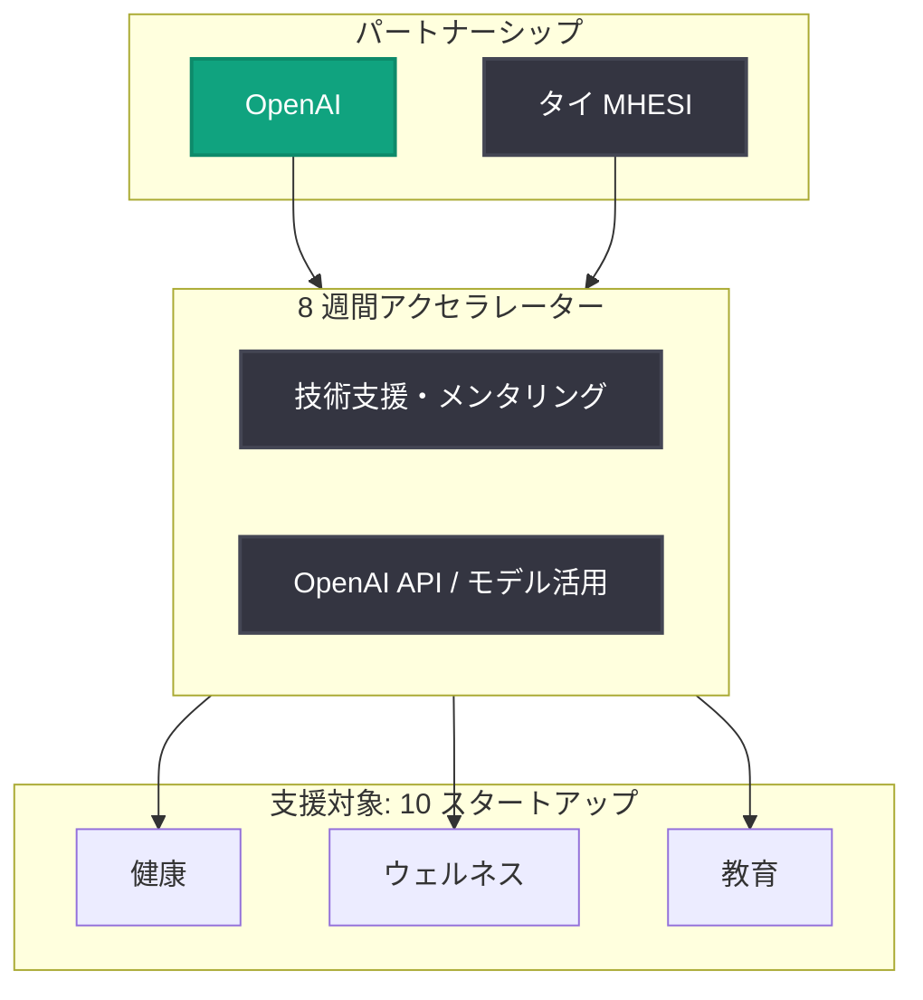

# タイ次世代 AI スタートアップ支援: OpenAI と MHESI がアクセラレーターを開始

## メタデータ

| 項目 | 内容 |
|------|------|
| 発表日 | 2026-08-28 |
| ソース | OpenAI News |
| カテゴリ | パートナーシップ / グローバル展開 |
| 公式リンク | https://openai.com/index/supporting-next-generation-ai-startups-thailand |

## 概要

OpenAI は、タイの高等教育・科学・研究・イノベーション省 (MHESI: Ministry of Higher Education, Science, Research and Innovation) と連携し、健康・ウェルネス・教育分野の 10 スタートアップを支援する 8 週間のアクセラレータープログラムを開始したことを発表した。

本プログラムは、OpenAI が東南アジア地域で進めるエコシステム支援の一環であり、タイ国内の AI スタートアップが OpenAI の技術と知見を活用して、社会的インパクトの大きい分野 (健康、ウェルネス、教育) でプロダクトを開発・成長させることを後押しするものである。

> 注記: 発表元の記事ページへのアクセスが制限されていたため (HTTP 403)、本レポートは公式 RSS/ニュース配信の概要情報をもとに作成している。詳細は公式リンクを参照のこと。

## 主な内容

### プログラムの概要

- **形式**: 8 週間のアクセラレータープログラム
- **対象**: タイ国内のスタートアップ 10 社
- **重点分野**: 健康 (Health)、ウェルネス (Wellness)、教育 (Education)
- **運営**: OpenAI とタイ MHESI (高等教育・科学・研究・イノベーション省) の連携

### パートナーシップの背景

MHESI はタイの高等教育、科学研究、イノベーション政策を所管する省庁であり、国家レベルで AI 人材育成とスタートアップエコシステムの強化を推進している。OpenAI にとって本取り組みは、政府機関と連携して各国の AI エコシステムを育成する「OpenAI for Countries」的なグローバル展開の流れに位置づけられる。

### 重点分野の意義

| 分野 | 期待される AI 活用例 |
|------|---------------------|
| 健康 | 診断支援、医療アクセス改善、患者向けチャットアシスタント |
| ウェルネス | メンタルヘルスサポート、パーソナライズされた健康管理 |
| 教育 | 個別最適化学習、教師支援ツール、タイ語対応の学習アシスタント |

いずれも社会課題への直接的なインパクトが大きく、AI による生産性向上とアクセス格差の解消が期待される分野である。

## プログラム構造

## 開発者・エコシステムへの影響

- **東南アジア市場での機会拡大**: タイをはじめとする東南アジアで、OpenAI の技術を活用したローカライズされた AI プロダクト開発の機会が広がる
- **政府連携モデルの拡大**: 政府機関 (MHESI) と OpenAI が直接連携する形式のアクセラレーターが増えることで、各国のスタートアップが公式支援を受けやすくなる
- **社会課題分野への注力シグナル**: 健康・ウェルネス・教育という重点分野の選定は、OpenAI が収益性だけでなく社会的インパクトの大きいユースケースを重視していることを示す
- **多言語・ローカル対応の進展**: タイ語圏向けの AI アプリケーション事例が増えることで、非英語圏での GPT モデル活用のベストプラクティスが蓄積される

## 関連リンク

- [公式発表 (OpenAI News)](https://openai.com/index/supporting-next-generation-ai-startups-thailand)
- [OpenAI News](https://openai.com/news)
- [OpenAI Global Affairs](https://openai.com/global-affairs/)
- [タイ MHESI 公式サイト](https://www.mhesi.go.th/)

## まとめ

OpenAI とタイ MHESI による 8 週間のアクセラレータープログラムは、健康・ウェルネス・教育分野の 10 スタートアップを対象に、タイの AI エコシステム育成を支援する取り組みである。政府機関との直接連携により、東南アジアにおける OpenAI のプレゼンス強化と、社会課題解決型 AI プロダクトの創出が期待される。OpenAI のグローバル展開戦略において、新興国のスタートアップ支援が重要な柱となっていることを示す発表といえる。
