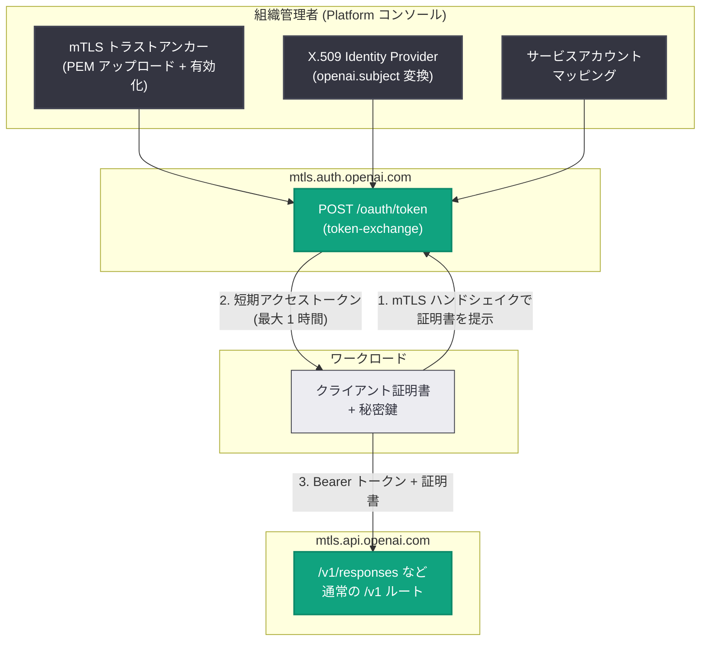

# Mutual TLS (mTLS) と X.509 Workload Identity Federation が一般提供開始

## メタデータ

| 項目 | 内容 |
|------|------|
| 発表日 | 2026-08-29 |
| ソース | OpenAI API Changelog |
| カテゴリ | API 更新 / セキュリティ |
| 公式リンク | https://developers.openai.com/api/docs/changelog |

## 概要

2026 年 8 月 29 日、OpenAI API Changelog にて **Mutual TLS (mTLS)** と **X.509 Workload Identity Federation** の一般提供 (GA) 開始が発表された。Changelog では "are now generally available for the OpenAI API" と記載されており、証明書と X.509 アイデンティティプロバイダーは Platform コンソールで直接設定でき、アクセスは組織のロールと権限によって制御される ("with access controlled by your organization's roles and permissions")。

mTLS は、通常のベアラー認証 (API キーなど) に**加えて** TLS クライアント証明書の検証を必須にする追加のセキュリティ層である。さらに X.509 Workload Identity Federation を使うと、検証済みのクライアント証明書を短期の OpenAI アクセストークンに交換でき、**長期保管される API キー自体を排除**できる。エンタープライズのゼロトラスト要件や、シークレットレス運用を求めるワークロードにとって重要なアップデートである。

## 主な内容

### 1. Mutual TLS (mTLS)

組織またはプロジェクトで信頼証明書 (トラストアンカー) を有効化すると、そのスコープ内の API リクエストは、通常の認証情報に加えて TLS クライアント証明書の提示が必須になる。API キーやサービスアカウント認証の**代替ではなく、追加の検証層**である点に注意。

- **設定場所**: Platform コンソールの Organization settings > Security > Mutual TLS (https://platform.openai.com/settings/organization/security)
- **証明書要件**: PEM エンコードのトラストアンカーを証明書オブジェクトごとに 1 つアップロード。アップロード時点から 1 日超先まで有効であること。クライアント証明書には Authority Key Identifier (AKI) が必須
- **有効化が必要**: 証明書のアップロードだけでは mTLS は強制されない。有効化 (activation) がリクエスト動作を変更するステップ
- **検証順序**: プロジェクトレベル → 組織レベルの順にトラストアンカーを確認し、まず直接パス、次に提示された中間証明書を含むチェーン検証にフォールバックする
- **CEL フィルタ**: 任意で CEL 式を追加し、受け入れるクライアント証明書を Subject や SAN の属性で制約できる

CEL フィルタの例 (公式ドキュメント記載):

```text
subject.organizational_unit == "Production" &&
subject_alt_names.exists(san, san.type == DNS && san.value.endsWith(".example.com"))
```

#### mTLS 専用ホスト

mTLS はホストベースで提供され、通常の `/v1` ルートをそのまま使用する。

| ホスト | 用途 |
|--------|------|
| `mtls.api.openai.com` | デフォルト mTLS ホスト |
| `mtls-us.api.openai.com` | 米国リージョナルホスト |
| `mtls-eu.api.openai.com` | EU リージョナルホスト |

#### 必要な権限 (RBAC)

| 権限 | 内容 |
|------|------|
| `api.mtls.read` | 証明書設定の一覧表示・閲覧・テスト |
| `api.mtls.write` | 証明書のアップロード・更新・有効化・無効化・削除 |

組織オーナーロールにはこれらの権限が含まれるが、カスタムロールにも付与できる。

### 2. X.509 Workload Identity Federation

TLS クライアント証明書のアイデンティティを、短期の OpenAI アクセストークンに交換する仕組み。**このフローが置き換えるのは API キーであり、クライアント証明書ではない**。X.509 プロバイダーは独自のトラストストアを持たず、mTLS で設定した既存の証明書トラストを再利用する。

設定手順は以下のとおり。

1. mTLS 設定で信頼ルート証明書をアップロード・有効化する
2. ダッシュボードで **Create identity provider** から Provider type に **X.509** を選択する (作成後にタイプ変更は不可)
3. 必須の `openai.subject` 変換 (空でない CEL 式) を設定し、任意で `openai.*` 名の追加変換や Attribute conditions を設定する
4. プロバイダー詳細ページから **Create mapping** で、対象プロジェクトのサービスアカウントと `openai.subject` の完全一致マッピングを作成する

属性変換の設定例 (公式ドキュメント記載):

```json
[
  {
    "attribute": "openai.subject",
    "expression": "assertion.subject.common_name"
  },
  {
    "attribute": "openai.environment",
    "expression": "assertion.subject.organizational_unit"
  }
]
```

#### トークンの特性

- アクセストークンは**最大 1 時間**で失効し、検証済みクライアント証明書より長く存続しない
- リフレッシュトークンは返されない。失効後は再交換が必要
- トークンは証明書に暗号学的にバインドされない (DPoP や `cnf` クレームは不使用)。証明書単体では API 呼び出しは認可されず、**トークンと証明書の両方**が独立に検証される

## 技術的な詳細

### コードサンプル

#### mTLS 経由の API 呼び出し (API キー使用)

```bash
export OPENAI_MTLS_CERT_CHAIN="/path/to/client-chain.pem"
export OPENAI_MTLS_KEY="/path/to/client-key.pem"

curl https://mtls.api.openai.com/v1/models \
  --cert "$OPENAI_MTLS_CERT_CHAIN" \
  --key "$OPENAI_MTLS_KEY" \
  --header "Authorization: Bearer $OPENAI_API_KEY"
```

チェーンファイルはクライアント証明書を先頭に、必要な中間証明書を続ける。OpenAI は AIA URL からの中間証明書取得や CRL/OCSP チェックを行わないため、完全なチェーンを TLS ハンドシェイクで提示する必要がある。

#### X.509 トークン交換 (API キー不要)

```bash
export OPENAI_IDENTITY_PROVIDER_ID="idp_example"
export OPENAI_SERVICE_ACCOUNT_ID="svc_acct_example"

curl --cert "$OPENAI_MTLS_CERT_CHAIN" \
  --key "$OPENAI_MTLS_KEY" \
  --request POST "https://mtls.auth.openai.com/oauth/token" \
  --header "Content-Type: application/json" \
  --data @- <<JSON
{
  "grant_type": "urn:ietf:params:oauth:grant-type:token-exchange",
  "subject_token_type": "urn:openai:params:oauth:token-type:x509",
  "identity_provider_id": "${OPENAI_IDENTITY_PROVIDER_ID}",
  "service_account_id": "${OPENAI_SERVICE_ACCOUNT_ID}"
}
JSON
```

証明書は TLS 接続経由で提示するため、リクエストボディに `subject_token` は含めない。成功レスポンス:

```json
{
  "access_token": "eyJ...",
  "issued_token_type": "urn:ietf:params:oauth:token-type:access_token",
  "token_type": "Bearer",
  "expires_in": 3600,
  "scope": "api.model.read api.model.request"
}
```

取得したトークンで API を呼び出す (証明書の提示も引き続き必要):

```bash
curl --request POST \
  --cert "$OPENAI_MTLS_CERT_CHAIN" \
  --key "$OPENAI_MTLS_KEY" \
  --header "Authorization: Bearer $OPENAI_WIF_ACCESS_TOKEN" \
  --header "Content-Type: application/json" \
  --data "{\"model\":\"$OPENAI_MODEL\",\"input\":\"Say hello in one sentence.\"}" \
  "https://mtls.api.openai.com/v1/responses"
```

### 証明書管理 API

証明書の管理は Platform コンソールだけでなく、管理 API でも自動化できる。

| タスク | エンドポイント |
|--------|---------------|
| 証明書アップロード | `POST /v1/organization/certificates` |
| 組織証明書一覧 | `GET /v1/organization/certificates` |
| 取得 / 更新 / 削除 | `GET` / `POST` / `DELETE /v1/organization/certificates/{certificate_id}` |
| 組織で有効化 / 無効化 | `POST /v1/organization/certificates/activate`、`.../deactivate` |
| プロジェクト単位の操作 | `GET` / `POST /v1/organization/projects/{project_id}/certificates` (`/activate`、`/deactivate`) |

### 主なエラーコード

| エラーコード | 意味 |
|-------------|------|
| `certificate_required` | 必要な証明書素材が未提示 |
| `invalid_certificate` | 証明書のデコード / パース不能、または AKI 欠如 |
| `certificate_verification_failed` | 有効なトラストアンカーに到達できない |
| `certificate_attribute_verification_failed` | パス検証は成功したが CEL フィルタで拒否 |
| `authentication_temporarily_unavailable` | 検証タイムアウト等 (HTTP 503、リトライ可) |
| `invalid_subject_token` (トークン交換時) | 証明書の欠落 / 無効、チェーン到達不可、有効期間外など |
| `invalid_grant` (トークン交換時) | プロバイダー / マッピング無効、Attribute conditions による拒否など |

## アーキテクチャ

X.509 Workload Identity Federation の認証フロー。



## 開発者への影響

- **セキュリティの多層化**: mTLS により、API キーが漏洩しても有効なクライアント証明書がなければ API を呼び出せなくなる。ゼロトラストやエンタープライズのコンプライアンス要件 (クライアント証明書検証の義務付け) に対応しやすくなる
- **長期シークレットの排除**: X.509 Workload Identity Federation により、ワークロードに長期の API キーを配布・保管する必要がなくなる。証明書ベースで最大 1 時間の短期トークンを都度取得するため、漏洩時の影響範囲を最小化できる
- **段階的な導入が可能**: 証明書はアップロードしただけでは強制されず、プロジェクト単位で有効化できる。公式ガイドは、まず非クリティカルなプロジェクトで有効化して代表的なリクエストを検証してから、他プロジェクトや組織レベルへ展開する手順を推奨している
- **無停止の証明書ローテーション**: 旧アンカーを無効化せずに新アンカーをアップロード・有効化し、全ワークロード移行後に旧アンカーを無効化する手順により、ダウンタイムなしでローテーションできる。中間証明書はアンカー変更なしでローテーション可能
- **運用上の注意点**: 組織あたり証明書オブジェクトは最大 50 個。CRL/OCSP による失効チェックは行われないため、インシデント対応はルート / プロバイダー / マッピングの無効化と短いトークン寿命を前提に設計する。Private Link とは互換性がない。SPIFFE X.509-SVID は非対応 (SPIFFE は JWT-SVID を使用)。Codex は X.509 フェデレーション非対応 (OIDC トークンか SPIFFE JWT-SVID を使用)

## 関連リンク

- [OpenAI API Changelog](https://developers.openai.com/api/docs/changelog)
- [Mutual TLS ガイド](https://developers.openai.com/api/docs/guides/mutual-tls)
- [X.509 Workload Identity Federation ガイド](https://developers.openai.com/api/docs/guides/workload-identity-federation/x509)
- [Platform コンソール (組織セキュリティ設定)](https://platform.openai.com/settings/organization/security)

## まとめ

mTLS と X.509 Workload Identity Federation の GA により、OpenAI API のワークロード認証はエンタープライズグレードに強化された。mTLS は API キー認証に TLS クライアント証明書検証を追加する多層防御を提供し、X.509 フェデレーションはその証明書を最大 1 時間の短期トークンに交換することで長期 API キーの配布自体を不要にする。Platform コンソール (Organization settings > Security) と管理 API の両方から設定でき、プロジェクト単位の段階的な有効化、CEL フィルタによる証明書の属性制約、無停止ローテーションなど、実運用に必要な仕組みが揃っている。証明書チェーンの完全な提示 (AIA 取得なし) や CRL/OCSP チェック非対応といった制約を踏まえた設計が導入の鍵となる。
