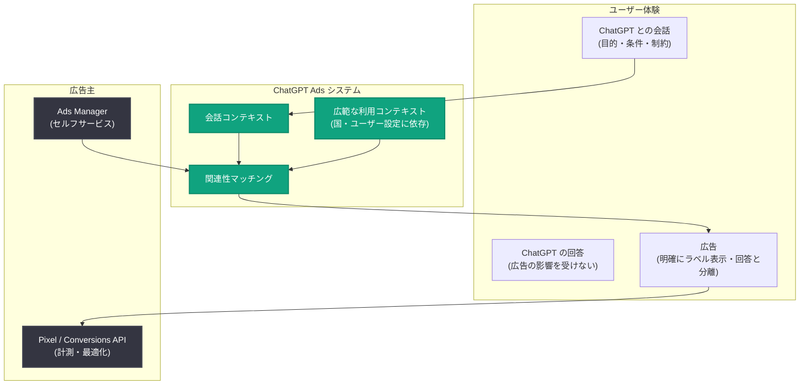

# AI へのアクセス拡大におけるマイルストーン: ChatGPT Ads が年間換算収益 10 億ドルを達成

## メタデータ

| 項目 | 内容 |
|------|------|
| 発表日 | 2026-08-31 |
| ソース | OpenAI News |
| カテゴリ | プロダクト (Product) / 広告プラットフォーム |
| 公式リンク | https://openai.com/index/expanding-access-to-ai-with-chatgpt-ads |

## 概要

OpenAI は 2026 年 8 月 31 日、広告プラットフォーム「ChatGPT Ads」がローンチから 200 日未満で年間換算収益ランレート (annualized revenue run rate) 10 億ドルに到達したと発表しました。プラットフォームはすでに数万の広告主に利用されており、グローバル展開を継続しています。発表当日より、インド、欧州、中東、北アフリカの広告主が Ads Manager を通じて ChatGPT 広告を直接購入できるセルフサービス提供が開始されます。

広告は、コンシューマー向けサブスクリプション、エンタープライズ向け製品、従量課金制 API と並ぶ、OpenAI の多角化されたビジネスモデルの柱の 1 つと位置づけられています。広告収益に支えられた無料ティアは、週間アクティブユーザー 10 億人超に ChatGPT を提供し続けるための基盤となっており、今回の発表は「AI へのアクセス拡大」というミッションの観点からのマイルストーンとされています。

## 主要な統計情報

| 指標 | 数値 |
|------|------|
| 年間換算収益ランレート | 10 億ドル |
| 達成までの期間 | ローンチから 200 日未満 |
| 広告主数 | 数万社 |
| ChatGPT 週間アクティブユーザー | 10 億人超 |
| ChatGPT Ads 提供国 | 40 か国以上 |
| テクノロジー / 計測パートナー | 50 社以上 |
| 広告主事例: e コマース広告主の ROAS | 28 日間で 3 倍 |
| パートナー事例: 広告経由トラフィックの新規顧客比率 | 80% 超 |

## 主な内容

### 意思決定が形づくられる場所としての ChatGPT

記事によると、人々は明確な目的を持って ChatGPT を利用しています。ビジネス向けソフトウェアの選定、語学学習、リフォームの計画、求職活動、新しい趣味の探索などがその例です。ユーザーは達成したいこと、重視する点、制約条件を説明し、ChatGPT は意思決定のフレーミング、基準の設定、代替案の理解、行動への移行を支援します。発見 (Discovery)、検討 (Consideration)、意思決定 (Decision-making) が単一の体験の中で完結する点が特徴です。

ChatGPT Ads は、この体験に対してマーケターが有用で関連性の高い情報を提供する機会を生み出します。広告システムは現在の会話のコンテキストを利用して、ユーザーが調べている内容に関連する広告を表示します。また、国とユーザー設定によっては、ユーザーの ChatGPT 利用全体のコンテキストも活用され、その時点の質問内容と (有効化されている場合は) より広範な興味・関心の両方を反映した広告表示が可能になります。

### 広告原則に基づく設計

OpenAI は自社の [広告原則](https://openai.com/index/our-approach-to-advertising-and-expanding-access/) に基づき、広告プラットフォームの構築と拡大を慎重に進めてきたとしています。「ChatGPT に寄せられる信頼を守ること」を最重要指針 (North Star) と位置づけ、以下の方針を明示しています。

- **明確なラベル表示**: ChatGPT 内の広告は常に明確にラベル付けされ、ChatGPT の回答とは分離される
- **回答への非干渉**: 広告が ChatGPT の回答内容に影響を与えることはない
- **プライバシー保護**: 広告主はユーザーの private な会話にアクセスできない
- **ユーザーコントロール**: ユーザーは広告体験のパーソナライズ方法を自身で制御できる

グローバル展開を通じて、信頼性・関連性・全体的な体験に関する追跡指標は堅調に推移しており、これがプラットフォーム拡大の確信につながっていると述べられています。

### 初期パイロットからグローバルプラットフォームへ

ChatGPT Ads は現在、OpenAI Ads Solutions チームおよび代理店・テクノロジーパートナーを通じて [40 か国以上で利用可能](https://help.openai.com/en/articles/20001245-ads-manager-availability) です。今回、インド、欧州、中東、北アフリカでセルフサービスアクセスが開始されます。

クライアント基盤の変化として、以下の点が挙げられています。

- **グローバル化**: 米国外の広告主が収益に占める割合が拡大しており、大手クライアントの多くが複数市場の顧客リーチに ChatGPT Ads を活用
- **エコシステムの拡大**: マネージドセールス・代理店・パートナー主導のモデルから始まり、現在は 50 社以上のテクノロジー / 計測パートナーへとエコシステムを拡大
- **SMB への開放**: 2026 年 5 月の Ads Manager 導入により中小企業 (SMB) にプラットフォームを開放し、現在では事業の相当な割合を占めるまでに成長

### 広告プラットフォームとしての高度化

ChatGPT Ads は機能面でも高度化が進んでいます。

- **入札**: CPC (クリック単価) 入札と成果最適化入札がキャンペーンの過半数を占める
- **計測と最適化**: Pixel と Conversions API が計測・最適化の重要な基盤に
- **ターゲティング**: 商品フィード、プラットフォーム / 地域ターゲティング、カスタムオーディエンスにより、事業に最も関連性の高い顧客へのリーチを支援

これらの改善は実際の成果につながっており、直近の事例として、ある e コマース広告主が全キャンペーンで 28 日間に 3 倍の ROAS (広告費用対効果) を達成したこと、あるテクノロジーパートナーが広告経由の ChatGPT トラフィックの 80% 超が新規顧客であると報告したことが紹介されています。

## 広告配信の仕組み

## 今後の展開

OpenAI は、原則を守りながら AI へのアクセスを拡大することに引き続き注力するとしています。次の成長フェーズでは以下が予定されています。

- ChatGPT Ads のさらなる市場への展開
- 追加の広告フォーマット、キャンペーン目的、購入オプション、計測機能の導入
- 企業が ChatGPT 内でよりネイティブな形で消費者とやり取りする新しい方法の模索

## ビジネス・広告主への影響

- **セルフサービスの地理的拡大**: インド、欧州、中東、北アフリカの広告主は Ads Manager から直接 ChatGPT 広告を購入可能になり、参入障壁が大幅に低下します
- **SMB・スタートアップの機会拡大**: あらゆる規模の企業が、ユーザーの検討・意思決定の場面で顧客にリーチする機会を得られます
- **計測基盤の整備**: Pixel と Conversions API により、成果ベースの運用と最適化が可能です
- **無料ユーザーへの還元**: 広告収益は無料ティアの維持を支え、より多くの人が AI にアクセスできる構造を支えます

## 関連リンク

- [発表記事 (原文)](https://openai.com/index/expanding-access-to-ai-with-chatgpt-ads)
- [OpenAI の広告原則: Our approach to advertising and expanding access](https://openai.com/index/our-approach-to-advertising-and-expanding-access/)
- [Ads Manager 提供国一覧 (ヘルプセンター)](https://help.openai.com/en/articles/20001245-ads-manager-availability)
- [OpenAI News](https://openai.com/news)

## まとめ

ChatGPT Ads はローンチから 200 日未満で年間換算収益 10 億ドルに到達し、40 か国以上・数万の広告主が利用するグローバルプラットフォームへと成長しました。今回のインド、欧州、中東、北アフリカでのセルフサービス開放により、SMB を含むあらゆる規模の広告主が ChatGPT 内でのリーチを獲得できるようになります。OpenAI は「広告は回答に影響しない」「広告主は private な会話にアクセスできない」などの広告原則を維持しつつ、広告収益によって週間アクティブユーザー 10 億人超への無料アクセスを支えるという、アクセス拡大と収益多角化を両立させる戦略を明確に示しました。
