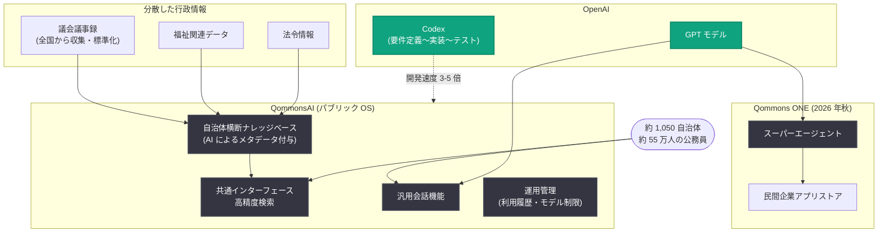

# Polimill が日本の次世代パブリック AI インフラを構築: 約 1,050 自治体が利用する QommonsAI と Codex による開発 3-5 倍高速化

## メタデータ

| 項目 | 内容 |
|------|------|
| 発表日 | 2026-08-31 |
| ソース | OpenAI News |
| カテゴリ | 導入事例 (Customer Story) |
| 公式リンク | https://openai.com/index/polimill |

## 概要

OpenAI は、日本のスタートアップ Polimill による導入事例「Polimill builds Japan's next-generation public AI infrastructure」を公開した。Polimill は市民が政治や社会について意見を交換できるプラットフォーム「Surfvote」から事業を開始し、自治体との協働を通じて「行政職員が日常業務に追われ、市民の声を政策に反映する時間がない」という構造的課題を認識した。この課題に対応するため、同社は行政業務向けの生成 AI プラットフォーム「QommonsAI」を 2024 年 10 月にリリースした。

QommonsAI は OpenAI の GPT モデルを中核に構築され、現在では日本全国の約 1,050 自治体、約 55 万人の公務員が利用している。さらに開発面では Codex を要件定義からテストまでのワークフロー全体に採用し、OpenAI のハンズオン支援と合わせて開発速度を従来の 3-5 倍に向上させた。Polimill は QommonsAI を職員の生産性ツールにとどまらない、日本の自治体業務を支える「パブリック OS」へと進化させることを目指している。

## 主な内容

### 自治体横断のナレッジベース構築

行政に生成 AI を導入する上で最大の障壁の 1 つは、データの分断だった。自治体ごとにワークフローや文書形式が異なり、過去の記録も散在している。例えば議会答弁の準備では、都道府県の方針と整合する回答を作るために、数年分の議事録を手作業で確認する必要があった。基盤となるデータが整理されていなければ、どれほど高性能な AI モデルでも実務に役立つ洞察は生み出せない。

Polimill は日本全国の議会議事録を収集・標準化し、AI でメタデータを付与することで、自治体と時期を横断して機能する高精度な検索基盤を構築した。さらにこの仕組みを議会だけでなく、福祉、法令などの行政領域にも拡張した。専門データと AI を 1 つのプラットフォームに集約し、共通インターフェースで検索可能にすることで、QommonsAI は分散した行政情報を日常業務で使える知識に変えている。

### 行政水準のセキュリティと日常的な使いやすさの両立

QommonsAI の中核には OpenAI の GPT モデルがある。公共部門では情報管理と監査対応が不可欠であるため、QommonsAI には管理者が機能の利用履歴を確認し、組織のポリシーに応じて利用可能なモデルを制限できる運用管理機能が組み込まれている。

Polimill の CAIO である若林昌宏氏は、GPT モデルを採用した主な理由として、幅広い能力と知名度を挙げている。ロールアウト後に公務員が新しいツールを使う際、ChatGPT の広範な認知度が重要になる。技術用語や他のモデル名を知らなくても、広く使われている ChatGPT の技術がベースだと分かれば、導入初期のハードルが下がるためである。

Polimill によれば、QommonsAI の汎用会話機能において、日常業務で最も頻繁に選択されるのは GPT モデルである。ファイルの読み取りから日々の対話支援まで、単一モデルで幅広い業務リクエストに確実に応答できる GPT の能力が、現場への定着を支えている。

> 深刻化する労働力不足の中で、AI による行政業務の効率化は不可欠です。しかし、個別のツールを導入すると自治体間でサービス格差が生まれかねません。だからこそ、QommonsAI がすべての自治体を平等に支える共通基盤となり、日本の行政を支えるパブリック OS に成長することを目指しています。(Masahiro Wakabayashi, CAIO, Polimill / 原文英語からの参考訳)

### Codex とハンズオン支援で開発を 3-5 倍高速化

OpenAI の技術は Polimill の開発プロセスも変えた。同社は要件定義から、GitHub 上の既存コードとの整合性チェック、実装、テストまでのワークフロー全体に Codex を採用した。エンジニアは AI が生成した計画のレビューと高レベルの意思決定に集中し、実装作業の多くは AI が自律的に実行する。

AI によるコーディング速度とバックグラウンドでの継続的な作業により、開発速度は従来の 3-5 倍に向上した。若林氏によれば、プロトタイプを構築して自治体チームに提示し、フィードバックを収集するという検証サイクルが劇的に加速したという。

OpenAI のハンズオン支援もこの取り組みを加速している。協働の内容には、世界の先進事例からのベストプラクティスの共有、Polimill に合わせた情報提供、そして「どのステップを AI に任せ、どこで人間がレビューし責任を持つか」を含む開発プロセス自体の設計支援が含まれる。モデルと能力の進化に伴い AI 支援開発の手法も変化し続けるため、個社で世界の先進事例を追跡して自社のエンジニアリング組織に取り込むのは難しい。若林氏は、OpenAI から継続的に学び、その知見を Polimill 内部で実装できることを、API の性能そのものと同等に価値があると評価している。

### 効率化を超えて: ベテラン職員の暗黙知の継承

QommonsAI の価値は情報検索の高速化にとどまらない。Polimill の検証では、経験の浅い職員が AI と蓄積された行政情報を使って政策提案書を作成したところ、ベテラン職員の提案に近い評価を得た。

一方で、最も高い評価を得たのは依然としてベテラン職員の提案だった。Polimill はその差の要因を、政策提案を実現するために必要な手続きや住民が抱きうる懸念といった、マニュアルには書かれていない実践的判断、すなわち暗黙知にあると分析している。

Polimill は、ベテラン職員が AI にどのように調査を指示し、出力をどのように修正するかを記録し、これまで文書化されてこなかった判断を組織の知識に変える計画である。熟練職員を AI で置き換えるのではなく、その能力を増幅し、ノウハウを次世代に継承することが目標であり、QommonsAI はそのような行政のナレッジトランスファーの基盤になり得る。

> ナレッジやデータに落ちていない部分が成果物の品質に寄与したと考えています。裏を返せば、そうした経験を持つ人が AI を使えば、さらに優れた仕事を生み出せるということです。(Masahiro Wakabayashi, CAIO, Polimill / 原文英語からの参考訳)

### 行政業務向け「スーパーエージェント」構想: Qommons ONE

2026 年秋、Polimill は外部企業が自治体向けアプリケーションを提供できるストア「Qommons ONE」の本格展開を計画している。その中心となるのは、複数の専門 AI システムと民間アプリを統合する「スーパーエージェント」である。ユーザーが目的を伝えると、システムが必要な AI やアプリを呼び出し、調査からプレゼンテーションまで実務に使える成果物を生成する。

このビジョンの実現に向けて、Polimill は GPT モデルの幅広い入出力能力と、OpenAI が蓄積してきたエージェント開発のノウハウを重要な基盤と位置づけている。OpenAI は技術検証や個別サンプルの提供を通じて開発を支援しており、モデルと開発手法が進化し続ける中、OpenAI と緊密に連携して最新の知見を取り込むことに大きな価値があると若林氏は述べている。

## アーキテクチャ

記事の内容に基づく QommonsAI の全体像を以下に示す。

## 主要な成果

| 項目 | 内容 |
|------|------|
| 導入規模 | 日本全国の約 1,050 自治体、約 55 万人の公務員が利用 |
| データ基盤 | 全国に分散した議会議事録・行政情報を統合し、組織横断で検索可能に |
| 開発速度 | Codex と OpenAI のハンズオン支援により 3-5 倍に向上 |
| 政策立案支援 | 経験の浅い職員でも、GPT モデルの高度な推論によりベテラン職員に近い品質の政策提案を作成 |

## 開発者・企業への影響

- **公共部門における AI 導入のモデルケース**: 監査対応 (利用履歴の確認) やモデル利用制限といったガバナンス機能を備えつつ、ChatGPT の知名度を活かして現場の導入ハードルを下げるアプローチは、公共・規制産業向け AI プロダクトの参考になる
- **データ整備の重要性**: 高性能なモデルだけでは不十分であり、分断されたデータの収集・標準化・メタデータ付与という基盤整備が実用的な AI 活用の前提であることを示している
- **Codex によるエンジニアリング変革**: 要件定義から実装・テストまでを AI に委ね、人間はレビューと高レベルの意思決定に集中する開発スタイルで 3-5 倍の高速化を達成した具体例である
- **暗黙知の形式知化**: ベテランの AI への指示や出力の修正過程を記録して組織知に変えるという発想は、AI 時代のナレッジマネジメントの新しい方向性を示している

## 関連リンク

- [Polimill builds Japan's next-generation public AI infrastructure (公式記事)](https://openai.com/index/polimill)
- [Codex 公式ページ](https://openai.com/codex/)
- [OpenAI API ドキュメント](https://platform.openai.com/docs)
- [OpenAI News](https://openai.com/news)

## まとめ

Polimill は、市民参加プラットフォーム Surfvote で見出した「行政職員の多忙さ」という構造的課題に対し、OpenAI の GPT モデルを中核とした行政業務向け生成 AI プラットフォーム QommonsAI を構築した。約 1,050 自治体・約 55 万人の公務員という導入規模、全国の行政情報を横断検索可能にしたデータ基盤、Codex による開発 3-5 倍の高速化が本事例の柱である。今後は 2026 年秋に予定される Qommons ONE のスーパーエージェントを通じて、行政・企業・市民が AI でつながる「パブリック OS」の実現を目指す。効率化で生まれた時間を職員が市民の声に向き合うために使うという、公共部門ならではの AI 活用ビジョンを示した事例である。
