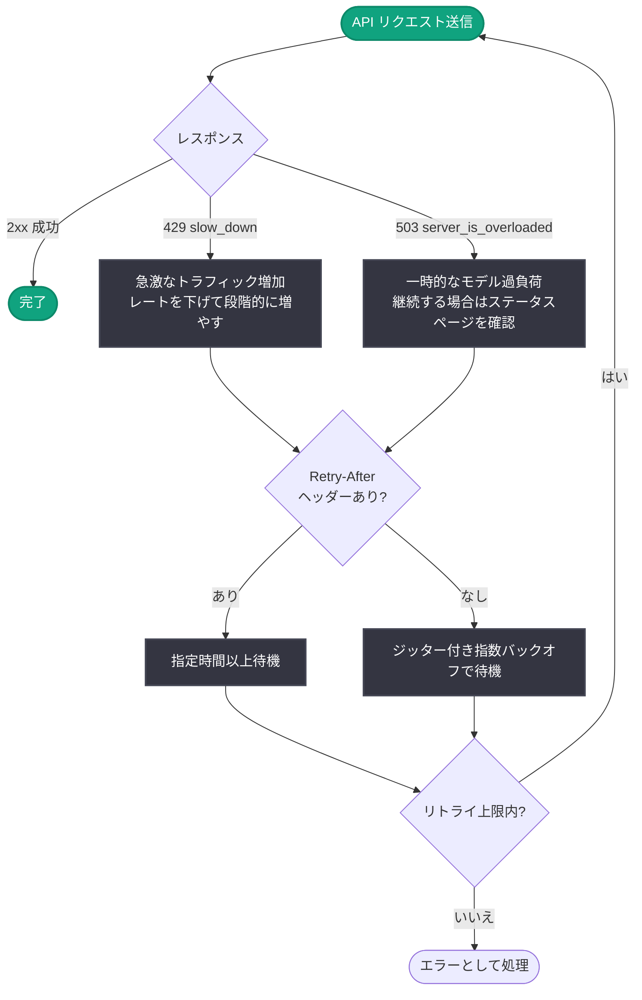

# API エラーレスポンスの改善 — 429 (slow_down) と 503 (server_is_overloaded) の区別

## メタデータ

| 項目 | 内容 |
|------|------|
| 発表日 | 2026-09-02 |
| ソース | OpenAI API Changelog |
| カテゴリ | API 更新 |
| 公式リンク | https://developers.openai.com/api/docs/changelog |

## 概要

2026 年 9 月 2 日、OpenAI API のエラーレスポンスが更新され、「急激なトラフィック増加」と「一時的なモデル過負荷」という 2 つの異なる状況を、アプリケーション側で区別できるようになった。前者は HTTP 429 エラー (エラーコード `slow_down`)、後者は HTTP 503 エラー (エラーコード `server_is_overloaded`) として返される。

この変更により、開発者はエラーの原因に応じて適切なリトライ戦略を選択できるようになる。どちらのレスポンスにも `Retry-After` ヘッダーが含まれる場合があり、ヘッダーがある場合は指定された時間以上待機してからリトライし、ない場合は指数バックオフ (exponential backoff) でリトライすることが推奨されている。

## 主な内容

### 429 エラー (slow_down): 急激なトラフィック増加

リクエストレートがサービスの安全に処理できる速度を超えて増加した場合に返される。

- エラータイプ: `rate_limit_error`
- エラーコード: `slow_down`
- **RPM (requests-per-minute) や TPM (tokens-per-minute) の制限内でも発生し得る**点が特徴で、レート制限超過とは異なり「増加ペースの速さ」が原因となる
- 公式ドキュメントでは、トラフィックが入力 100 万 TPM に達した後は、15 分ごとに 50% を超えない範囲で増やすことが目安として示されている
- 推奨対応: リクエストレートを下げ、その後段階的に増やす

### 503 エラー (server_is_overloaded): 一時的なモデル過負荷

リクエストしたモデルに、その時点でリクエストを処理する十分なキャパシティがない場合に返される。

- エラータイプ: `service_unavailable_error`
- エラーコード: `server_is_overloaded`
- クライアント側のトラフィックではなく、サーバー側の一時的な状態を示す
- エラーが継続する場合は、ステータスページでインシデントが発生していないか確認することが推奨されている

### 推奨リトライ戦略

| 条件 | 推奨される対応 |
|------|----------------|
| `Retry-After` ヘッダーあり | 指定された時間以上待機してからリトライ |
| `Retry-After` ヘッダーなし | ジッター付きの指数バックオフでリトライし、リトライ回数に上限を設ける |

公式 SDK は、リトライ対象のエラーに対して `Retry-After` ヘッダーをすでに考慮して動作する。

## 技術的な詳細

### エラーレスポンスの例

エラーレスポンスの `error` オブジェクトには `type` と `code` が含まれ、`error.code` を確認することで具体的な原因を特定できる。以下はドキュメントに記載されたフィールドに基づく例である。

**429 (slow_down) の例:**

```json
{
  "error": {
    "message": "Your request rate increased faster than the service can safely handle. Reduce your request rate, then increase it gradually.",
    "type": "rate_limit_error",
    "code": "slow_down"
  }
}
```

**503 (server_is_overloaded) の例:**

```json
{
  "error": {
    "message": "The requested model does not have enough capacity to process your request at the moment. Please retry later.",
    "type": "service_unavailable_error",
    "code": "server_is_overloaded"
  }
}
```

### コードサンプル

`Retry-After` ヘッダーを優先し、ない場合はジッター付き指数バックオフでリトライする Python の実装例。

```python
import random
import time

from openai import OpenAI, APIStatusError

client = OpenAI(max_retries=0)  # SDK の自動リトライを無効化し、手動で制御する例

MAX_RETRIES = 5
BASE_DELAY = 1.0  # 秒


def create_response_with_retry(**kwargs):
    for attempt in range(MAX_RETRIES + 1):
        try:
            return client.chat.completions.create(**kwargs)
        except APIStatusError as e:
            # 429 (slow_down) と 503 (server_is_overloaded) のみリトライ対象
            if e.status_code not in (429, 503) or attempt == MAX_RETRIES:
                raise

            retry_after = e.response.headers.get("Retry-After")
            if retry_after is not None:
                # Retry-After ヘッダーがある場合: 指定時間以上待機
                delay = float(retry_after)
            else:
                # ヘッダーがない場合: ジッター付き指数バックオフ
                delay = BASE_DELAY * (2 ** attempt) + random.uniform(0, 1)

            error_code = getattr(e, "code", None)
            print(f"HTTP {e.status_code} (code={error_code}): {delay:.1f} 秒待機してリトライします")
            time.sleep(delay)


response = create_response_with_retry(
    model="gpt-4o",
    messages=[{"role": "user", "content": "Hello!"}],
)
print(response.choices[0].message.content)
```

なお、公式 SDK のデフォルトのリトライ機構は `Retry-After` ヘッダーをすでに考慮するため、多くのケースでは SDK の自動リトライをそのまま利用できる。

## アーキテクチャ

リトライフローの全体像。



## 開発者への影響

- **エラー原因の切り分けが可能に**: これまで区別しにくかった「クライアント側のトラフィック増加ペースの問題 (429 slow_down)」と「サーバー側の一時的な過負荷 (503 server_is_overloaded)」を、ステータスコードとエラーコードで明確に判別できる
- **エラーハンドリングの見直しが必要な場合がある**: `error.code` に基づいて分岐するエラーハンドリングを実装している場合、新しいコード (`slow_down`, `server_is_overloaded`) への対応を追加するとよい
- **リトライ戦略の最適化**: 429 (slow_down) ではリクエストレートを下げて段階的に増やす対応、503 (server_is_overloaded) では待機後のリトライとステータスページの確認という、原因別の対応が可能になる
- **`Retry-After` ヘッダーの活用**: 自前のリトライ処理を実装している場合は、`Retry-After` ヘッダーを優先し、ない場合のみ指数バックオフを使う実装が推奨される。公式 SDK を利用している場合はヘッダーがすでに考慮される

## 関連リンク

- [OpenAI API Changelog (公式)](https://developers.openai.com/api/docs/changelog)
- [エラーコードガイド](https://developers.openai.com/api/docs/guides/error-codes)
- [レート制限ガイド](https://developers.openai.com/api/docs/guides/rate-limits)

## まとめ

2026 年 9 月 2 日の更新により、OpenAI API は「急激なトラフィック増加 (429 slow_down)」と「一時的なモデル過負荷 (503 server_is_overloaded)」を明確に区別して返すようになった。開発者は `Retry-After` ヘッダーがあれば指定時間以上待機し、なければジッター付き指数バックオフでリトライするという公式推奨に沿って、原因別に最適化されたエラーハンドリングを実装できる。
