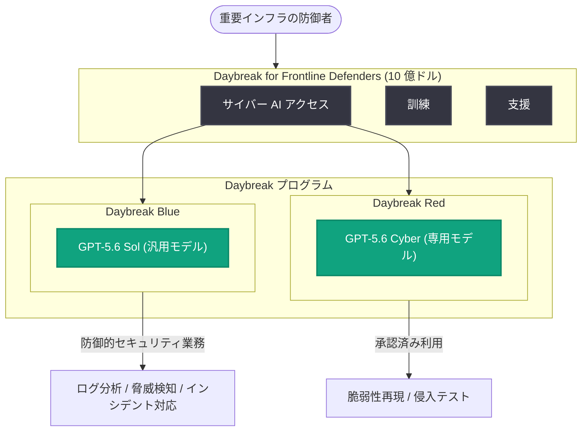

# Daybreak for Frontline Defenders: 重要インフラ防御に 10 億ドル規模の取り組みを発表

## メタデータ

| 項目 | 内容 |
|------|------|
| 発表日 | 2026-09-03 |
| ソース | OpenAI News |
| カテゴリ | サイバーセキュリティ / 社会貢献イニシアチブ |
| 公式リンク | https://openai.com/index/daybreak-for-frontline-defenders |

> 注: 本レポート作成時点で公式ページへのアクセスが制限されていたため (HTTP 403)、提供されたニュース概要および関連発表のコンテキストに基づいて記述しています。

## 概要

OpenAI は 2026 年 9 月 3 日、「Daybreak for Frontline Defenders」を発表しました。これは、電力・水道・医療・交通などの重要インフラ (essential services) を守る最前線の防御者 (frontline defenders) に対して、最先端のサイバー AI、訓練、支援へのアクセスを拡大する 10 億ドル規模の取り組みです。

本取り組みは、2026 年 8 月 7 日に発表されたサイバーセキュリティプログラム「Daybreak」を基盤としており、リソースの限られた重要インフラ事業者にも高度な AI 防御能力を届けることを目的としています。

## 主な内容

### 10 億ドル規模のコミットメント

発表の中核は、重要インフラ向けに以下へのアクセスを拡大する 10 億ドル規模のコミットメントです。

- **最先端のサイバー AI**: Daybreak プログラムで提供される防御向け AI モデルへのアクセス
- **訓練 (トレーニング)**: 防御者が AI を活用したセキュリティ業務を実践するための教育・訓練
- **支援**: 重要インフラ事業者に対する導入・運用面のサポート

### 基盤となる Daybreak プログラム

関連コンテキストによると、Daybreak には承認済み防御者向けに 2 つのアクセスティアが用意されています (2026-08-07 発表)。

| ティア | 提供モデル | 用途 |
|--------|-----------|------|
| Daybreak Blue | GPT-5.6 Sol などの汎用モデル | 防御的セキュリティ業務 (ログ分析、脅威検知、インシデント対応など) |
| Daybreak Red | GPT-5.6 Cyber などの専用モデル | 承認済みの脆弱性再現・侵入テスト |

### 背景: AI のサイバー能力の進展

本取り組みの背景には、AI モデルのサイバーセキュリティ能力の急速な進展があります。GPT-6 Astra は、OpenAI の Preparedness Framework においてサイバーセキュリティ能力が初めて Critical レベルに達したモデルとされています。攻撃側にも利用され得る高度な能力の登場に対し、防御側、とりわけリソースの限られた重要インフラの防御者を強化することが急務となっています。

## アーキテクチャ

Daybreak プログラムのアクセス構造 (関連発表のコンテキストに基づく概念図) は以下のとおりです。

## 開発者・組織への影響

- **重要インフラ事業者**: これまで予算や人材の制約で高度なセキュリティツールを導入できなかった組織でも、最先端のサイバー AI・訓練・支援を利用できる可能性が広がります
- **セキュリティチーム**: Daybreak Blue を通じて、防御的セキュリティ業務 (脅威検知、インシデント対応など) に AI を組み込む道が開かれます
- **承認済みのセキュリティ専門家**: Daybreak Red により、承認された範囲での脆弱性再現・侵入テストに専用モデルを活用できます
- **業界全体**: AI のサイバー能力が Critical レベルに達する中で、防御側の能力向上に大規模投資が行われることは、攻撃と防御のバランス維持に向けた重要な動きです

なお、対象組織の具体的な要件、申請方法、資金の配分内訳などの詳細は、本レポート作成時点では公式ページから確認できていません。最新情報は公式リンクを参照してください。

## 関連リンク

- [Daybreak for Frontline Defenders (公式発表)](https://openai.com/index/daybreak-for-frontline-defenders)
- [OpenAI News](https://openai.com/news)
- [OpenAI Preparedness Framework](https://openai.com/safety/preparedness)

## まとめ

- OpenAI が重要インフラ防御のために 10 億ドル規模の取り組み「Daybreak for Frontline Defenders」を発表
- 最先端のサイバー AI・訓練・支援へのアクセスを重要インフラの防御者に拡大
- 基盤となる Daybreak プログラムには Daybreak Blue (防御業務向け) と Daybreak Red (承認済み侵入テスト向け) の 2 ティアが存在
- GPT-6 Astra のサイバー能力が Preparedness Framework で初の Critical レベルに達したことが背景にあり、防御側強化の重要性が高まっている
