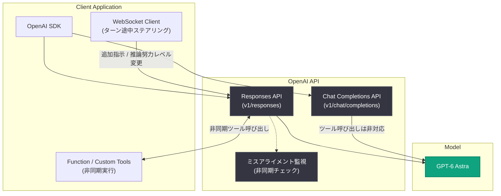

# GPT-6 Astra が API でリリース、Responses API に長時間タスク向け新機能

## メタデータ

| 項目 | 内容 |
|------|------|
| 発表日 | 2026-09-03 |
| ソース | OpenAI API Changelog |
| カテゴリ | 新機能 / API 更新 |
| 公式リンク | https://developers.openai.com/api/docs/changelog |

## 概要

2026 年 9 月 3 日、OpenAI は最上位モデル **GPT-6 Astra** を Responses API と Chat Completions API でリリースした。GPT-6 Astra は「最も困難なエンドツーエンドの作業のために構築された、最も高性能なモデル」と位置付けられており、推論・コーディング・コンピュータ操作・調査 (リサーチ)・文書作成を組み合わせ、提供されたコンテキストとツールを使って複雑なタスクを最初の依頼から完成まで遂行できる。

同日、Responses API には GPT-6 Astra での長時間実行タスクを制御するための 3 つの新機能 (非同期ツール呼び出し、ターン途中のステアリング、会話途中での推論努力レベル変更) が追加された。なお、GPT-6 Astra は Preparedness Framework においてサイバーセキュリティ能力が初めて Critical レベルに達したモデルであり、安全対策の詳細は「Path to Astra」(2026-09-01) および「Safety overview: GPT-6 Astra」(2026-09-03) で説明されている。

## 主な内容

### GPT-6 Astra のリリース (v1/responses / v1/chat/completions)

GPT-6 Astra は Responses API と Chat Completions API の両方で利用可能になった。ただし、既存モデルからの移行にあたっては以下の注意点がある。

**移行時の主な注意点:**

- 推論努力レベル `none` は非対応
- カスタムの `temperature`、`top_p`、`logprobs` は非対応
- **ツール呼び出しには Responses API が必須**。Chat Completions API でツールを使用している場合は、Responses API への移行ガイドに従う必要がある
- ミスアライメント監視が、対応する Responses API リクエストでエージェント作業中の問題を非同期にチェックし、安全アラートの発報や会話停止によるレビューを行う場合がある

参照先として「Using GPT-6 Astra」ガイド、コンピュータ操作ガイド、料金ページが案内されている。

### Responses API の長時間タスク向け新機能 (v1/responses)

GPT-6 Astra での長時間実行作業向けに、以下の 3 つの制御機能が追加された。

1. **非同期ツール呼び出し (Async tool calling)**: アプリケーション側が function ツールやカスタムツールを実行している間もモデルが作業を継続し、ツールの結果が利用可能になり次第返却できる
2. **ターン途中のステアリング (Mid-turn steering)**: WebSocket 経由でレスポンス生成中に追加指示を送信でき、修正や要件変更を実行中のモデルに反映できる
3. **会話途中での推論努力レベル変更**: キャッシュ済みプロンプトのプレフィックスを保持したまま、難しい作業では推論努力レベルを上げ、定型的なフォローアップでは下げることができる

## 技術的な詳細

### API 変更点のまとめ

| 項目 | 内容 |
|------|------|
| 対象エンドポイント | `v1/responses`、`v1/chat/completions` |
| 新モデル | GPT-6 Astra (推論・コーディング・コンピュータ操作・調査・文書作成) |
| 非対応パラメータ | `temperature`、`top_p`、`logprobs`、推論努力レベル `none` |
| ツール呼び出し | Responses API のみ対応 (Chat Completions は移行が必要) |
| 安全機構 | ミスアライメント監視による非同期チェック (安全アラート・会話停止の可能性あり) |
| 新機能 | 非同期ツール呼び出し、WebSocket 経由のターン途中ステアリング、会話途中の推論努力レベル変更 |

### コードサンプル

Responses API での GPT-6 Astra の基本的な呼び出し例 (公式の「Using GPT-6 Astra」ガイドを参照のこと)。

```python
from openai import OpenAI

client = OpenAI()

response = client.responses.create(
    model="gpt-6-astra",
    input="リポジトリ全体を調査し、リファクタリング計画を作成してください。",
    tools=[
        {
            "type": "function",
            "name": "run_tests",
            "description": "テストスイートを実行する",
            "parameters": {"type": "object", "properties": {}},
        }
    ],
)
print(response.output_text)
```

## アーキテクチャ

GPT-6 Astra へのアクセス経路と、Responses API の長時間タスク向け新機能の流れを示す。



## 開発者への影響

- **Responses API への移行が実質的に必須になる**: GPT-6 Astra でツール呼び出しを利用するには Responses API が必要なため、Chat Completions API でツールを使用している既存アプリケーションは移行ガイドに従った対応が求められる
- **サンプリング系パラメータの見直しが必要**: `temperature`、`top_p`、`logprobs` に依存した実装 (出力の多様性制御やログ確率を利用した後処理など) は、GPT-6 Astra では動作しないため設計の見直しが必要になる
- **長時間タスクの設計自由度が向上する**: 非同期ツール呼び出しにより、時間のかかるツール実行中もモデルが作業を継続できるため、エージェント型アプリケーションのスループット改善が期待できる
- **実行中のタスクに介入できる**: WebSocket 経由のターン途中ステアリングにより、長時間タスクを最初からやり直すことなく、途中で修正指示や要件変更を反映できる
- **コストと品質の動的な調整が可能になる**: 会話途中で推論努力レベルを変更でき、キャッシュ済みプレフィックスを保持したまま、タスクの難易度に応じてコストとレイテンシを最適化できる
- **安全機構の挙動を考慮した設計が必要**: ミスアライメント監視により安全アラートの発報や会話停止が発生し得るため、エージェントワークフローではこれらのケースのハンドリングを考慮する必要がある

## 関連リンク

- [OpenAI API Changelog](https://developers.openai.com/api/docs/changelog)
- [OpenAI API リファレンス](https://platform.openai.com/docs/api-reference)
- [OpenAI News](https://openai.com/news)
- 関連レポート: [Path to Astra (2026-09-01)](./2026-09-01-path-to-astra.md)
- 関連レポート: [Safety overview: GPT-6 Astra (2026-09-03)](./2026-09-03-safety-overview-gpt-6-astra.md)

## まとめ

GPT-6 Astra は、推論からコンピュータ操作までを組み合わせて複雑なタスクをエンドツーエンドで遂行する OpenAI の最上位モデルとして、Responses API と Chat Completions API でリリースされた。ツール呼び出しが Responses API 必須となり、サンプリング系パラメータが非対応になるなど、既存アプリケーションには移行対応が求められる。同時に追加された非同期ツール呼び出し・ターン途中ステアリング・推論努力レベルの動的変更という 3 つの新機能は、長時間実行されるエージェント型ワークフローの制御性を大きく高めるものであり、Responses API を中心としたエージェント開発への移行を加速させる更新と言える。
