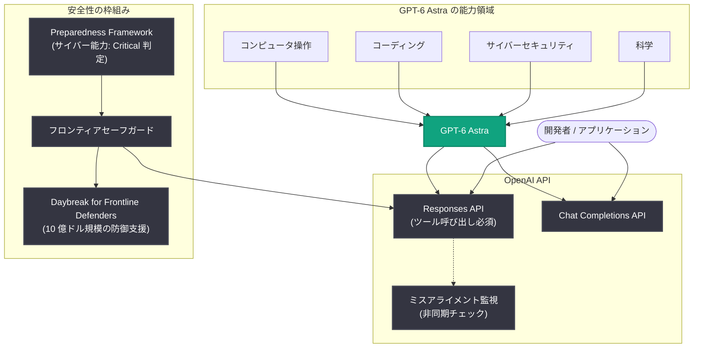

# GPT-6 Astra 発表: コンピュータ操作・コーディング・サイバーセキュリティ・科学で最先端の新世代モデル

## メタデータ

| 項目 | 内容 |
|------|------|
| 発表日 | 2026-09-03 |
| ソース | OpenAI News/Blog |
| カテゴリ | 新モデル発表 |
| 公式リンク | https://openai.com/index/gpt-6-astra |

> **注**: 本レポート作成時点で公式記事本文へのアクセスが制限されていたため (HTTP 403)、RSS 配信の公式説明文、OpenAI API Changelog (2026-09-03 のエントリを取得・確認済み)、および同時期の関連発表に関する検証済み情報に基づいて記述しています。記事本文にのみ含まれる詳細 (ベンチマークスコア、提供プラン、価格など) は本レポートでは扱いません。

## 概要

OpenAI は 2026 年 9 月 3 日、新世代モデル **GPT-6 Astra** を発表した。公式説明文 (RSS) によると、GPT-6 Astra は「これまでで最も知的でアラインされたモデル (our most intelligent and aligned model yet)」であり、**コンピュータ操作 (computer use)・コーディング・サイバーセキュリティ・科学**の各分野で最先端 (state-of-the-art) の能力を備えるとされている。

同日、GPT-6 Astra は Responses API と Chat Completions API で提供が開始された。API Changelog では「最も困難なエンドツーエンドの作業のために構築された、最も高性能なモデル」と説明されており、推論・コーディング・コンピュータ操作・調査 (リサーチ)・文書作成を組み合わせ、提供されたコンテキストとツールを使って複雑なタスクを最初の依頼から完成まで遂行できる。一方で、GPT-6 Astra は OpenAI の Preparedness Framework においてサイバーセキュリティ能力が初めて **Critical レベル**に達したモデルでもあり、発表はフロンティアセーフガードの強化や 10 億ドル規模の防御支援プログラムなど、安全性に関する一連の取り組みとセットで行われた。

## 主な内容

### 能力領域: 4 つの分野で最先端

公式説明文で挙げられている GPT-6 Astra の主要な能力領域は以下のとおり。

| 能力領域 | 概要 |
|---------|------|
| コンピュータ操作 (computer use) | 画面操作を通じたタスク遂行。API Changelog でも専用のコンピュータ操作ガイドが案内されている |
| コーディング | コード生成・修正。導入事例では手作業の修正 50% 削減が報告されている (後述) |
| サイバーセキュリティ | Preparedness Framework で初の Critical レベル到達と評価された分野 |
| 科学 | 科学分野での最先端能力 (詳細は公式記事を参照) |

API Changelog ではこれに加え、推論・調査 (リサーチ)・文書作成を含む複数の能力を組み合わせて、複雑なタスクをエンドツーエンドで完遂するモデルであることが強調されている。

### API での利用方法と制約

GPT-6 Astra は `v1/responses` と `v1/chat/completions` の両エンドポイントで利用できるが、既存モデルからの移行にあたっては以下の制約がある (API Changelog より)。

- 推論努力レベル `none` は非対応
- カスタムの `temperature`、`top_p`、`logprobs` は非対応
- **ツール呼び出しには Responses API が必須**。Chat Completions API でツールを使用している場合は移行ガイドに従う必要がある
- **ミスアライメント監視**: 対応する Responses API リクエストでは、エージェント作業中の潜在的な問題が非同期にチェックされ、安全アラートの発報やレビューのための会話停止が発生し得る

また、GPT-6 Astra での長時間実行タスクを制御するため、Responses API に以下の 3 つの新機能が同日追加された。

1. **非同期ツール呼び出し**: アプリケーション側がツールを実行している間もモデルが作業を継続し、結果が利用可能になり次第返却できる
2. **ターン途中のステアリング**: WebSocket 経由でレスポンス生成中に追加指示を送信し、修正や要件変更を実行中のモデルに反映できる
3. **会話途中での推論努力レベル変更**: キャッシュ済みプロンプトのプレフィックスを保持したまま、タスクの難易度に応じて推論努力レベルを上下できる

詳細は関連レポート「[GPT-6 Astra が API でリリース](./2026-09-03-gpt-6-astra-api-release.md)」を参照。

### 安全性: 初の Critical レベル到達とフロンティアセーフガード

GPT-6 Astra のリリースは、安全性に関する段階的な発表とともに行われた。

| 日付 | 発表内容 |
|------|---------|
| 2026-09-01 | 「Path to Astra: critical capabilities and frontier safeguards」公開。Astra が Preparedness Framework のサイバーセキュリティ分野で Critical 基準に達した初の OpenAI モデルであることと、フロンティアセーフガードの強化を発表 |
| 2026-09-03 | GPT-6 Astra を発表、Responses API と Chat Completions API でリリース |
| 2026-09-03 | 「Safety overview: GPT-6 Astra」公開。リリースに伴う安全対策の全体像を解説 |
| 2026-09-03 | 重要インフラ防御向けの 10 億ドル規模プログラム「Daybreak for Frontline Defenders」を発表 |

Preparedness Framework は、フロンティアモデルがもたらし得る深刻なリスクを能力レベルに応じて評価し、必要なセーフガードを義務付ける OpenAI の枠組みである。Critical レベルの能力を持つモデルのリリースには強力なセーフガードの整備が前提となり、API レベルではミスアライメント監視がその一環として組み込まれている。さらに、高度なサイバー能力の提供と並行して防御側の能力強化に投資する「Daybreak for Frontline Defenders」により、攻撃側と防御側のバランスを防御優位に保つ取り組みが同時に進められている。

### 初期導入事例

リリースと同日に、GPT-6 Astra の実務適用例が公開されている。

- **Legora (リーガルテック / 財務レビュー)**: GPT-6 Astra を活用して 41 件の文書を数分でレビューし、財務レビュー業務の性能を約 40% 向上させた
- **Playco (ゲーム開発)**: GPT-6 Astra で 3 つのゲームプロトタイプを構築し、従来モデル比で手作業の修正を 50% 削減した

いずれも、長時間・高精度が求められる専門業務や反復的な開発プロセスにおける GPT-6 Astra の実用性を示す事例である。

## 技術的な詳細

### コードサンプル

Responses API での GPT-6 Astra の基本的な呼び出し例 (モデル ID や詳細は公式の「Using GPT-6 Astra」ガイドを参照のこと)。

```python
from openai import OpenAI

client = OpenAI()

response = client.responses.create(
    model="gpt-6-astra",
    input="この財務諸表一式をレビューし、論点を整理したレポートを作成してください。",
    tools=[
        {
            "type": "function",
            "name": "fetch_document",
            "description": "文書 ID から文書本文を取得する",
            "parameters": {
                "type": "object",
                "properties": {"doc_id": {"type": "string"}},
                "required": ["doc_id"],
            },
        }
    ],
)
print(response.output_text)
```

## アーキテクチャ

GPT-6 Astra の能力領域、API 経由の提供、および安全性の枠組みの関係を示す。



## 開発者への影響

- **エンドツーエンドのエージェント型タスクへの適用**: 推論・コーディング・コンピュータ操作・調査・文書作成を組み合わせ、複雑なタスクを依頼から完成まで遂行できるため、これまで複数モデル・複数ステップで構成していたワークフローの簡素化が検討できる
- **Responses API への移行が実質的に必須**: ツール呼び出しには Responses API が必要であり、Chat Completions API でツールを使用している既存アプリケーションは移行対応が求められる
- **サンプリング系パラメータの見直し**: `temperature`、`top_p`、`logprobs` に依存した実装は GPT-6 Astra では動作しないため、設計の見直しが必要になる
- **長時間タスクの制御性向上**: 非同期ツール呼び出し・ターン途中ステアリング・推論努力レベルの動的変更により、長時間実行されるエージェントワークフローの設計自由度とコスト効率が向上する
- **安全機構を前提とした設計**: ミスアライメント監視による安全アラートや会話停止が発生し得るため、エージェントワークフローではこれらのハンドリングを組み込む必要がある
- **サイバーセキュリティ用途での留意**: Critical レベルと評価された能力領域であるため、セキュリティ関連のユースケースでは利用ポリシーと安全性概要の確認が推奨される。重要インフラの防御に携わる組織は「Daybreak for Frontline Defenders」による支援対象となる可能性がある

## 関連リンク

- [GPT-6 Astra: A new generation of intelligence (公式記事)](https://openai.com/index/gpt-6-astra)
- [OpenAI API Changelog](https://developers.openai.com/api/docs/changelog)
- [OpenAI News](https://openai.com/news)
- [OpenAI API リファレンス](https://platform.openai.com/docs/api-reference)
- 関連レポート: [GPT-6 Astra が API でリリース (2026-09-03)](./2026-09-03-gpt-6-astra-api-release.md)
- 関連レポート: [Path to Astra (2026-09-01)](./2026-09-01-path-to-astra.md)
- 関連レポート: [Safety overview: GPT-6 Astra (2026-09-03)](./2026-09-03-safety-overview-gpt-6-astra.md)
- 関連レポート: [Legora 導入事例 (2026-09-03)](./2026-09-03-legora-financial-statement-review-with-astra.md)
- 関連レポート: [Playco 導入事例 (2026-09-03)](./2026-09-03-playco-game-prototyping-with-astra.md)
- 関連レポート: [Daybreak for Frontline Defenders (2026-09-03)](./2026-09-03-daybreak-for-frontline-defenders.md)

## まとめ

GPT-6 Astra は、OpenAI が「最も知的でアラインされたモデル」と位置付ける新世代モデルであり、コンピュータ操作・コーディング・サイバーセキュリティ・科学の各分野で最先端の能力を備えるとされる。発表と同日に Responses API と Chat Completions API で提供が開始され、非同期ツール呼び出しやターン途中ステアリングなど長時間タスク向けの新機能もあわせて追加された。一方で、Preparedness Framework のサイバーセキュリティ分野で初めて Critical レベルに達したモデルであることから、フロンティアセーフガードの強化、ミスアライメント監視、10 億ドル規模の防御支援プログラムといった安全性の取り組みが発表全体を貫く特徴となっている。能力の提供と安全性・防御支援を一体で進める、OpenAI の新世代モデル展開の姿勢を象徴する発表と言える。
