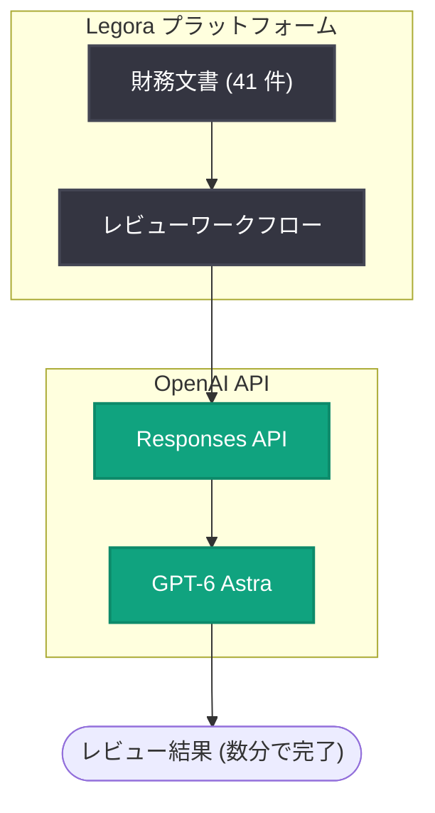

# Legora が GPT-6 Astra で 41 件の文書を数分でレビュー

## メタデータ

| 項目 | 内容 |
|------|------|
| 発表日 | 2026-09-03 |
| ソース | OpenAI News |
| カテゴリ | 導入事例 (リーガルテック / 財務レビュー) |
| 公式リンク | https://openai.com/index/legora-financial-statement-review-with-astra |

## 概要

リーガルテック企業の Legora が、OpenAI の最上位モデル GPT-6 Astra を活用し、41 件の文書を数分でレビューした導入事例が公開された。財務諸表レビュー業務において、性能を約 40% 向上させたと報告されている。

GPT-6 Astra は 2026 年 9 月 3 日に Responses API と Chat Completions API でリリースされた最上位モデルであり、推論・コーディング・コンピュータ操作・調査・文書作成に対応する。本事例は、リリースと同日に公開された実務適用例として、長時間かつ高精度が求められる専門文書レビューへの適用可能性を示すものである。

## 主な内容

### Legora による財務諸表レビューの効率化

Legora は GPT-6 Astra を用いて、41 件の文書レビューを数分で完了した。従来、財務諸表のレビューは専門家が多数の文書を突き合わせて確認する必要があり、多くの時間を要する業務である。本事例では、大量の文書を短時間で処理できることが示された。

### 約 40% の性能向上

財務レビュー業務において、GPT-6 Astra の導入により性能が約 40% 向上したと報告されている。

### GPT-6 Astra について

本事例で使用された GPT-6 Astra は、2026 年 9 月 3 日にリリースされた OpenAI の最上位モデルである。

- Responses API と Chat Completions API の両方で利用可能
- 推論、コーディング、コンピュータ操作、調査、文書作成に対応
- 本事例のような大量文書の分析・レビューといった長時間タスクへの適用が想定される

## アーキテクチャ

以下は、公開情報を基にした文書レビューワークフローの概念図である。

## 開発者への影響

- **専門業務への LLM 適用の実証**: 財務諸表レビューのような高い正確性が要求される専門業務でも、GPT-6 Astra が実務レベルで活用できることが示された
- **大量文書処理の高速化**: 41 件の文書を数分でレビューできることから、大量文書を扱うワークフローの設計において処理時間の大幅な短縮が期待できる
- **API 経由での利用**: GPT-6 Astra は Responses API と Chat Completions API で利用可能であり、既存のアプリケーションに組み込みやすい
- **定量的な効果測定の参考**: 約 40% の性能向上という数値は、同様のユースケースを検討する際のベンチマークとして参考になる

## 関連リンク

- [Legora reviewed 41 documents in minutes with GPT-6 Astra (OpenAI 公式)](https://openai.com/index/legora-financial-statement-review-with-astra)
- [OpenAI News](https://openai.com/news)
- [OpenAI 公式ドキュメント](https://platform.openai.com/docs)
- [OpenAI API リファレンス](https://platform.openai.com/docs/api-reference)

## まとめ

Legora が GPT-6 Astra を活用し、41 件の文書を数分でレビューし、財務レビュー業務の性能を約 40% 向上させた事例が公開された。2026 年 9 月 3 日にリリースされた最上位モデル GPT-6 Astra の実務適用例として、専門性の高い文書レビュー業務における LLM 活用の有効性を示すものである。

なお、本レポートは公式記事の詳細取得ができなかったため (HTTP 403)、公開されている概要情報に基づいて作成している。詳細は公式リンクを参照されたい。
