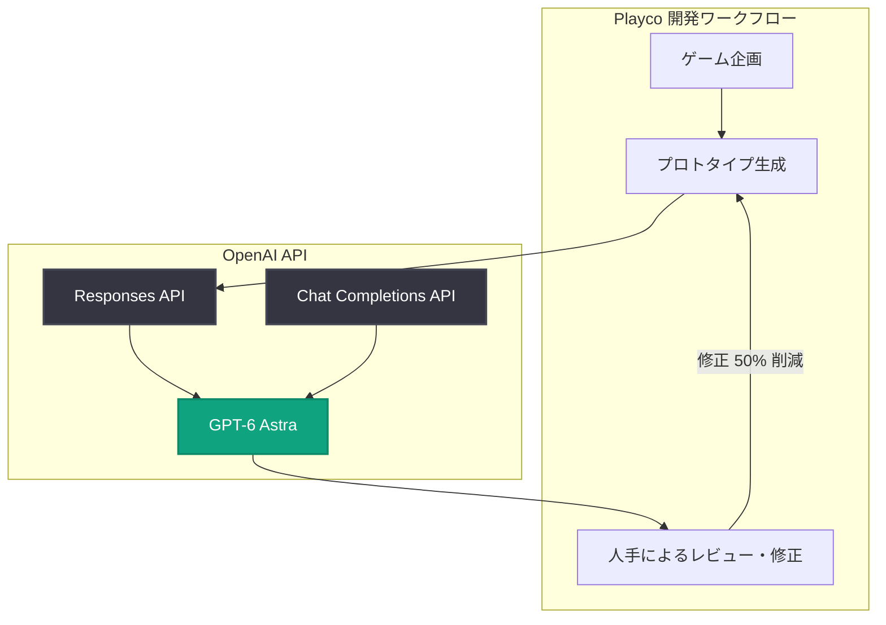

# Playco が GPT-6 Astra によるゲームプロトタイピングで手作業の修正を 50% 削減

## メタデータ

| 項目 | 内容 |
|------|------|
| 発表日 | 2026-09-03 |
| ソース | OpenAI News |
| カテゴリ | 導入事例 |
| 公式リンク | https://openai.com/index/playco-game-prototyping-with-astra |

## 概要

ゲーム開発企業の Playco が、OpenAI の最上位モデル GPT-6 Astra を活用して 3 つのゲームプロトタイプを構築し、従来モデルと比較して手作業での修正を 50% 削減した事例が公開された。GPT-6 Astra のコーディング能力を活かすことで、プロトタイピングの反復サイクルにおける人手の介入を大幅に減らしている。

GPT-6 Astra は 2026 年 9 月 3 日に Responses API と Chat Completions API でリリースされたモデルで、推論・コーディング・コンピュータ操作・調査・文書作成に対応する。本事例は、同モデルのリリースと同日に公開された活用例である。

注: 本レポート作成時点で記事本文の取得ができなかったため (HTTP 403)、公開されている概要と関連コンテキストに基づいて記述している。詳細は公式リンクを参照のこと。

## 主な内容

### Playco による活用

- Playco は GPT-6 Astra を用いて 3 つのゲームプロトタイプを構築した
- 生成されたコードに対する手作業での修正が、従来モデル比で半減 (50% 削減) した
- ゲームプロトタイピングという反復の多い開発プロセスで、モデルのコーディング精度向上が直接的な工数削減につながった事例である

### GPT-6 Astra について

- 2026 年 9 月 3 日にリリースされた OpenAI の最上位モデル
- Responses API と Chat Completions API の両方で利用可能
- 推論・コーディング・コンピュータ操作・調査・文書作成に対応

## 技術的な詳細

GPT-6 Astra は Responses API と Chat Completions API から利用できる。以下は Responses API を使用した呼び出し例である (モデル ID は公式ドキュメントで確認のこと)。

### コードサンプル

```python
from openai import OpenAI

client = OpenAI()

response = client.responses.create(
    model="gpt-6-astra",
    input="2D パズルゲームのプロトタイプ用に、盤面生成ロジックを実装してください。",
)
print(response.output_text)
```

## アーキテクチャ



## 開発者への影響

- ゲーム開発をはじめとする反復的なプロトタイピング業務で、GPT-6 Astra のコーディング能力により手作業での修正コストを削減できる可能性がある
- Responses API と Chat Completions API の両方で利用できるため、既存の API 統合からの移行がしやすい
- 推論・コンピュータ操作・調査など複数の能力を備えたモデルであり、コード生成にとどまらない開発ワークフローの自動化が検討できる

## 関連リンク

- [Playco 事例 (OpenAI 公式)](https://openai.com/index/playco-game-prototyping-with-astra)
- [OpenAI 公式ドキュメント](https://platform.openai.com/docs)
- [OpenAI API リファレンス](https://platform.openai.com/docs/api-reference)
- [OpenAI News](https://openai.com/news)

## まとめ

Playco は GPT-6 Astra を活用して 3 つのゲームプロトタイプを構築し、従来モデル比で手作業の修正を 50% 削減した。GPT-6 Astra はリリース当日から実務での効果が示された形であり、プロトタイピングのような反復の多い開発プロセスにおける最新モデルの実用性を示す事例である。
