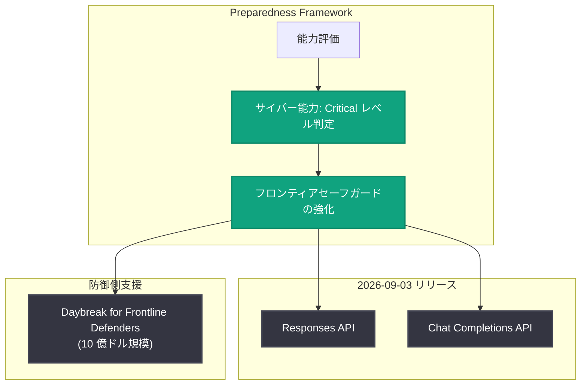

# GPT-6 Astra の安全性概要: Preparedness Framework で初の Critical レベル到達モデル

## メタデータ

| 項目 | 内容 |
|------|------|
| 発表日 | 2026-09-03 |
| ソース | OpenAI News |
| カテゴリ | 安全性 / 新機能 |
| 公式リンク | https://openai.com/index/safety-overview-gpt-6-astra |

## 概要

OpenAI は 2026 年 9 月 3 日、新モデル GPT-6 Astra の安全性概要 (Safety overview) を公開した。GPT-6 Astra は、OpenAI の Preparedness Framework においてサイバーセキュリティ能力が初めて Critical レベルに達したモデルであり、本記事ではそのリリースに伴う安全対策の全体像が解説されている。

本発表に先立ち、2026 年 9 月 1 日には「Path to Astra: critical capabilities and frontier safeguards」が公開され、Astra が Critical なサイバー能力基準に達した初の OpenAI モデルであること、およびリリースに向けて安全策を強化したことが発表されていた。GPT-6 Astra は安全性概要の公開と同日の 2026 年 9 月 3 日に、Responses API と Chat Completions API を通じて提供が開始された。

## 主な内容

### Preparedness Framework における Critical レベル到達

Preparedness Framework は、フロンティアモデルがもたらし得る深刻なリスク (サイバーセキュリティ、生物・化学、自己改善など) を追跡・評価し、能力レベルに応じた安全策を義務付ける OpenAI の枠組みである。GPT-6 Astra は、この枠組みにおいてサイバーセキュリティ能力が初めて Critical レベルに達したと評価された OpenAI モデルである。

Critical レベルの能力を持つモデルのリリースには、対応する強力なセーフガードの整備が前提となる。2026 年 9 月 1 日公開の「Path to Astra」では、リリースに向けてフロンティアセーフガードを強化したことが説明されており、本安全性概要はその詳細を包括的にまとめたものと位置付けられる。

### API を通じた提供開始

GPT-6 Astra は 2026 年 9 月 3 日に以下の API でリリースされた。

- Responses API
- Chat Completions API

Critical レベルのサイバー能力を持つモデルを API 経由で提供するにあたり、安全性概要では悪用防止のための対策が解説されている。

### 重要インフラ防御プログラム「Daybreak for Frontline Defenders」

同日、重要インフラの防御を支援する 10 億ドル規模のプログラム「Daybreak for Frontline Defenders」も発表された。高度なサイバー能力を持つモデルの提供と並行して、防御側 (重要インフラの防御担当者) の能力強化に投資することで、攻撃側と防御側のバランスを防御優位に保つ狙いがあるとみられる。

## リリースまでの流れ

## 発表のタイムライン

| 日付 | 発表内容 |
|------|---------|
| 2026-09-01 | 「Path to Astra: critical capabilities and frontier safeguards」公開。Astra が Critical なサイバー能力基準に達した初の OpenAI モデルであることと、安全策の強化を発表 |
| 2026-09-03 | GPT-6 Astra を Responses API と Chat Completions API でリリース |
| 2026-09-03 | GPT-6 Astra の安全性概要 (本記事) を公開 |
| 2026-09-03 | 重要インフラ防御向けの 10 億ドル規模プログラム「Daybreak for Frontline Defenders」を発表 |

## 開発者への影響

- **高度なサイバー能力を持つモデルの利用**: GPT-6 Astra は Responses API と Chat Completions API から利用可能となり、開発者は Critical レベルと評価された高度な能力を持つモデルをアプリケーションに組み込めるようになった。
- **安全策による利用条件への留意**: Critical レベルのモデルには強化されたセーフガードが適用されるため、特にサイバーセキュリティ関連のユースケースでは、利用ポリシーや安全策の内容を安全性概要で確認することが推奨される。
- **防御用途への支援機会**: 重要インフラの防御に携わる組織は、「Daybreak for Frontline Defenders」プログラムによる支援の対象となる可能性がある。

なお、本レポートは公式記事本文の取得ができなかったため、発表時の概要および関連発表のコンテキストに基づいて作成している。安全策の具体的な内容や評価手法の詳細は、公式の安全性概要を直接参照されたい。

## 関連リンク

- [Safety overview: GPT-6 Astra (公式)](https://openai.com/index/safety-overview-gpt-6-astra)
- [OpenAI News](https://openai.com/news)
- [OpenAI 公式ドキュメント](https://platform.openai.com/docs)
- [OpenAI API リファレンス](https://platform.openai.com/docs/api-reference)

## まとめ

GPT-6 Astra は、OpenAI の Preparedness Framework でサイバーセキュリティ能力が初めて Critical レベルに達したモデルであり、その安全性概要が 2026 年 9 月 3 日に公開された。リリースに先立つ「Path to Astra」でのセーフガード強化の発表、Responses API と Chat Completions API での提供開始、そして 10 億ドル規模の防御支援プログラム「Daybreak for Frontline Defenders」の発表という一連の取り組みは、高度な能力の提供と安全性・防御支援を一体で進める OpenAI の姿勢を示している。
