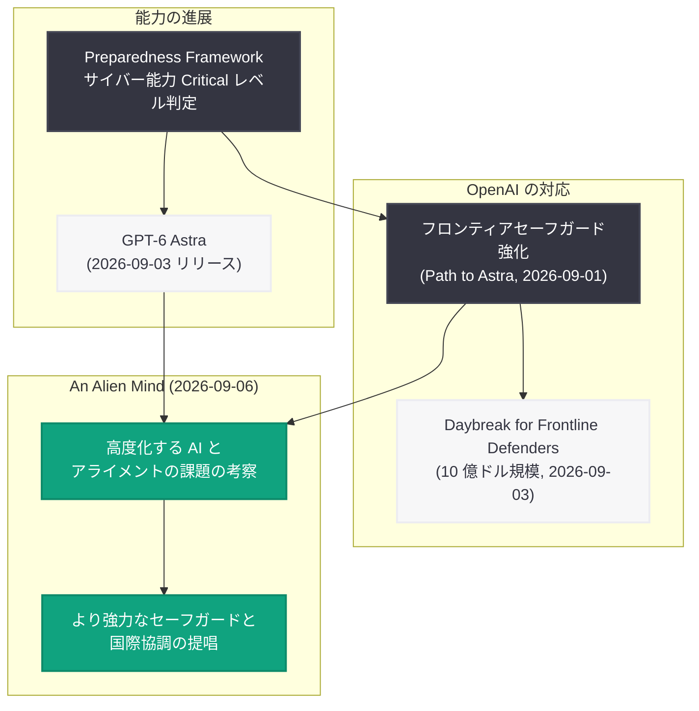

# An Alien Mind: Chief Scientist Pachocki が語る高度化する AI とアライメントの課題

## メタデータ

| 項目 | 内容 |
|------|------|
| 発表日 | 2026-09-06 |
| ソース | OpenAI News (Safety) |
| カテゴリ | 研究 / 安全性 |
| 公式リンク | https://openai.com/index/an-alien-mind |

> **注意**: 本レポート作成時点で記事本文の取得に失敗した (HTTP 403 Forbidden)。内容は OpenAI News の RSS フィードで配信された概要、および OpenAI が直近に公開した関連発表のコンテキストに基づいて作成している。エッセイ本文の具体的な論旨や表現については、必ず公式リンクを直接参照されたい。

## 概要

OpenAI は 2026 年 9 月 6 日、Chief Scientist (チーフサイエンティスト) の Jakub Pachocki 氏によるエッセイ「An Alien Mind」を公開した。RSS フィードの概要によると、本エッセイは「ますます高度化する AI と、それをアライン (人間の意図と整合) させ続けることの難しさ」についての考察であり、より強力なセーフガード (安全策) の整備と国際協調を提唱する内容である。カテゴリは Safety に分類されている。

本エッセイは、OpenAI が 2026 年 9 月上旬に相次いで発表した一連の安全性関連の取り組み、すなわち Preparedness Framework で初めてサイバーセキュリティ能力が Critical レベルに達したモデル GPT-6 Astra のリリース (9 月 3 日) と、その前提となるフロンティアセーフガード強化 (9 月 1 日「Path to Astra」)、重要インフラ防御プログラム「Daybreak for Frontline Defenders」(9 月 3 日) の直後に公開されたものであり、フロンティア AI の能力が質的に新しい段階へ入ったことを受けた、同社の科学部門トップによる包括的な問題提起と位置付けられる。

## 主な内容

### RSS フィードから確認できる事実

- **著者**: Jakub Pachocki 氏 (OpenAI Chief Scientist)
- **公開日時**: 2026 年 9 月 6 日 09:00 GMT
- **カテゴリ**: Safety
- **主題**: 高度化を続ける AI と、それをアラインし続けるという課題についての考察 ("Jakub Pachocki reflects on increasingly capable AI and the challenge of keeping it aligned.")
- **提唱内容**: より強力なセーフガードの整備と国際協調

### タイトル「An Alien Mind」が示唆するもの

タイトルの「An Alien Mind (異質な知性)」は、フロンティア AI が人間とは異なる原理で動作する知性であることを踏まえた表現と考えられる。人間と同じ思考様式を前提にできない知性に対して、その目標や振る舞いを人間の意図と整合させ続けること (アライメント) がいかに難しい課題であるか、というエッセイの主題 (RSS 概要より) と呼応するタイトルである。ただし、本文中でこの語がどのように定義・展開されているかは未取得のため、本レポートでは扱わない。

### 公開の文脈: 2026 年 9 月の一連の安全性関連発表

本エッセイの公開直前、OpenAI は安全性に関わる重要な発表を連続して行っている。

| 日付 | 発表内容 |
|------|---------|
| 2026-09-01 | 「Path to Astra: critical capabilities and frontier safeguards」公開。Astra が Preparedness Framework のサイバーセキュリティ分野で Critical 基準に達した初の OpenAI モデルであることと、セーフガードの強化を発表 |
| 2026-09-03 | GPT-6 Astra を Responses API と Chat Completions API でリリース。「Safety overview: GPT-6 Astra」を同時公開 |
| 2026-09-03 | 重要インフラ防御向けの 10 億ドル規模プログラム「Daybreak for Frontline Defenders」を発表 |
| 2026-09-06 | Pachocki 氏のエッセイ「An Alien Mind」公開 (本記事) |

Preparedness Framework で Critical レベルと評価される能力を持つモデルの登場は、単一企業の内部プロセスだけでリスクを管理する段階から、業界横断・国家間の協調が求められる段階への移行を意味する。エッセイが「より強力なセーフガードと国際協調」を提唱している (RSS 概要より) のは、まさにこの文脈においてであると考えられる。

### 未確認の事項

以下は本文を取得できていないため、推測による補完を避け、本レポートでは記載しない。

- アライメントの課題に関する具体的な技術的議論 (何が難しいのか、現行手法の限界など)
- 提唱されているセーフガードの具体像
- 国際協調の具体的な枠組みや提案内容
- GPT-6 Astra や将来モデルへの直接的な言及の有無

## エッセイの位置付け (文脈図)

## 開発者・業界への影響

本エッセイは新機能や API 変更の発表ではないため、開発者への直接的・即時的な影響はない。一方で、OpenAI の科学部門トップが安全性とアライメントに関する見解を公に示すことには、以下のような中長期的な意味がある。

- **安全ポリシーの方向性のシグナル**: Chief Scientist がセーフガード強化を提唱していることは、今後のモデルリリースにおいて能力評価とセーフガードの連動 (Preparedness Framework の運用) が一層厳格化される可能性を示唆する。フロンティアモデルを利用する開発者は、利用ポリシーや安全要件の変化を継続的に確認することが望ましい
- **国際協調・規制議論への波及**: フロンティア AI 企業の幹部による国際協調の呼びかけは、各国政府や国際機関における AI ガバナンス議論の材料となり得る。AI を組み込んだ製品・サービスを国際展開する事業者は、規制動向への影響を注視する必要がある
- **アライメント研究への注目**: 高度化する AI のアライメントが未解決の課題として第一線の研究者から改めて提起されたことは、アライメント・安全性研究分野への投資と人材流入を促す要因となり得る

## 関連リンク

- [An Alien Mind (公式記事)](https://openai.com/index/an-alien-mind)
- [OpenAI Safety](https://openai.com/safety/)
- [OpenAI Preparedness](https://openai.com/preparedness/)
- [関連レポート: Path to Astra (2026-09-01)](2026-09-01-path-to-astra.md)
- [関連レポート: Safety overview: GPT-6 Astra (2026-09-03)](2026-09-03-safety-overview-gpt-6-astra.md)
- [関連レポート: Daybreak for Frontline Defenders (2026-09-03)](2026-09-03-daybreak-for-frontline-defenders.md)
- [OpenAI News](https://openai.com/news)
- [OpenAI 公式ドキュメント](https://platform.openai.com/docs)

## まとめ

- OpenAI Chief Scientist の Jakub Pachocki 氏が、高度化する AI とアライメントの課題を考察するエッセイ「An Alien Mind」を 2026 年 9 月 6 日に公開した
- RSS 概要によると、エッセイはより強力なセーフガードの整備と国際協調を提唱している
- 公開は、GPT-6 Astra のサイバー能力が Preparedness Framework で初の Critical レベルと判定され、セーフガード強化と防御支援プログラムが相次いで発表された直後であり、フロンティア AI の新段階を踏まえた問題提起と位置付けられる
- 記事本文は取得できなかったため (HTTP 403)、本レポートはフィード情報と関連発表の文脈に基づく。論旨の詳細は公式記事での確認が必要
