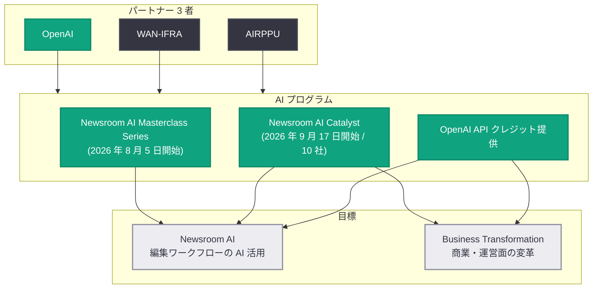

# ウクライナの独立ジャーナリズム支援: OpenAI・AIRPPU・WAN-IFRA が AI プログラムを開始

## メタデータ

| 項目 | 内容 |
|------|------|
| 発表日 | 2026-09-07 |
| ソース | OpenAI News |
| カテゴリ | Global Affairs |
| 公式リンク | https://openai.com/index/supporting-independent-journalism-in-ukraine |

## 概要

OpenAI、WAN-IFRA (世界ニュース発行者協会)、AIRPPU (ウクライナ独立地域新聞発行者協会) の 3 者は 2026 年 9 月 7 日、ウクライナの報道機関を支援する新たな AI プログラムの開始を発表した。継続する戦争と社会的混乱の中で、AI の活用によって独立ジャーナリズムの持続可能性・効率性・レジリエンス (回復力) を強化することを目的としている。

プログラムは「Newsroom AI Masterclass Series」と「Newsroom AI Catalyst」の 2 つの主要コンポーネントで構成され、参加する全組織には OpenAI の API クレジットが提供される。Masterclass Series は 2026 年 8 月 5 日にすでに開始されており、Catalyst は 2026 年 9 月 17 日に開始予定である。

## 主な内容

### プログラムの 2 つの柱

本イニシアチブは以下の 2 つの領域で報道機関の変革を支援する。

1. **Newsroom AI**: AIRPPU が選出した報道機関による、AI を活用したニュースルーム・プロジェクトの開発と実装を支援
2. **Business Transformation**: AI による商業面・運営面の変革プロジェクトを支援

### Newsroom AI Masterclass Series

WAN-IFRA と OpenAI がこれまで世界各地で実施してきた成功事例を土台としたマスタークラスシリーズ。国際的な専門家や実務家が、実践的知識、ケーススタディ、実装戦略を共有する。主なテーマは以下のとおり。

- 編集ワークフローの改善
- オーディエンス・エンゲージメント
- プロダクト開発
- 収益創出
- 組織変革
- 責任ある AI 導入

Masterclass Series は 2026 年 8 月 5 日に開始済みである。

### Newsroom AI Catalyst

ウクライナの報道機関 10 社を対象に、より深いハンズオン支援を提供するアクセラレーター型プログラム。以下の支援を行う。

- 影響度の高いユースケースの特定
- 実装ロードマップの策定
- AI ソリューションの試験導入 (パイロット)

Catalyst は 2026 年 9 月 17 日に開始予定である。

### API クレジットの提供

参加する全組織に OpenAI の API クレジットが提供され、各報道機関が独自のニュースルーム向け AI ソリューションを開発できるよう支援する。

## プログラム構成

## 関係者のコメント

- **Oksana Brovko 氏 (AIRPPU CEO)**: 戦争、経済的圧力、日常生活の混乱が独立メディアに前例のない課題をもたらしていると指摘。AI は編集ワークフローの強化と効率化に大きく貢献でき、「ジャーナリストがジャーナリズムに取り組む時間を取り戻すべきだ」と強調した。
- **Stig Ørskov 氏 (WAN-IFRA CEO)**: 2022 年の全面侵攻以来、ウクライナメディア支援は WAN-IFRA の中核的コミットメントであると表明。戦時下の独立ジャーナリズムは公共の記録を守り、ウクライナの物語をウクライナ人自身が語ることを保証すると述べた。OpenAI とは 2024 年から協力関係にある。
- **Tom Rubin 氏 (OpenAI 知的財産・コンテンツ責任者)**: 戦争・危機・不確実性の時代における独立ジャーナリズムの重要性を強調し、ウクライナの独立ジャーナリズムの「より強く、より持続可能な未来」への貢献を目指すと表明した。

## 背景

- 本プログラムは、WAN-IFRA がグローバルに展開してきた AI 導入支援活動 (リーダーシップ・プログラム、業界調査、ピアラーニングなど) と、OpenAI の世界中の報道機関との継続的パートナーシップを基盤としている。
- **AIRPPU** はウクライナ最大の独立系地域・ローカル報道機関ネットワークであり、能力開発、緊急支援、イノベーション、国際連携を通じてメディアの持続可能性と報道の自由を支援している。
- **WAN-IFRA** は世界ニュース発行者協会であり、信頼されるジャーナリズムのビジネス強化と報道の自由の擁護を使命としている。

## 影響

- **ウクライナの報道機関**: 戦時下の限られたリソースの中で、AI による編集ワークフローの効率化と新たな収益モデルの構築が可能になる。特に Catalyst 対象の 10 社は具体的な AI ソリューションの実装まで伴走支援を受けられる。
- **報道業界全体**: OpenAI と WAN-IFRA が各地で実施してきた Newsroom AI プログラムの枠組みが、紛争地域の独立メディア支援にも適用された事例となり、他地域への展開モデルとなり得る。
- **開発者・技術者**: 参加組織への API クレジット提供により、ニュースルーム特化型の AI アプリケーション (記事要約、翻訳、オーディエンス分析など) の開発事例が増えることが期待される。

## 関連リンク

- [OpenAI 公式発表: Supporting independent journalism in Ukraine](https://openai.com/index/supporting-independent-journalism-in-ukraine)
- [WAN-IFRA プレスリリース](https://wan-ifra.org/2026/09/airppu-partners-with-openai-and-wan-ifra-to-strengthen-ukrainian-media-with-new-ai-programme/)
- [WAN-IFRA Newsroom AI Catalyst](https://wan-ifra.org/ai-accelerator/)
- [OpenAI News](https://openai.com/news)

## まとめ

OpenAI、WAN-IFRA、AIRPPU の 3 者によるウクライナ独立ジャーナリズム支援プログラムは、Masterclass Series (2026 年 8 月 5 日開始) と Catalyst (2026 年 9 月 17 日開始、10 社対象) の 2 本立てで、API クレジット提供も含む包括的な支援体制を構築するものである。戦時下の報道機関が AI を活用して持続可能性とレジリエンスを高めるための実践的な枠組みであり、「ジャーナリストがジャーナリズムに集中できる時間を取り戻す」ことを目指す点が特徴である。
