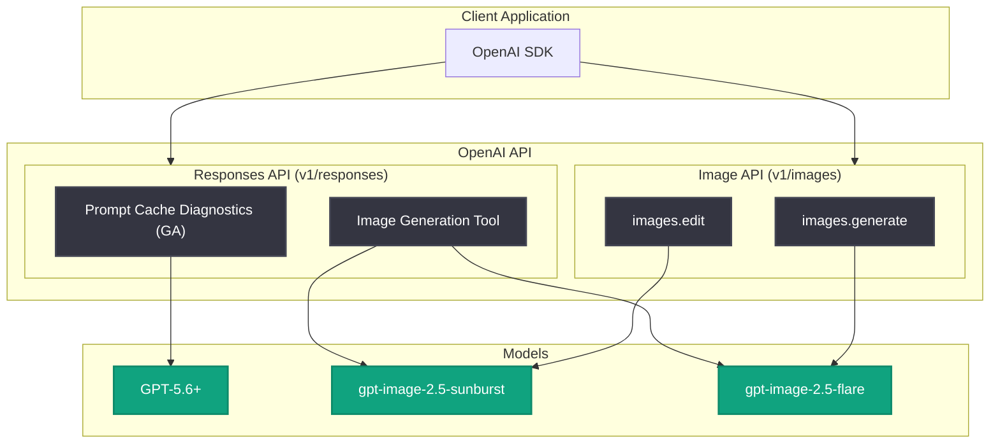

# API アップデート: Prompt Cache Diagnostics GA 化と GPT Image 2.5 モデルリリース

## メタデータ

| 項目 | 内容 |
|------|------|
| 発表日 | 2026-09-08 |
| ソース | OpenAI API Changelog |
| カテゴリ | API 更新 |
| 公式リンク | https://platform.openai.com/docs/changelog |

## 概要

2026 年 9 月 8 日、OpenAI は API Changelog にて 2 つのアップデートを発表した。1 つ目は Responses API における Prompt Cache Diagnostics の一般提供 (GA) 開始である。GPT-5.6 以降のサポート対象モデルで利用でき、過去のレスポンスとのキャッシュ再利用状況の比較、キャッシュミスの原因特定、トラブルシューティングガイダンスの参照が可能になった。

2 つ目は画像生成モデル GPT Image 2.5 Sunburst と GPT Image 2.5 Flare のリリースである。両モデルは Image API および Responses API の画像生成ツール経由で利用でき、新しい `xhigh` と `max` の品質設定に対応する。料金は GPT Image 2 と同じトークンレートが適用される。

## 主な内容

### Prompt Cache Diagnostics の GA 化

Responses API で Prompt Cache Diagnostics が一般提供 (GA) となった。対応モデルは GPT-5.6 以降のサポート対象モデルである。

公式 Changelog では、この機能について次のように説明されている。

> Compare cache reuse against a previous response, identify reasons for cache misses, and follow troubleshooting guidance

主なポイントは以下のとおり。

- **キャッシュ再利用の比較**: 過去のレスポンスと比較して、プロンプトキャッシュがどの程度再利用されたかを確認できる
- **キャッシュミスの原因特定**: キャッシュヒットしなかった理由 (プロンプト先頭部分の変更など) を診断情報として取得できる
- **トラブルシューティングガイダンス**: 診断結果に基づく改善ガイダンスに従うことで、キャッシュ再利用率を高めコストとレイテンシを削減できる

プロンプトキャッシュはプロンプトの共通プレフィックスを再利用することで入力トークンのコストとレイテンシを削減する仕組みだが、これまではキャッシュミスが発生した際にその原因を特定する手段が限られていた。GA 化により、本番環境でも安心して診断機能を活用できるようになった。

### GPT Image 2.5 Sunburst / GPT Image 2.5 Flare のリリース

画像生成・編集向けの新モデル 2 種がリリースされた。

| モデル | 特徴 | 主な用途 |
|--------|------|----------|
| `gpt-image-2.5-sunburst` | 編集精度を最重視 | 精密な画像編集ワークフロー |
| `gpt-image-2.5-flare` | 高速かつ高品質 | 日常的な画像生成 |

公式 Changelog では使い分けについて次のように説明されている。

> Use Sunburst for workflows where editing precision matters most, or Flare for fast, high-quality everyday image generation

- **利用可能な API**: Image API (`v1/images`) および Responses API (`v1/responses`) の画像生成ツール
- **品質設定**: 両モデルとも新しい `xhigh` と `max` の品質設定に対応
- **料金**: GPT Image 2 と同じトークンレートを使用

## 技術的な詳細

### Prompt Cache Diagnostics の利用イメージ

Responses API のレスポンスに含まれるキャッシュ関連情報を参照し、過去のレスポンスと比較してキャッシュミスの原因を診断する。

```python
from openai import OpenAI

client = OpenAI()

# 1 回目のリクエスト (キャッシュのベースライン)
first = client.responses.create(
    model="gpt-5.6",
    input=[
        {"role": "developer", "content": LONG_SYSTEM_PROMPT},
        {"role": "user", "content": "ユーザーからの質問 1"},
    ],
)

# 2 回目のリクエスト (キャッシュ再利用を期待)
second = client.responses.create(
    model="gpt-5.6",
    input=[
        {"role": "developer", "content": LONG_SYSTEM_PROMPT},
        {"role": "user", "content": "ユーザーからの質問 2"},
    ],
)

# キャッシュ利用状況の確認
print(second.usage.input_tokens_details.cached_tokens)
```

キャッシュヒット率が低い場合は、診断情報をもとにプロンプト構成 (静的な部分を先頭に、動的な部分を末尾に配置するなど) を見直すことで再利用率を改善できる。

### GPT Image 2.5 の利用例

```python
from openai import OpenAI

client = OpenAI()

# Flare: 高速な日常用途の画像生成
result = client.images.generate(
    model="gpt-image-2.5-flare",
    prompt="夕焼けの富士山と桜の風景",
    quality="xhigh",  # 新しい品質設定: xhigh / max
)

# Sunburst: 編集精度が重要なワークフロー
edited = client.images.edit(
    model="gpt-image-2.5-sunburst",
    image=open("input.png", "rb"),
    prompt="背景を星空に変更し、被写体はそのまま維持する",
    quality="max",
)
```

Responses API の画像生成ツール経由でも利用できる。

```python
response = client.responses.create(
    model="gpt-5.6",
    input="製品ロゴのコンセプト画像を生成してください",
    tools=[{"type": "image_generation", "model": "gpt-image-2.5-flare"}],
)
```

## アーキテクチャ



## 開発者への影響

- **コスト最適化の可視化**: Prompt Cache Diagnostics により、キャッシュミスの原因をデータに基づいて特定できるようになり、プロンプト設計の改善サイクルを回しやすくなった
- **本番環境での利用**: GA 化により、本番ワークロードでも診断機能を安定して利用できる
- **画像生成の選択肢拡大**: 編集精度重視の Sunburst と速度重視の Flare をユースケースに応じて使い分けられる
- **品質の柔軟な制御**: 新しい `xhigh` / `max` 品質設定により、用途に応じた品質とコストのバランス調整が可能になった
- **移行コストの低さ**: 料金は GPT Image 2 と同じトークンレートのため、既存の画像生成ワークフローからモデル名の変更だけで移行しやすい

## 関連リンク

- [OpenAI API Changelog](https://platform.openai.com/docs/changelog)
- [OpenAI API リファレンス](https://platform.openai.com/docs/api-reference)
- [プロンプトキャッシュガイド](https://platform.openai.com/docs/guides/prompt-caching)
- [画像生成ガイド](https://platform.openai.com/docs/guides/image-generation)
- [料金ページ (画像生成)](https://platform.openai.com/docs/pricing#image-generation)

## まとめ

2026 年 9 月 8 日の API アップデートでは、Responses API の Prompt Cache Diagnostics が GA 化され (GPT-5.6 以降対応)、キャッシュミスの原因特定と再利用改善が本番環境で可能になった。また、画像生成モデル GPT Image 2.5 Sunburst (編集精度重視) と GPT Image 2.5 Flare (高速・高品質) がリリースされ、新しい `xhigh` / `max` 品質設定に対応した。料金は GPT Image 2 と同一のため、既存ワークフローからの移行障壁は低い。コスト最適化と画像生成品質の両面で、開発者にとって実用性の高いアップデートである。
