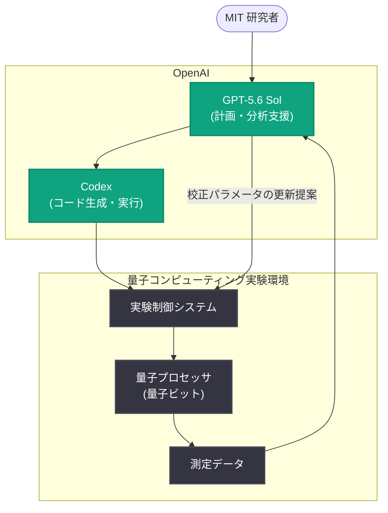

# GPT-5.6 Sol が量子コンピューティング実験の実行を支援

## メタデータ

| 項目 | 内容 |
|------|------|
| 発表日 | 2026-09-08 |
| ソース | OpenAI News |
| カテゴリ | 導入事例 / 研究 |
| 公式リンク | https://openai.com/index/codex-quantum-computing-experiments |

> **注記**: 本レポート作成時点で記事本文の取得ができなかったため (HTTP 403)、公開されている概要情報をもとに構成しています。詳細は公式リンクをご確認ください。

## 概要

MIT の研究者が、OpenAI の GPT-5.6 Sol と Codex を活用して量子コンピューティング実験を支援する事例が紹介された。この取り組みでは、量子実験の自律実行、測定結果の分析、量子ビット (qubit) の校正といった、従来は研究者が多くの時間を費やしてきた作業に AI エージェントを適用している。

量子コンピューティングの研究では、実験装置の制御コードの作成、パラメータの調整、ノイズの多い測定データの解釈など、反復的かつ専門性の高い作業が大量に発生する。GPT-5.6 Sol と Codex をワークフローに組み込むことで、研究者はこれらの作業の一部を AI に委ね、研究の設計や考察といった本質的な活動に集中できるようになる。

## 主な内容

### 量子実験の自律実行

Codex を用いて実験制御コードを生成・実行し、実験のワークフローを自動化する。実験パラメータの掃引 (スイープ) や測定シーケンスの実行など、定型的だが正確さが求められる工程を AI エージェントが担うことで、実験のスループット向上が期待できる。

### 測定結果の分析

GPT-5.6 Sol が測定データの解析を支援する。量子実験の測定結果はノイズを含むことが多く、フィッティングや統計処理、異常値の検出といった分析作業が必要になる。モデルが解析コードの作成やデータの解釈を補助することで、結果の評価サイクルを短縮できる。

### 量子ビットの校正

量子コンピュータの安定した動作には、量子ビットの周波数やゲート操作のパラメータを定期的に校正する作業が不可欠である。校正は多数のステップからなる反復作業であり、装置の状態変化に応じた再調整も頻繁に発生する。AI エージェントがこの校正プロセスを支援することで、装置の稼働率と実験の再現性の向上が見込まれる。

## 技術的な詳細

本事例は、汎用の大規模言語モデル (GPT-5.6 Sol) とコーディングエージェント (Codex) を科学実験のループに組み込む「AI for Science」の応用例と位置づけられる。一般的な構成としては、以下のような役割分担が考えられる。

- **GPT-5.6 Sol**: 実験計画の解釈、解析方針の提案、結果の要約・考察の支援
- **Codex**: 実験制御・データ解析コードの生成、実行、デバッグ
- **実験装置側**: 量子プロセッサの制御系と測定系が API やスクリプト経由で操作される

## アーキテクチャ

## 開発者・研究者への影響

- **実験の自動化**: 実験制御や校正といった反復作業を AI エージェントに委任でき、研究者は実験設計や考察に集中できる
- **解析サイクルの短縮**: 測定データの解析コード作成や結果の解釈を AI が補助することで、仮説検証のサイクルが速くなる
- **専門分野への AI 応用の指針**: 量子コンピューティングのような高度に専門的な領域でも、汎用モデルとコーディングエージェントの組み合わせが実用段階にあることを示す事例となる
- **再現性の向上**: 実験手順がコードとして明示的に管理されることで、実験の再現性や記録性の向上が期待できる

## 関連リンク

- [公式記事: How GPT-5.6 Sol helps run quantum computing experiments](https://openai.com/index/codex-quantum-computing-experiments)
- [OpenAI News](https://openai.com/news)
- [OpenAI Codex](https://openai.com/codex/)
- [OpenAI Research](https://openai.com/research)

## まとめ

MIT の研究者による本事例は、GPT-5.6 Sol と Codex を量子コンピューティング実験のワークフローに組み込み、実験の自律実行、結果分析、量子ビット校正を支援するものである。反復的で専門性の高い実験作業を AI エージェントが担うことで、研究のスループットと再現性の向上が期待される。汎用 AI モデルが最先端の科学研究の現場で実用的に活用され始めていることを示す、「AI for Science」の代表的な導入事例といえる。
