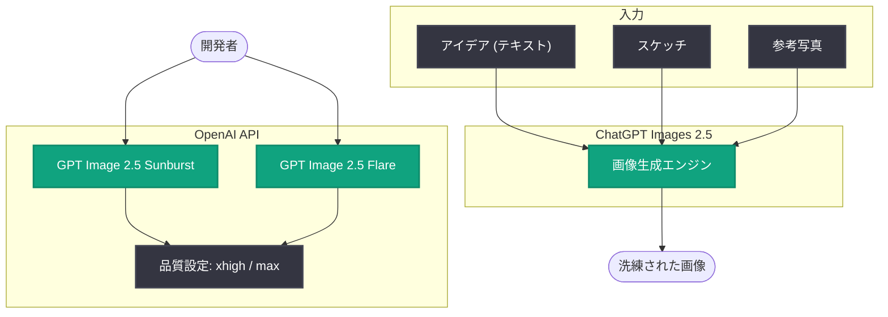

# ChatGPT Images 2.5 の発表: アイデアやスケッチをより洗練された画像へ

## メタデータ

| 項目 | 内容 |
|------|------|
| 発表日 | 2026-09-08 |
| ソース | OpenAI News |
| カテゴリ | 新機能 |
| 公式リンク | https://openai.com/index/introducing-chatgpt-images-2-5 |

## 概要

OpenAI は 2026 年 9 月 8 日、ChatGPT の新しい画像生成機能「ChatGPT Images 2.5」を発表した。この機能は、ユーザーのアイデアやスケッチ、参考写真を、より個人に合った洗練された画像に変換することを目的としている。テキストによる指示だけでなく、手描きのラフや既存の写真といった視覚的なインプットを起点に、意図を汲み取った高品質な画像を生成できる点が特徴である。

同日、API 側でも画像生成モデル **GPT Image 2.5 Sunburst** と **GPT Image 2.5 Flare** がリリースされ、新しい **xhigh / max** 品質設定に対応した (API Changelog 2026-09-08 より)。ChatGPT のコンシューマー向け体験と開発者向け API の両面で、画像生成機能が同時に強化された形となる。

## 主な内容

### ChatGPT Images 2.5 の特徴

発表内容によると、ChatGPT Images 2.5 は以下の入力を画像生成の起点として活用できる。

- **アイデア (テキスト)**: 自然言語による指示から画像を生成
- **スケッチ**: 手描きのラフや下書きを、洗練された完成イメージへ変換
- **参考写真**: 既存の写真をもとに、スタイルや構図を反映した画像を生成

これにより、デザインの初期段階にあるラフなインプットからでも、より個人の意図に合った (パーソナライズされた) アウトプットを得られるようになる。

### API 側のアップデート: GPT Image 2.5 Sunburst / Flare

API Changelog (2026-09-08) によると、同日に以下の 2 つの画像生成モデルが API でリリースされた。

| モデル | 位置づけ |
|--------|----------|
| GPT Image 2.5 Sunburst | GPT Image 2.5 系の画像生成モデル |
| GPT Image 2.5 Flare | GPT Image 2.5 系の画像生成モデル |

さらに、品質設定として新しい **xhigh** と **max** が追加された。従来の品質設定 (low / medium / high など) に加えて、より高品質な出力を明示的に指定できるようになる。

## 技術的な詳細

**注意**: 本レポート作成時点では記事本文を取得できなかったため (HTTP 403)、以下は公開されている API の一般的な利用方法に基づく参考例である。正確なモデル ID やパラメータ仕様は公式ドキュメントを確認すること。

### コードサンプル (参考例)

```python
from openai import OpenAI

client = OpenAI()

# GPT Image 2.5 系モデルで画像を生成する例
result = client.images.generate(
    model="gpt-image-2.5-sunburst",  # 正確なモデル ID は公式ドキュメントを確認
    prompt="A watercolor illustration of a cozy coffee shop at sunset",
    quality="xhigh",  # 新しい品質設定: xhigh / max
    size="1024x1024",
)

print(result.data[0].url)
```

## アーキテクチャ



## 開発者への影響

- **API での新モデル利用**: GPT Image 2.5 Sunburst / Flare が API で利用可能になり、アプリケーションに最新の画像生成機能を組み込める
- **品質の選択肢が拡大**: 新しい xhigh / max 品質設定により、用途に応じて品質とコストのバランスをより細かく制御できる
- **マルチモーダル入力の活用**: スケッチや参考写真を起点とした画像生成のワークフローが強化され、デザインツールやクリエイティブ系アプリケーションへの応用範囲が広がる
- **既存実装の見直し**: 既存の画像生成 API を利用している場合、新モデル・新品質設定への移行を検討する価値がある (料金・レート制限は公式ドキュメントで要確認)

## 関連リンク

- [発表記事: Introducing ChatGPT Images 2.5](https://openai.com/index/introducing-chatgpt-images-2-5)
- [OpenAI API Changelog](https://platform.openai.com/docs/changelog)
- [OpenAI 公式ドキュメント](https://platform.openai.com/docs)
- [OpenAI API リファレンス](https://platform.openai.com/docs/api-reference)
- [OpenAI News](https://openai.com/news)

## まとめ

ChatGPT Images 2.5 は、アイデア・スケッチ・参考写真といった多様なインプットを、より個人に合った洗練された画像へ変換する新しい画像生成機能である。同日に API 側でも GPT Image 2.5 Sunburst / Flare がリリースされ、新しい xhigh / max 品質設定に対応した。ChatGPT ユーザーと開発者の双方にとって、画像生成の表現力と柔軟性が大きく向上するアップデートといえる。なお、本レポートは記事本文を直接取得できなかったため、公式発表の説明文と API Changelog の情報に基づいて作成している。詳細は公式リンクを参照のこと。
