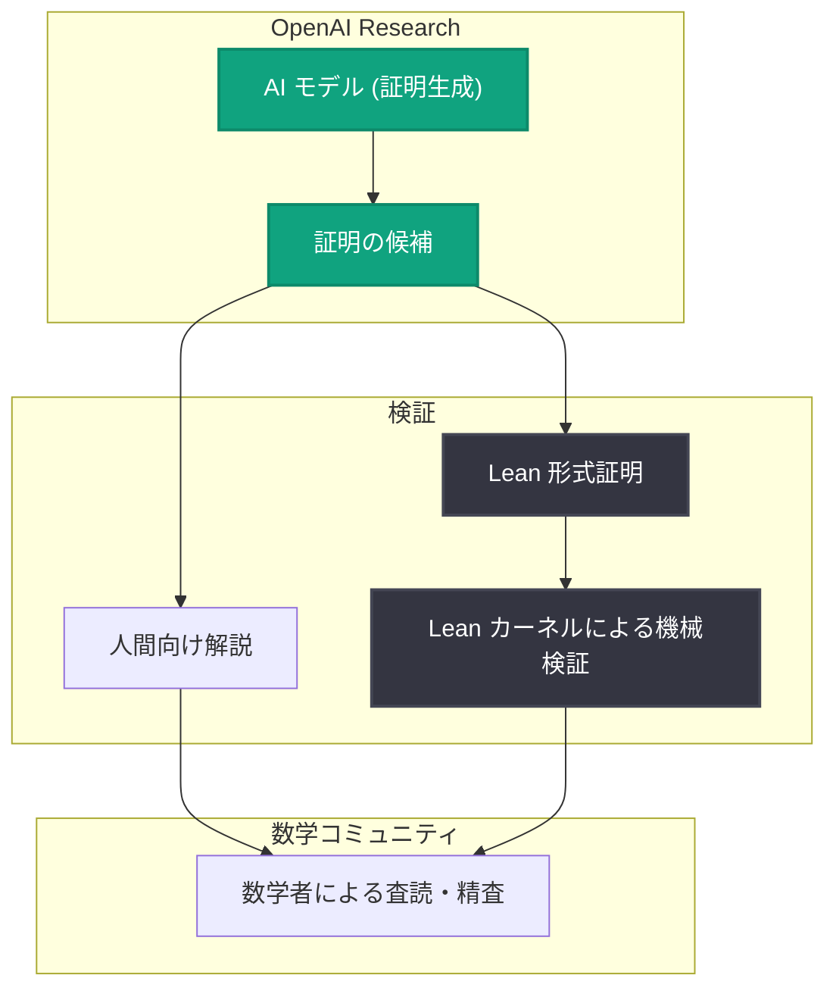

# ナビエ–ストークス方程式のミレニアム懸賞問題に対する AI 生成の解法を公開

## メタデータ

| 項目 | 内容 |
|------|------|
| 発表日 | 2026-09-08 |
| ソース | OpenAI Research |
| カテゴリ | 研究成果 |
| 公式リンク | https://openai.com/index/navier-stokes-solution |

> **注記**: 本レポート作成時点で記事本文の取得ができなかったため (HTTP 403)、公式発表の説明文および一般に知られている事実に基づいて記述している。詳細は必ず公式リンクを参照のこと。

## 概要

OpenAI は 2026 年 9 月 8 日、クレイ数学研究所が提示する 7 つのミレニアム懸賞問題の 1 つである「ナビエ–ストークス方程式の解の存在と滑らかさ」に対する AI 生成の解法を、人間向けの解説と Lean による形式証明とともに公開した。

ミレニアム懸賞問題は 2000 年にクレイ数学研究所が発表した、数学における最重要級の未解決問題群であり、各問題の解決には 100 万ドルの懸賞金が設定されている。AI が生成した証明が、定理証明支援系 Lean によって機械検証可能な形で提示された点は、AI による数学研究の到達点を示す出来事として大きな意味を持つ。

## 主な内容

### ナビエ–ストークス問題とは

ナビエ–ストークス方程式は、流体 (水や空気など) の運動を記述する非線形偏微分方程式である。工学・気象学・航空力学など幅広い分野で日常的に使われている一方、数学的には基本的な問いが未解決のままだった。

ミレニアム懸賞問題として問われているのは、3 次元空間におけるナビエ–ストークス方程式について、次のいずれかを証明することである。

- 滑らかな初期条件に対して、大域的に滑らかな解が常に存在すること (解の存在と滑らかさ)
- あるいは、有限時間で解が破綻する (爆発する) 反例が存在すること

### AI 生成の解法と Lean 形式証明

今回の発表の特徴は、解法が AI によって生成され、かつ Lean による形式証明が併せて公開された点である。

- **人間向けの解説**: 数学者が検証・理解できる形での証明の説明
- **Lean 形式証明**: 定理証明支援系 Lean 上で機械的に検証可能な証明コード

Lean は証明の各ステップを型システムに基づいて厳密に検査するため、形式化された証明は「証明として論理的に正しいか」を計算機で確認できる。査読に長い時間を要する大規模な数学的証明に対して、機械検証は信頼性を担保する強力な手段となる。

## 技術的な詳細

公式発表の説明によれば、公開物は以下の構成である。

1. **解法本体**: ナビエ–ストークス問題に対する AI 生成の証明
2. **解説 (exposition)**: 証明の構造と鍵となるアイデアを人間が読める形で説明した文書
3. **Lean 形式証明**: 証明全体を Lean で形式化したコード

### 検証パイプライン (概念図)

なお、ミレニアム懸賞問題の正式な解決認定には、クレイ数学研究所の規定に基づく専門誌での発表とコミュニティによる一定期間の検証が必要とされており、今回の公開はそのプロセスの起点に位置づけられる。

## 開発者・研究者への影響

- **AI による数学研究の実証**: 最難関クラスの未解決問題に対して AI が証明を生成できる可能性が示され、数学研究における AI 活用が新たな段階に入った
- **形式検証との組み合わせ**: AI 生成の証明を Lean で機械検証するワークフローは、ハルシネーションの懸念を排除しつつ AI の出力を信頼する方法論のモデルケースとなる
- **科学・工学への波及**: ナビエ–ストークス方程式の数学的理解が進めば、流体シミュレーション、気象予測、航空機設計などの基盤理論に長期的な影響を与えうる
- **形式手法エコシステムの拡大**: Lean や mathlib などの形式数学基盤への関心と貢献が加速すると見込まれる

## 関連リンク

- [公式発表: On the Navier–Stokes Millennium Prize Problem](https://openai.com/index/navier-stokes-solution)
- [OpenAI Research](https://openai.com/research)
- [クレイ数学研究所: ミレニアム懸賞問題](https://www.claymath.org/millennium-problems/)
- [Lean 定理証明支援系](https://lean-lang.org/)

## まとめ

OpenAI は、ミレニアム懸賞問題の 1 つであるナビエ–ストークス問題に対する AI 生成の解法を、解説と Lean 形式証明つきで公開した。証明の正当性については今後の数学コミュニティによる精査と正式な認定プロセスを経る必要があるが、AI が生成した大規模証明を機械検証可能な形で提示したこと自体が、AI と数学研究の関係を大きく前進させる成果である。
