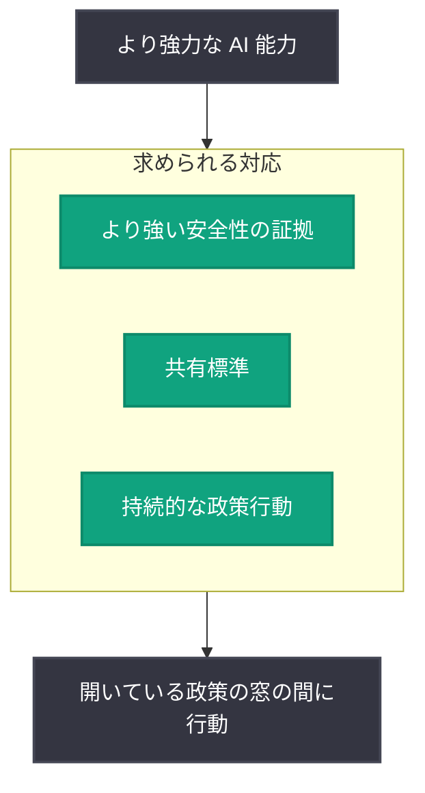

# AI 政策の窓は開いている: Chris Lehane が持続的な政策行動を提唱

## メタデータ

| 項目 | 内容 |
|------|------|
| 発表日 | 2026-09-09 |
| ソース | OpenAI News |
| カテゴリ | 政策 / Global Affairs |
| 公式リンク | https://openai.com/index/ai-policy-window |

> **注記**: 本レポート作成時点で記事本文の取得ができなかったため (HTTP 403)、本レポートは RSS フィードの概要情報および直近の関連発表のみに基づいて作成している。詳細は公式リンクを参照のこと。

## 概要

OpenAI は「The AI policy window is open. We need to act. (AI 政策の窓は開いている。今こそ行動が必要だ)」と題した記事を公開した。RSS 概要によると、OpenAI の Global Affairs 部門を率いる Chris Lehane 氏が、より強力な AI 能力にはより強い安全性の証拠 (safety evidence)、共有標準 (shared standards)、そして持続的な政策行動 (durable policy action) が必要であり、政策の窓が開いているうちに行動すべきだと論じている。

## 主な内容

### RSS 概要から確認できる主張

Chris Lehane 氏の主張として、RSS 概要から以下の 3 点が確認できる。

- **より強い安全性の証拠**: AI の能力が強まるほど、それに見合う安全性の裏付けとなる証拠が必要になる
- **共有標準**: 業界や社会で共有される標準の整備が必要である
- **持続的な政策行動**: 一時的な対応ではなく、持続性のある政策行動が求められる

タイトルが示すとおり、これらを実現するための「政策の窓」が現在開いており、その機会が閉じる前に行動する必要があるという時間的な緊急性が本記事の中心的なメッセージである。

### 政策提言の構造 (RSS 概要に基づく整理)

### 未確認の事項

以下は本文を取得できていないため、本レポートでは記載しない (推測による補完を避けるため)。

- 提言されている具体的な政策の内容や対象 (連邦・州・国際レベルなど)
- 「安全性の証拠」「共有標準」の具体的な定義や実現手段
- 記事内で言及されている可能性のある個別の法案や規制枠組み

### 直近の関連動向 (背景)

本記事の前後に、OpenAI は安全性・政策に関する発表を続けている。

- **2026-08-31**: カリフォルニア州法案 SB 1119 (若年層向けの年齢に応じた AI 保護策) への支持を表明
- **2026-09-01**: Preparedness Framework のサイバーセキュリティ「Critical」基準に達した初のモデル Astra とフロンティアセーフガードに関する記事「Path to Astra」を公開

「より強力な能力にはより強い安全性の証拠が必要」という本記事の主張は、Critical 水準の能力に対してセーフガードを定める Preparedness Framework の考え方と方向性を同じくするものと位置づけられるが、記事本文での具体的な言及の有無は未確認である。

## 開発者への影響

本発表は政策提言に関するものであり、API や製品仕様への直接的な変更を伴うものではない。ただし、以下の点に留意されたい。

- 共有標準の整備が進んだ場合、AI を利用するサービスの開発者にも安全性評価や標準への準拠が求められる可能性がある
- OpenAI の政策スタンスは、今後のモデル提供条件やセーフガードの運用方針に反映される可能性がある
- 具体的な影響は提言の内容と各国・各州の政策動向に依存するため、公式情報の継続的な確認が必要である

## 関連リンク

- [The AI policy window is open. We need to act. (公式記事)](https://openai.com/index/ai-policy-window)
- [OpenAI Global Affairs](https://openai.com/global-affairs/)
- [OpenAI News](https://openai.com/news)
- [Path to Astra (関連レポート)](./2026-09-01-path-to-astra.md)
- [カリフォルニア州法案 SB 1119 支持 (関連レポート)](./2026-08-31-supporting-california-bill-advance-ai-youth-safety.md)

## まとめ

- OpenAI の Chris Lehane 氏が、より強力な AI 能力には「より強い安全性の証拠」「共有標準」「持続的な政策行動」が必要だと主張 (RSS 概要より)
- 「政策の窓」が開いている今のうちに行動すべきという時間的な緊急性が中心的なメッセージ
- 直近の SB 1119 支持や Path to Astra の発表と方向性を同じくする政策・安全性関連の発信と位置づけられる
- 記事本文は取得できなかったため (HTTP 403)、提言の具体的な内容は公式記事での確認が必要
