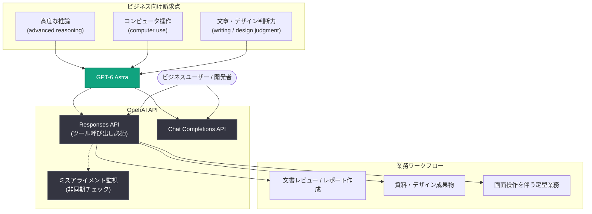

# GPT-6 Astra: ビジネス向けの次世代インテリジェンス — 高度な推論・コンピュータ操作・文章/デザイン判断力を訴求

## メタデータ

| 項目 | 内容 |
|------|------|
| 発表日 | 2026-09-09 |
| ソース | OpenAI News |
| カテゴリ | Product (製品) |
| 公式リンク | https://openai.com/index/gpt-6-astra-next-generation-work |

> **注**: 本レポート作成時点で公式記事本文へのアクセスが制限されていたため (HTTP 403)、RSS 配信の公式説明文、および 2026 年 9 月 3 日の GPT-6 Astra 発表・API リリースに関する検証済みの既存レポートに基づいて記述しています。記事本文にのみ含まれる詳細 (提供プラン、価格、ベンチマーク、導入手順など) は本レポートでは扱わず、公式ページの参照を案内します。

## 概要

OpenAI は 2026 年 9 月 9 日、「GPT-6 Astra: The next generation in intelligence for work」と題した記事を公開した。公式説明文 (RSS) によると、本記事は GPT-6 Astra を「ビジネス向けに最も高性能なモデル (most capable model for business)」として紹介するもので、**高度な推論 (advanced reasoning)**、**コンピュータ操作 (computer use)**、そして**より強化された文章作成とデザインの判断力 (stronger writing and design judgment)** が訴求点として挙げられている。

GPT-6 Astra 自体は 2026 年 9 月 3 日に発表され、同日 Responses API と Chat Completions API で提供が開始された新世代モデルである。発表時には「これまでで最も知的でアラインされたモデル」と位置付けられ、コンピュータ操作・コーディング・サイバーセキュリティ・科学の各分野で最先端の能力を備えるとされていた。今回の記事は、その GPT-6 Astra を「仕事 (work)」という切り口で企業・ビジネスユーザー向けに位置付け直した発表とみられる。

## 主な内容

### ビジネス向けの訴求点 (RSS 説明文より)

公式説明文で挙げられている GPT-6 Astra のビジネス向け訴求点は以下の 3 点である。

| 訴求点 | 概要 |
|--------|------|
| 高度な推論 (advanced reasoning) | 複雑な業務タスクに対する推論能力。発表時の情報では、推論・調査・文書作成を組み合わせてタスクをエンドツーエンドで完遂できるとされている |
| コンピュータ操作 (computer use) | 画面操作を通じたタスク遂行。9 月 3 日の発表で最先端とされた能力領域の 1 つ |
| 文章・デザイン判断力の強化 (stronger writing and design judgment) | 文章作成およびデザインに関するより優れた判断力。ビジネス文書や成果物の品質に直結する能力として訴求されている |

このうち「文章・デザイン判断力の強化」は、9 月 3 日の技術発表では前面に出ていなかった観点であり、ビジネス用途 (レポート作成、資料作成、コミュニケーションなど) を意識した訴求と考えられる。具体的な機能や提供形態の詳細は公式ページを参照されたい。

### GPT-6 Astra のこれまでの発表経緯

本記事は、以下の一連の発表に続くものである。

| 日付 | 発表内容 |
|------|---------|
| 2026-09-01 | 「Path to Astra」公開。Astra が Preparedness Framework のサイバーセキュリティ分野で Critical 基準に達した初の OpenAI モデルであることと、フロンティアセーフガードの強化を発表 |
| 2026-09-03 | GPT-6 Astra を発表。Responses API と Chat Completions API でリリース |
| 2026-09-03 | 「Safety overview: GPT-6 Astra」公開。重要インフラ防御プログラム「Daybreak for Frontline Defenders」(10 億ドル規模) も発表 |
| 2026-09-09 | 本記事「The next generation in intelligence for work」公開。ビジネス向けの位置付けを訴求 |

### ビジネス実務での実績 (発表時の導入事例より)

9 月 3 日のリリース時に公開された導入事例は、GPT-6 Astra の業務適用の実例として本記事の文脈にも関連する。

- **Legora (リーガルテック / 財務レビュー)**: GPT-6 Astra を活用して 41 件の文書を数分でレビューし、財務レビュー業務の性能を約 40% 向上
- **Playco (ゲーム開発)**: GPT-6 Astra で 3 つのゲームプロトタイプを構築し、従来モデル比で手作業の修正を 50% 削減

いずれも、長時間・高精度が求められる専門業務における GPT-6 Astra の実用性を示すものであり、「仕事のための次世代インテリジェンス」という本記事の位置付けを裏付ける事例と言える。

## 技術的な詳細

GPT-6 Astra を業務アプリケーションに組み込む場合の技術的な前提は、9 月 3 日の API リリース時の情報が適用される。

| 項目 | 内容 |
|------|------|
| 対象エンドポイント | `v1/responses`、`v1/chat/completions` |
| 非対応パラメータ | `temperature`、`top_p`、`logprobs`、推論努力レベル `none` |
| ツール呼び出し | Responses API のみ対応 (Chat Completions は移行が必要) |
| 安全機構 | ミスアライメント監視による非同期チェック (安全アラート・会話停止の可能性あり) |
| 長時間タスク向け機能 | 非同期ツール呼び出し、WebSocket 経由のターン途中ステアリング、会話途中の推論努力レベル変更 |

### コードサンプル

Responses API での GPT-6 Astra を使った業務タスクの呼び出し例 (モデル ID や詳細は公式の「Using GPT-6 Astra」ガイドを参照のこと)。

```python
from openai import OpenAI

client = OpenAI()

response = client.responses.create(
    model="gpt-6-astra",
    input="四半期レビュー資料のドラフトを作成してください。"
          "構成・文章のトーン・図表のレイアウトまで含めて提案してください。",
    tools=[
        {
            "type": "function",
            "name": "fetch_quarterly_data",
            "description": "四半期の業績データを取得する",
            "parameters": {
                "type": "object",
                "properties": {"quarter": {"type": "string"}},
                "required": ["quarter"],
            },
        }
    ],
)
print(response.output_text)
```

## アーキテクチャ

GPT-6 Astra のビジネス向け訴求点と、業務ワークフローへの組み込みの関係を示す。



## 開発者への影響

- **業務アプリケーションへの適用範囲の拡大**: 高度な推論とコンピュータ操作に加え、文章・デザインの判断力が訴求されたことで、レポート作成・資料作成・レビュー業務など、成果物の品質が問われるビジネスワークフローへの適用が想定しやすくなった
- **エンドツーエンドの業務自動化**: 推論・コンピュータ操作・文書作成を組み合わせて複雑なタスクを依頼から完成まで遂行できるため、複数ツール・複数ステップで構成していた業務プロセスの簡素化が検討できる
- **Responses API を中心とした設計**: ツール呼び出しには Responses API が必須であり、業務システムとの連携 (社内データ取得、既存ツールの呼び出しなど) を伴うユースケースでは Responses API ベースの設計が前提となる
- **安全機構を前提とした運用設計**: ミスアライメント監視による安全アラートや会話停止が発生し得るため、業務ワークフローに組み込む際はこれらのハンドリングを考慮する必要がある
- **提供プラン・価格の確認**: ビジネス向けの提供形態 (対象プラン、価格、利用条件など) は本レポートの証拠からは確認できないため、公式ページおよび料金ページで確認されたい

## 関連リンク

- [GPT-6 Astra: The next generation in intelligence for work (公式記事)](https://openai.com/index/gpt-6-astra-next-generation-work)
- [OpenAI News](https://openai.com/news)
- [OpenAI 公式ドキュメント](https://platform.openai.com/docs)
- [OpenAI API リファレンス](https://platform.openai.com/docs/api-reference)
- 関連レポート: [GPT-6 Astra 発表 (2026-09-03)](./2026-09-03-introducing-gpt-6-astra.md)
- 関連レポート: [GPT-6 Astra が API でリリース (2026-09-03)](./2026-09-03-gpt-6-astra-api-release.md)
- 関連レポート: [Safety overview: GPT-6 Astra (2026-09-03)](./2026-09-03-safety-overview-gpt-6-astra.md)
- 関連レポート: [Path to Astra (2026-09-01)](./2026-09-01-path-to-astra.md)

## まとめ

本記事は、2026 年 9 月 3 日に発表された GPT-6 Astra を「ビジネス向けに最も高性能なモデル」として位置付け直す発表であり、高度な推論・コンピュータ操作・文章/デザイン判断力の強化という 3 つの訴求点が挙げられている。特に文章・デザイン判断力は、技術発表では前面に出ていなかったビジネス成果物の品質に関わる観点であり、Legora や Playco の導入事例が示す業務実績とあわせて、GPT-6 Astra の企業利用を後押しする内容とみられる。提供プランや価格などの詳細は記事本文が未取得のため、公式ページを直接参照されたい。
