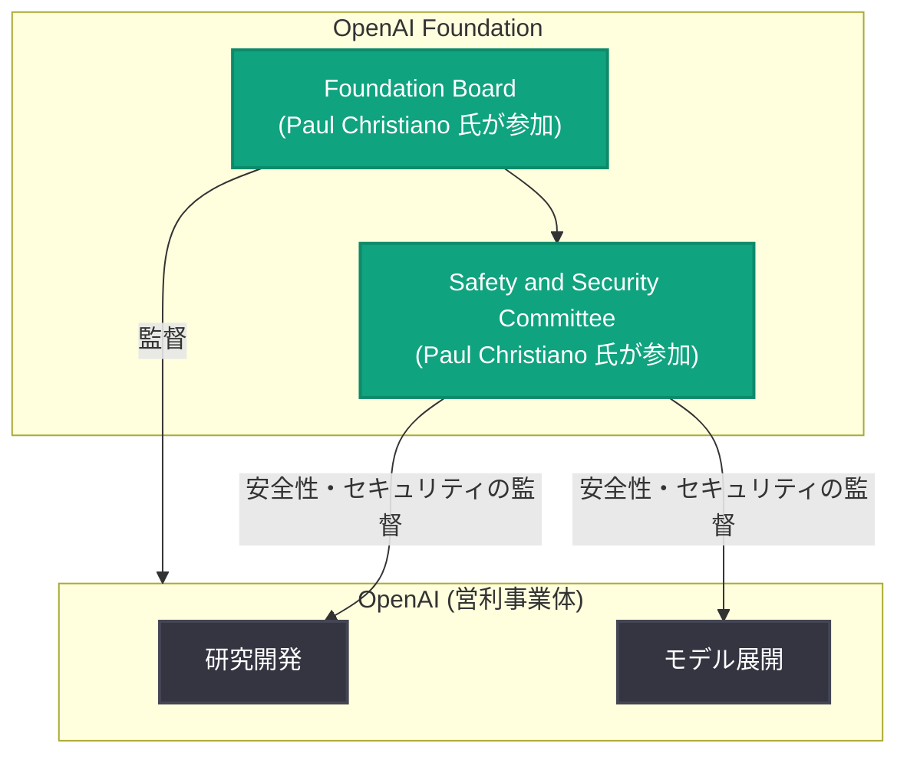

# Paul Christiano 氏が OpenAI Foundation Board に参加

## メタデータ

| 項目 | 内容 |
|------|------|
| 発表日 | 2026-09-09 |
| ソース | OpenAI News |
| カテゴリ | 企業 / ガバナンス |
| 公式リンク | https://openai.com/index/paul-christiano-joins-openai-foundation-board |

## 概要

OpenAI は 2026 年 9 月 9 日、AI アラインメント研究の第一人者である Paul Christiano 氏が OpenAI Foundation Board (財団理事会) に参加したことを発表した。同氏は理事会に加えて Safety and Security Committee (安全・セキュリティ委員会) にも参加し、AI アラインメント、安全性、標準化における豊富な経験をガバナンス体制に持ち込むことになる。

AI システムの能力が急速に向上する中で、安全性の専門家が非営利側のガバナンス機構に加わることは、OpenAI のミッションである「AGI が全人類に利益をもたらすことの保証」に向けた監督機能の強化を意味する。

## 主な内容

### 発表の要点

公式発表で確認できる事実は以下のとおり。

- Paul Christiano 氏が OpenAI Foundation Board に参加
- 同時に Safety and Security Committee にも参加
- 同氏は AI アラインメント、安全性、標準化 (standards) の分野における経験を持つ

記事詳細ページの全文は取得できなかったため、就任の背景や本人・OpenAI のコメントなどの詳細は公式ページを参照されたい。

### Paul Christiano 氏の経歴

Paul Christiano 氏は AI アラインメント分野で広く知られる研究者である。公知の経歴として以下が挙げられる。

- **RLHF 研究への貢献**: 人間のフィードバックによる強化学習 (RLHF: Reinforcement Learning from Human Feedback) の基礎研究に貢献した。RLHF は ChatGPT をはじめとする現代の対話型 AI の中核技術となっている
- **元 OpenAI 研究者**: かつて OpenAI でアラインメント研究チームを率いた経歴を持つ
- **Alignment Research Center (ARC) 創設者**: OpenAI 退職後、AI アラインメントの理論研究を行う非営利研究組織 ARC を創設した
- **US AI Safety Institute での勤務歴**: 米国の AI 安全性研究機関である US AI Safety Institute で安全性部門の責任者を務めた経歴を持ち、AI の安全性評価や標準化に携わった

このように、研究・非営利組織・政府機関の 3 つの立場から AI 安全性に取り組んできた人物であり、OpenAI のガバナンス体制にとって適合性の高い人材と言える。

### ガバナンス体制における位置づけ

OpenAI のガバナンス構造では、非営利の OpenAI Foundation が営利事業体を監督する立場にある。Safety and Security Committee は、モデルの開発・展開に関する安全性とセキュリティの重要な判断について監督・勧告を行う委員会である。

理事会と安全委員会の両方に参加することで、同氏は組織全体の方向性の決定と、安全性に関する具体的な監督の双方に関与することになる。

## 開発者・業界への影響

今回の就任は人事・ガバナンスに関する発表であり、API や製品への直接的な変更はない。ただし、中長期的には以下のような影響が考えられる。

- **安全性重視の姿勢の強化**: アラインメント研究の第一人者が監督機構に加わることで、モデルの開発・リリースプロセスにおける安全性評価の水準が維持・強化されることが期待される
- **標準化の動向**: 同氏は AI 安全性の標準化に関する経験を持つため、OpenAI の安全性評価手法や公開プラクティスが業界標準の形成に影響を与える可能性がある
- **ガバナンスへの信頼性**: 外部の安全性コミュニティでも評価の高い人物の参加は、OpenAI のガバナンス体制に対する透明性・信頼性の観点で意味を持つ

## 関連リンク

- [公式発表: Paul Christiano joins OpenAI Foundation Board](https://openai.com/index/paul-christiano-joins-openai-foundation-board)
- [OpenAI News](https://openai.com/news)
- [Alignment Research Center](https://alignment.org/)

## まとめ

- AI アラインメント研究の第一人者 Paul Christiano 氏が OpenAI Foundation Board に参加した
- 同時に Safety and Security Committee にも参加し、安全性の監督に直接関与する
- 同氏は RLHF 研究への貢献、元 OpenAI アラインメント研究者、Alignment Research Center 創設、US AI Safety Institute 勤務歴など、AI 安全性分野で豊富な経験を持つ
- 製品や API への直接的な変更はないが、OpenAI の安全性ガバナンスの強化を示す動きである
- 就任の詳細な背景やコメントは公式ページを参照
