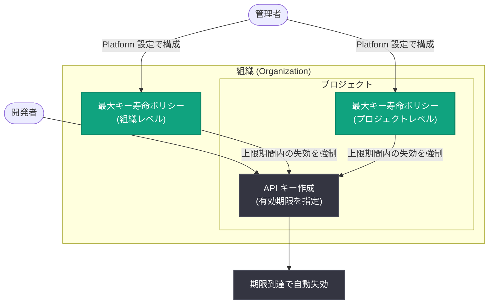

# プロジェクト API キーに有効期限を設定可能に: 組織・プロジェクトレベルでの最大キー寿命の強制にも対応

## メタデータ

| 項目 | 内容 |
|------|------|
| 発表日 | 2026-09-10 |
| ソース | OpenAI API Changelog |
| カテゴリ | API 更新 |
| 公式リンク | https://developers.openai.com/api/docs/changelog |

## 概要

2026 年 9 月 10 日、OpenAI はプロジェクト API キーの作成時に有効期限 (expiration date) を設定できる機能を API Changelog で発表した。これにより、キーが作成後に無期限で有効であり続けるというこれまでの運用リスクを軽減し、キーの寿命をあらかじめ制限するセキュリティプラクティスを標準機能として実現できるようになった。

さらに、管理者は Platform 設定 (Platform settings) において、組織レベルまたはプロジェクトレベルで最大キー寿命 (maximum key lifetime) を強制できる。この設定が有効な場合、新規に作成されるキーは設定された上限期間内に失効することが必須となる。

なお、同日には Agents API パブリックベータや GPT-Live 1 の GA も発表されているが、それらは別レポートで扱う。本レポートは API キー有効期限機能に絞って解説する。

## 主な内容

### プロジェクト API キーの有効期限設定

Changelog の原文では以下のように記載されている。

> "You can now set expiration dates when creating project API keys."

プロジェクト API キーの作成時に有効期限を指定できるようになり、期限を過ぎたキーは自動的に失効する。これまでは、不要になったキーを手動で失効 (revoke) させる運用が必要であり、削除し忘れたキーが長期間有効なまま残存するリスクがあった。

### 組織・プロジェクトレベルでの最大キー寿命の強制

管理者向けのガバナンス機能として、最大キー寿命の強制が可能になった。

> "Administrators can also enforce a maximum key lifetime at the organization or project level in Platform settings, requiring newly created keys to expire within the configured limit."

- **組織レベル**: 組織全体のポリシーとして、すべてのプロジェクトで作成されるキーに最大寿命を適用
- **プロジェクトレベル**: 特定プロジェクトに対して個別に最大寿命を適用
- **強制の対象**: 設定後に「新規作成されるキー」が対象。設定された上限期間内に失効する有効期限の指定が必須となる

既存キー (設定前に作成されたキー) への遡及適用の有無については Changelog に明記されておらず、公式情報での確認が必要である。

## 技術的な詳細

有効期限の設定と最大キー寿命の強制は、Platform 設定 (ダッシュボード) 経由で行うと説明されている。Changelog には具体的な API エンドポイントやパラメータ名の記載はないため、Admin API (プロジェクト API キー管理エンドポイント) からプログラマティックに有効期限を設定できるかどうかは、公式情報での確認が必要である。

指定可能な有効期限の粒度 (日数単位など) や上限・下限値についても Changelog には記載がなく、公式ドキュメントでの確認が必要である。

## アーキテクチャ

## セキュリティ上の意義

- **キー漏洩時の被害期間の限定**: 有効期限付きキーは、万一漏洩しても悪用可能な期間が期限までに限定される。無期限キーの放置による長期的なリスクを構造的に排除できる
- **最小権限・短寿命の原則への準拠**: クレデンシャルは短寿命であるほど安全という一般的なセキュリティ原則を、OpenAI プラットフォームの標準機能として実践できる
- **組織ガバナンスの強化**: 個々の開発者の運用任せではなく、組織・プロジェクトレベルのポリシーとして最大寿命を強制できるため、コンプライアンス要件 (定期的なクレデンシャルローテーションの義務付けなど) への対応が容易になる
- **棚卸し漏れの防止**: 退職者や終了したプロジェクトのキーが失効されずに残る、いわゆる「ゾンビキー」の発生を期限切れによって自動的に防止できる

## 開発者への影響

- **キーローテーション運用の設計が必要**: 有効期限付きキーを採用する場合、期限前に新しいキーを発行してアプリケーションに反映するローテーション手順 (シークレットマネージャーとの連携、デプロイパイプラインでの差し替えなど) を整備する必要がある
- **期限切れによる障害への備え**: キーの失効に気付かないと本番環境で認証エラー (401) が発生する。期限の監視・通知の仕組みや、失効時のアラート設定を検討すべきである。プラットフォーム側の期限接近通知機能の有無は Changelog に記載がなく、公式情報での確認が必要
- **組織ポリシー適用時の影響確認**: 管理者が最大キー寿命を強制すると、新規キー作成時に無期限キーを選択できなくなる。CI/CD やバッチ処理で長期間キーを使い続けている場合は、運用フローの見直しが必要になる
- **段階的な導入が可能**: 強制は「新規作成されるキー」が対象と説明されているため、まず新規キーから有効期限運用を開始し、既存キーを順次置き換える移行戦略が取りやすい

## 関連リンク

- [OpenAI API Changelog](https://developers.openai.com/api/docs/changelog)
- [Production Best Practices - API Keys](https://developers.openai.com/api/docs/guides/production-best-practices#api-keys)
- [OpenAI API リファレンス](https://platform.openai.com/docs/api-reference)

## まとめ

プロジェクト API キーへの有効期限設定と、組織・プロジェクトレベルでの最大キー寿命の強制は、API キー管理のセキュリティを構造的に強化するアップデートである。キー漏洩時の被害期間を限定し、ゾンビキーの残存を防止できる一方、開発者には期限前のキーローテーション運用と期限切れ監視の整備が求められる。Admin API からの設定可否や期限接近通知の有無など、Changelog に記載のない詳細については公式ドキュメントでの確認が必要である。
