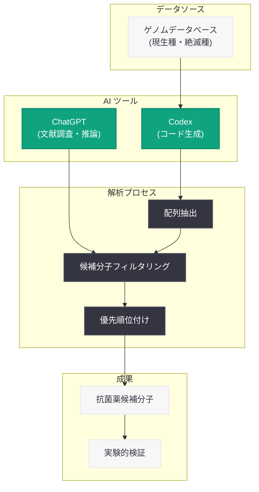

# Codex と ChatGPT を活用した抗菌分子の探索: ペンシルベニア大学の研究事例

## メタデータ

| 項目 | 内容 |
|------|------|
| 発表日 | 2026-09-10 |
| ソース | OpenAI News |
| カテゴリ | 事例 |
| 公式リンク | https://openai.com/index/using-codex-chatgpt-to-search-for-new-antimicrobials |

## 概要

ペンシルベニア大学の César de la Fuente 研究室が、OpenAI の Codex と ChatGPT を活用して、現生および絶滅種のゲノムデータから新しい抗菌薬候補を探索している研究事例が紹介されました。抗生物質耐性菌への対抗手段として、AI ツールを用いたゲノム解析と分子設計のワークフローが注目されています。

この事例は、生命科学研究における AI の実用的な活用方法を示すものであり、特にコーディング支援 (Codex) と対話型推論 (ChatGPT) を組み合わせた研究プロセスの加速化が重要なポイントとなっています。

## 主な内容

### 研究の背景と目的

抗生物質耐性菌 (薬剤耐性菌) の増加は世界的な公衆衛生上の課題となっています。新しい抗菌薬の開発が求められる中、César de la Fuente 研究室は、既存の生物種および絶滅種のゲノムデータという膨大な情報源から、抗菌活性を持つ可能性のあるペプチドや分子を探索するアプローチを採用しています。

### Codex と ChatGPT の活用方法

**注記**: 以下の内容は、提供された概要情報に基づいています。記事全文が取得できなかったため、具体的な活用方法の詳細については公式情報での確認が必要です。

研究チームは、以下のような研究ワークフローで AI ツールを活用していると考えられます。

1. **Codex によるデータ解析パイプラインの構築**: ゲノムデータベースの検索、配列抽出、特徴量計算などのバイオインフォマティクス処理を、Codex を用いてコーディング。研究者が自然言語で処理内容を記述すると、Codex が実行可能なコードを生成することで、プログラミングの専門知識がなくても効率的にデータ解析が可能になります。

2. **ChatGPT による文献調査と仮説生成**: 抗菌ペプチドの構造的特徴や、既知の抗菌分子に関する科学的知見を ChatGPT に問い合わせることで、文献レビューや仮説の形成を支援。

3. **候補分子の優先順位付け**: 抽出された候補分子の中から、実験による検証の優先順位を決定する際に、AI ツールを活用して既存の知識ベースと照合。

### 研究の意義

この研究アプローチの重要な点は、AI ツールが研究者の作業を置き換えるのではなく、研究者の専門知識を拡張し、研究プロセスを加速させる補助ツールとして機能していることです。特に、以下のような利点があります。

- **探索空間の拡大**: 絶滅種を含む広範なゲノムデータから候補を探索することで、従来は見落とされていた可能性のある分子を発見
- **研究サイクルの短縮**: データ解析のコーディングやレビュー作業の効率化により、仮説検証のサイクルを迅速化
- **学際的アプローチの促進**: 生物学者がプログラミングのハードルを越えて、計算手法を活用しやすくなる

## ワークフローの可視化

## 研究コミュニティへの影響

### 生命科学研究での AI 活用の広がり

この事例は、生命科学分野での AI ツール活用の実践例として、以下のような影響を与える可能性があります。

- **研究手法の民主化**: プログラミング経験が限られた研究者でも、AI 支援により高度なデータ解析を実施可能
- **新薬開発の加速**: 候補分子の探索から検証までのサイクルを短縮し、創薬プロセス全体の効率化に貢献
- **学際的協働の促進**: バイオインフォマティクスと実験生物学の境界を越えた研究アプローチの普及

### 今後の展開

**注記**: 以下の内容は一般的な考察であり、記事に明示されていない可能性があります。

- より多様な生物種のゲノムデータへの適用
- 他の疾患領域 (抗ウイルス、抗がんなど) への応用
- AI モデルの専門特化による精度向上
- 実験検証との統合ワークフローの確立

## 関連リンク

- [OpenAI Codex](https://openai.com/index/openai-codex)
- [ChatGPT](https://openai.com/chatgpt)
- [César de la Fuente Lab - University of Pennsylvania](https://www.med.upenn.edu/apps/faculty/index.php/g275/p8803452) (参考)
- [OpenAI News](https://openai.com/news)

## まとめ

César de la Fuente 研究室の事例は、Codex と ChatGPT が生命科学研究の実務にどのように統合され、抗菌薬探索という重要な課題に貢献しているかを示しています。AI ツールは研究者の専門知識を置き換えるのではなく、データ解析の効率化と仮説生成の支援により、研究プロセスを加速させる役割を果たしています。

この事例は、AI が科学研究のあり方をどのように変革しつつあるかを示す一例であり、今後さらに多くの研究分野での AI 活用が期待されます。

---

**執筆注記**: この レポートは、元記事の全文を取得できなかった (HTTP 403) ため、提供された概要情報に基づいて作成されています。具体的な研究手法やワークフローの詳細については、公式リンクから元記事を参照することをお勧めします。
