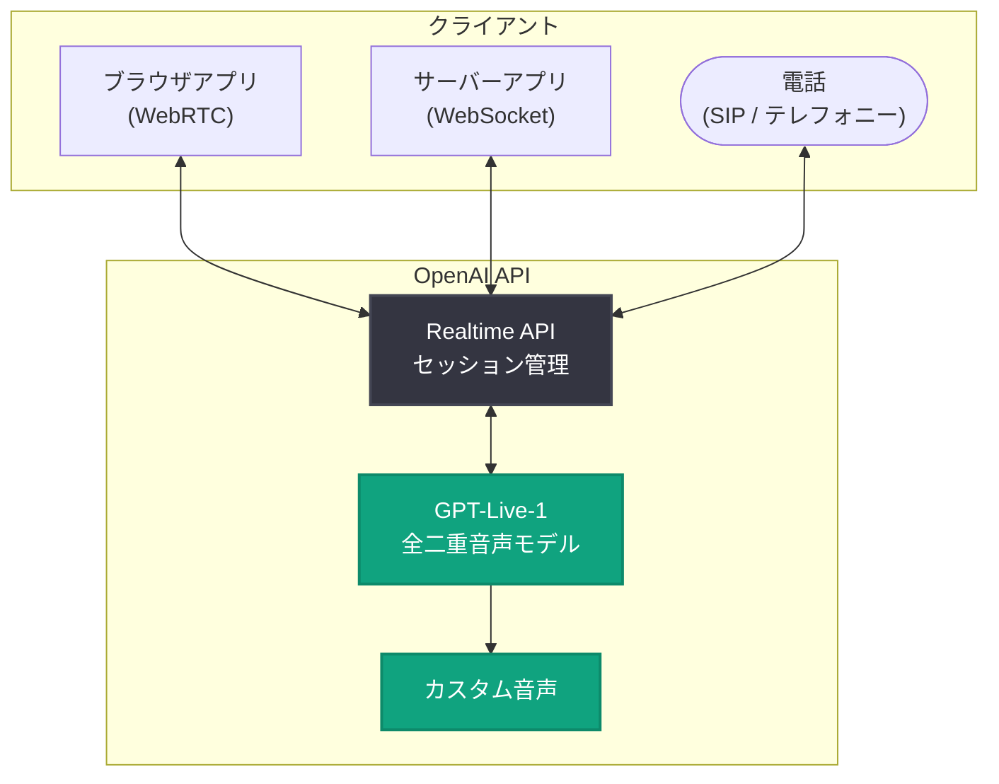

# GPT-Live-1 が API で提供開始: より自然な音声体験の構築が可能に

## メタデータ

| 項目 | 内容 |
|------|------|
| 発表日 | 2026-09-10 |
| ソース | OpenAI News / API Changelog |
| カテゴリ | 新機能 / API 更新 |
| 公式リンク | https://openai.com/index/introducing-gpt-live-1-in-the-api |

## 概要

OpenAI は 2026 年 9 月 10 日、新しい音声モデル **GPT-Live-1** を API で一般提供 (GA) 開始したと発表した。GPT-Live-1 は全二重 (full-duplex) の音声会話を実現するモデルで、ユーザーとモデルが互いに話を遮ったり、相槌を打ったりといった、人間同士の会話に近い自然なやり取りが可能になる。

従来のターン制の音声対話とは異なり、GPT-Live-1 は発話と聴取を同時に行えるため、応答のタイミングや会話の流れが大幅に自然になる。加えて、指示追従 (instruction following) の強化、カスタム音声のサポート、電話 (テレフォニー) 統合のサポートが提供され、音声エージェントや電話応対システムの構築がより実用的になった。料金は音声セッションあたり 1 分 $0.05 で、秒単位で課金される。

## 主な内容

### 全二重 (Full-Duplex) の音声会話

GPT-Live-1 の最大の特徴は、全二重の音声会話に対応した点である。

- **同時発話と聴取**: モデルは自身が話している間もユーザーの音声を聞き続けるため、ユーザーによる割り込み (barge-in) に即座に反応できる
- **自然なターンテイキング**: 発話の切れ目を待つターン制ではなく、会話の文脈に応じて話し始め・話し終わりを判断する
- **低レイテンシな応答**: 会話のテンポが人間同士の対話に近づき、不自然な間 (ま) が減少する

### 指示追従の強化

システムプロンプトや開発者の指示に対する追従性が強化された。

- 話し方のトーン、スピード、応対スタイルなどの指定をより正確に反映
- 業務フローに沿った応対 (例: 本人確認の手順、エスカレーション条件) をより確実に実行
- 音声エージェントとしての一貫したペルソナの維持が容易に

### カスタム音声のサポート

ブランドやサービスに合わせたカスタム音声を利用できるようになった。プリセット音声に加えて、独自の音声体験を構築することで、製品やブランドの世界観に統一感のある音声インターフェースを提供できる。

### テレフォニー (電話) サポート

電話回線経由の音声対話をサポートし、コールセンターや電話応対の自動化ユースケースに対応する。SIP などの電話インフラと接続することで、既存の電話システムに AI 音声エージェントを組み込める。

## 技術的な詳細

GPT-Live-1 は Realtime API を通じて利用でき、WebRTC・WebSocket・SIP (テレフォニー) の各接続方式に対応する。

### コードサンプル

```python
# Realtime API で GPT-Live-1 セッションを開始する例 (WebSocket)
import json
import websocket

url = "wss://api.openai.com/v1/realtime?model=gpt-live-1"
headers = [
    "Authorization: Bearer " + OPENAI_API_KEY,
]

ws = websocket.create_connection(url, header=headers)

# セッション設定: 指示とカスタム音声を指定
ws.send(json.dumps({
    "type": "session.update",
    "session": {
        "instructions": "あなたは丁寧なカスタマーサポート担当です。",
        "voice": "custom-brand-voice",
        "turn_detection": {"type": "semantic_vad"},
    }
}))
```

```javascript
// ブラウザから WebRTC で接続する例
const pc = new RTCPeerConnection();
const dc = pc.createDataChannel("oai-events");

const offer = await pc.createOffer();
await pc.setLocalDescription(offer);

const response = await fetch(
  "https://api.openai.com/v1/realtime?model=gpt-live-1",
  {
    method: "POST",
    headers: {
      Authorization: `Bearer ${EPHEMERAL_KEY}`,
      "Content-Type": "application/sdp",
    },
    body: offer.sdp,
  }
);
```

注: 上記は Realtime API の一般的な利用パターンに基づくサンプルであり、正確なパラメータは[公式ドキュメント](https://platform.openai.com/docs)を参照のこと。

## アーキテクチャ



## 料金情報

| 項目 | 料金 |
|------|------|
| 音声セッション | $0.05 / 分 |
| 課金単位 | 秒単位 |

トークン数ベースではなくセッション時間ベースの課金となるため、音声アプリケーションのコストが事前に見積もりやすい点が特徴である。たとえば平均 5 分の通話であれば 1 通話あたり約 $0.25 となる。

## 開発者への影響

- **音声 UX の質的向上**: 全二重対応により、割り込みや相槌を含む自然な会話体験を実装できる。従来のターン制音声対話で課題だった「応答待ちの不自然な間」が解消される
- **電話応対の自動化が容易に**: テレフォニーサポートにより、コールセンターや予約受付などの電話ベースのユースケースに直接組み込める
- **ブランド体験の統一**: カスタム音声により、サービス独自の音声アイデンティティを構築できる
- **コスト設計の簡素化**: 分単価 ($0.05/分)・秒単位課金のため、通話時間からコストを直接見積もれる
- **既存 Realtime API 実装からの移行**: すでに Realtime API で音声機能を実装している場合、モデル指定の変更を中心に GPT-Live-1 の恩恵を受けられる可能性が高い

## 関連リンク

- [GPT-Live-1 発表記事 (OpenAI News)](https://openai.com/index/introducing-gpt-live-1-in-the-api)
- [OpenAI API Changelog](https://platform.openai.com/docs/changelog)
- [OpenAI 公式ドキュメント](https://platform.openai.com/docs)
- [OpenAI API リファレンス](https://platform.openai.com/docs/api-reference)
- [OpenAI News](https://openai.com/news)

## まとめ

GPT-Live-1 の一般提供開始により、API 経由で全二重の自然な音声会話を構築できるようになった。指示追従の強化、カスタム音声、テレフォニーサポートという 3 つの柱により、カスタマーサポート・電話応対・音声アシスタントといった実務ユースケースへの適用が現実的になっている。1 分 $0.05 (秒単位課金) というシンプルな料金体系も、音声アプリケーションの商用展開を後押しする内容である。

なお、本レポートの一部は発表記事本文が取得できなかったため (HTTP 403)、公開されている概要および API Changelog (2026-09-10) の情報に基づいて作成している。詳細な仕様は公式ドキュメントで確認されたい。
