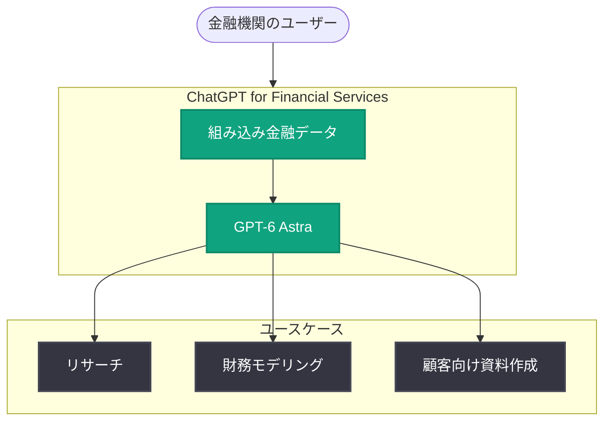

# ChatGPT for Financial Services の発表 : 金融サービス向け ChatGPT が登場

## メタデータ

| 項目 | 内容 |
|------|------|
| 発表日 | 2026-09-10 |
| ソース | OpenAI News |
| カテゴリ | 新機能 (業界特化ソリューション) |
| 公式リンク | https://openai.com/index/introducing-chatgpt-financial-services |

> **注記**: 本レポート作成時点で記事ページへのアクセスが制限されていたため (HTTP 403)、公式発表の概要情報をもとに作成しています。詳細は公式リンクをご確認ください。

## 概要

OpenAI は 2026 年 9 月 10 日、金融サービス業界向けの特化ソリューション「ChatGPT for Financial Services」を発表しました。組み込みの金融データ (built-in financial data) と最新モデル GPT-6 Astra を組み合わせ、リサーチ、財務モデリング、顧客向け資料 (client-ready materials) の作成といった金融実務のワークフローを支援します。

これは、汎用アシスタントとしての ChatGPT を、業界固有のデータとユースケースに最適化した「業界特化型 ChatGPT」の展開であり、金融機関における AI 活用を業務の中核へと引き上げる動きと位置付けられます。

## 主な内容

### 組み込みの金融データ

概要によれば、ChatGPT for Financial Services には金融データが組み込まれています。これにより、ユーザーが外部データソースを個別に接続することなく、以下のような情報を活用したリサーチや分析が可能になると考えられます。

- 市場データや企業情報を参照したリサーチ
- 最新データに基づく分析・比較
- データソースの整備にかかる導入コストの削減

### GPT-6 Astra による高度な処理

本ソリューションは GPT-6 Astra を基盤としています。金融業務で求められる複雑な推論・長文ドキュメントの処理・数値を扱う分析タスクに対応することが想定されます。

### 主要ユースケース

発表の概要では、以下の 3 つのユースケースが挙げられています。

| ユースケース | 説明 |
|-------------|------|
| リサーチ (Research) | 市場・企業・業界の調査、情報収集と要約 |
| モデリング (Modeling) | 財務モデルの構築・分析の支援 |
| 顧客向け資料 (Client-ready materials) | 提案書・レポートなど、そのまま顧客に提出できる品質の資料作成 |

## アーキテクチャ (概念図)

発表内容の概要に基づく概念的な構成図です。

## ビジネス・開発者への影響

### 金融機関への影響

- **業務効率化**: リサーチやモデリング、資料作成といった時間のかかる業務を AI で高速化できる
- **データ統合の負担軽減**: 金融データが組み込まれているため、独自にデータ基盤を接続・整備する負担が軽減される可能性がある
- **成果物の品質向上**: 「client-ready」を掲げており、顧客提出レベルの品質を目指したアウトプットが期待できる

### 開発者・IT 部門への影響

- **業界特化型 ChatGPT の潮流**: 汎用 ChatGPT から業界特化ソリューションへの展開が進んでおり、他業界 (医療、法務など) への波及も想定される
- **導入検討時の確認事項**: 金融業界特有のコンプライアンス・データガバナンス要件 (データの取り扱い、監査対応など) について、公式情報での確認が必要
- **既存ワークフローとの統合**: 社内システムや既存の分析ツールとの連携方法は、今後公開される詳細情報の確認が推奨される

## 関連リンク

- [公式発表 : Introducing ChatGPT for Financial Services](https://openai.com/index/introducing-chatgpt-financial-services)
- [OpenAI News](https://openai.com/news)
- [ChatGPT Enterprise](https://openai.com/chatgpt/enterprise)
- [OpenAI 公式ドキュメント](https://platform.openai.com/docs)

## まとめ

- OpenAI が金融サービス業界向けの特化ソリューション「ChatGPT for Financial Services」を発表
- 組み込みの金融データと GPT-6 Astra を組み合わせ、リサーチ・モデリング・顧客向け資料作成を支援
- 汎用 AI から業界特化型 AI への展開を示す動きであり、金融機関の業務プロセスへの AI 組み込みが一段と進む可能性がある
- 価格・提供時期・コンプライアンス対応などの詳細は、公式発表ページでの確認が必要
