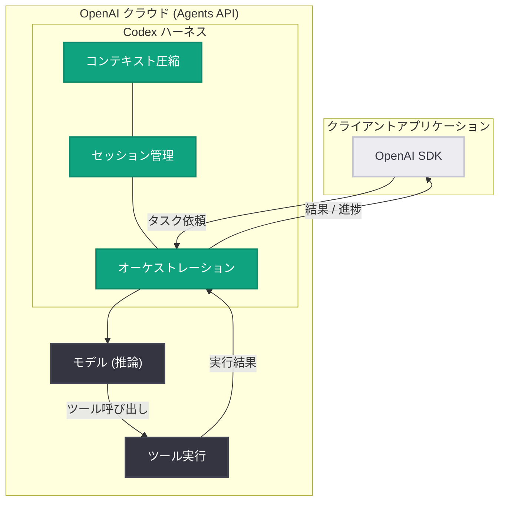

# Agents API 発表: Codex ハーネスによるクラウドエージェントのマネージドサービス

## メタデータ

| 項目 | 内容 |
|------|------|
| 発表日 | 2026-09-10 |
| ソース | OpenAI News / API Changelog |
| カテゴリ | 新機能 / API 更新 (パブリックベータ) |
| 公式リンク | https://openai.com/index/introducing-the-agents-api |

## 概要

OpenAI は 2026 年 9 月 10 日、クラウド上でエージェントを構築・起動できるマネージドサービス「Agents API」をパブリックベータとして発表した。Agents API は Codex ハーネスを基盤とし、オーケストレーション、長時間実行セッション、ツール使用を OpenAI 側のインフラで提供する。

これまで開発者が自前で実装する必要があったエージェントループの制御、セッション状態の管理、コンテキスト圧縮といった複雑な処理を OpenAI が担当することで、開発者はエージェントのタスク定義とツール連携に集中できるようになる。

## 主な内容

### マネージド Codex ハーネス

Agents API の中核は、Codex で実績のあるエージェントハーネスをマネージドサービスとして提供する点にある。ハーネスとは、モデルの推論・ツール呼び出し・結果のフィードバックを繰り返すエージェントループを制御する実行基盤を指す。

- **オーケストレーション**: モデル呼び出しとツール実行の反復ループを OpenAI 側で管理
- **長時間実行セッション**: 数分から数時間に及ぶタスクをクラウド上で継続実行
- **ツール使用**: エージェントが外部ツールを呼び出しながらタスクを遂行

### セッション管理とコンテキスト圧縮

API Changelog (2026-09-10) によると、以下の管理機能を OpenAI が担当する。

- **セッション管理**: エージェントの実行状態をクラウド上で保持し、開発者側での状態管理を不要にする
- **コンテキスト圧縮**: 長時間実行でコンテキストウィンドウが逼迫した際に、履歴の要約・圧縮を自動的に実施

これにより、長大なタスクでもコンテキスト長の上限を意識せずにエージェントを運用できる。

### パブリックベータとしての提供

Agents API はパブリックベータとして公開されており、API を通じて誰でも利用を開始できる。ベータ期間中は仕様変更の可能性があるため、本番導入時は最新のドキュメントを確認することが推奨される。

## 技術的な詳細

Agents API は、従来のステートレスな API 呼び出しとは異なり、クラウド側でエージェントのライフサイクル全体を管理する。

| 項目 | 従来 (自前実装) | Agents API |
|------|----------------|------------|
| エージェントループ | 開発者が実装 | Codex ハーネスが管理 |
| セッション状態 | 開発者が保持 | OpenAI が管理 |
| コンテキスト圧縮 | 開発者が実装 | 自動実行 |
| 長時間実行 | インフラを自前で用意 | クラウドで継続実行 |
| ツール実行の調整 | 開発者が制御 | ハーネスがオーケストレーション |

### コードサンプル

以下は Agents API の概念的な利用イメージである (パブリックベータのため、正式な仕様は公式ドキュメントを参照)。

```python
from openai import OpenAI

client = OpenAI()

# クラウドエージェントのセッションを作成し、タスクを依頼
agent = client.agents.create(
    model="gpt-5-codex",
    instructions="リポジトリのテスト失敗を調査して修正してください",
    tools=[{"type": "shell"}, {"type": "web_search"}],
)

# 長時間実行タスクはクラウド側で継続され、
# セッション管理とコンテキスト圧縮は OpenAI が担当する
result = client.agents.sessions.retrieve(agent.id)
print(result.status)
```

## アーキテクチャ



## 開発者への影響

- **エージェント実装コストの大幅削減**: エージェントループ、リトライ、状態管理などの定型実装が不要になり、開発者はタスク定義とツール設計に集中できる
- **長時間タスクの実現が容易に**: 自前のワーカーインフラなしで、数時間規模のタスクをクラウド上で実行可能になる
- **コンテキスト長の制約を意識しない設計**: 自動コンテキスト圧縮により、長い作業履歴を持つエージェントでも安定して動作する
- **既存の自前ハーネスとの比較検討が必要**: すでに独自のエージェント基盤を構築済みのチームは、マネージドサービスへの移行メリット (運用負荷軽減) とロックインのトレードオフを評価する必要がある
- **ベータ段階での仕様変更リスク**: パブリックベータのため、API 仕様やパラメータが変更される可能性があり、本番利用は慎重に判断すべきである

## 関連リンク

- [Introducing the Agents API (OpenAI News)](https://openai.com/index/introducing-the-agents-api)
- [OpenAI API Changelog](https://platform.openai.com/docs/changelog)
- [OpenAI 公式ドキュメント](https://platform.openai.com/docs)
- [OpenAI API リファレンス](https://platform.openai.com/docs/api-reference)
- [Codex](https://openai.com/codex/)

## まとめ

Agents API は、Codex で培われたエージェントハーネスをマネージドサービスとして開放するもので、オーケストレーション、長時間実行セッション、ツール使用、コンテキスト圧縮を OpenAI 側が担当する。エージェント開発の複雑さの大部分をクラウドにオフロードできるため、エージェントアプリケーション開発の参入障壁を大きく下げる発表である。現在はパブリックベータであり、正式版に向けた仕様の進化に注視したい。

---

*注: 本レポートは記事ページへのアクセスが制限されていたため (HTTP 403)、公式発表の概要および API Changelog (2026-09-10) の情報をもとに作成しています。詳細は公式リンクをご確認ください。*
