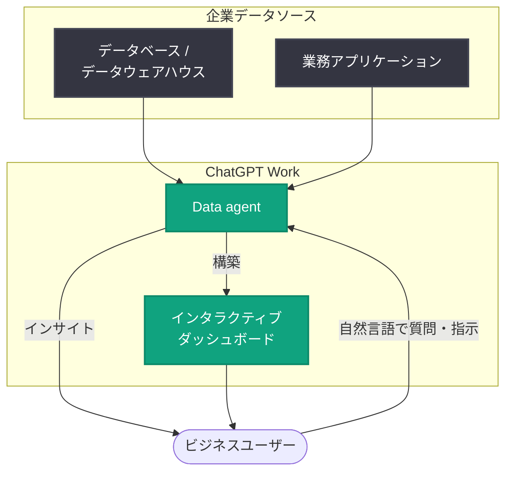

# Now everyone can put data to work: ChatGPT Work の Data agent 発表

## メタデータ

| 項目 | 内容 |
|------|------|
| 発表日 | 2026-09-10 |
| ソース | OpenAI News |
| カテゴリ | 新機能 (ChatGPT Work) |
| 公式リンク | https://openai.com/index/put-data-to-work |

> **注**: 本レポート作成時点で記事ページへのアクセスが制限されていた (HTTP 403) ため、公式に公開されている概要情報をもとに作成している。詳細な仕様や提供条件については公式情報での確認が必要である。

## 概要

OpenAI は 2026 年 9 月 10 日、ChatGPT Work 向けの新機能「Data agent」を発表した。Data agent は、企業データを接続し、自然言語で AI とやり取りするだけで、インサイトの発見やインタラクティブなダッシュボードの構築を可能にするエージェント機能である。

「Now everyone can put data to work (誰もがデータを活用できるように)」というタイトルが示すとおり、この機能は SQL やデータ分析ツールの専門知識を持たないビジネスユーザーでも、企業データから価値を引き出せるようにすることを目的としている。

## 主な内容

公式概要から確認できる Data agent の主要な機能は以下の 3 点である。

### 1. 企業データへの接続

Data agent は企業が保有するデータソースに接続できる。これにより、ChatGPT Work 上で自社のビジネスデータを直接扱えるようになる。

- 対応するデータソースの種類 (データウェアハウス、データベース、SaaS コネクタなど) の詳細は、公式情報での確認が必要
- 接続時の認証方式やアクセス制御の仕様も、公式情報での確認が必要

### 2. インサイトの発見

自然言語による質問を通じて、接続したデータからインサイトを引き出せる。従来はデータアナリストに依頼していたようなアドホックな分析を、ビジネスユーザー自身が対話形式で実行できることが想定される。

### 3. インタラクティブなダッシュボードの構築

自然言語の指示だけで、インタラクティブなダッシュボードを AI が構築する。ダッシュボードの共有方法、更新頻度、カスタマイズ可能な範囲などの詳細は、公式情報での確認が必要である。

## 想定されるワークフロー

公式概要をもとにした、Data agent の想定されるワークフローの概念図を以下に示す (詳細なアーキテクチャは公式情報での確認が必要)。

## ビジネスユーザーへの影響

- **データ分析の民主化**: SQL や BI ツールのスキルがなくても、自然言語で企業データを分析できるようになり、データ活用の裾野が広がる
- **意思決定の高速化**: アナリストへの依頼を待たずに、その場でデータに基づく質問と検証を繰り返せるため、意思決定サイクルが短縮される
- **BI ツールとの関係の変化**: ダッシュボード構築が対話型 AI で完結する可能性があり、既存の BI ワークフローとの使い分けや統合の検討が必要になる
- **データガバナンスの重要性の高まり**: 企業データを AI に接続するにあたり、アクセス権限、データの取り扱いポリシー、監査の整備が前提となる (Data agent 自体のセキュリティ・コンプライアンス仕様は公式情報での確認が必要)

## ユースケース

概要から想定される代表的なユースケースを示す (実際に対応可能な範囲は公式情報での確認が必要)。

### 1. 営業パフォーマンスの分析

営業マネージャーが「今四半期の地域別売上と前年比を見せて」と自然言語で質問し、その場でインサイトを取得。継続的にモニタリングするためのダッシュボードもそのまま構築する。

### 2. 経営層向けレポーティング

経営企画担当者が複数のデータソースを横断した KPI ダッシュボードを、専門チームに依頼することなく対話形式で作成・更新する。

### 3. 現場部門のアドホック分析

マーケティングやカスタマーサポートなどの現場部門が、キャンペーン効果や問い合わせ傾向をセルフサービスで分析し、施策の改善に活かす。

## 不明点・今後の確認事項

以下の項目は公式概要に含まれておらず、公式情報での確認が必要である。

- 対応データソース (コネクタ) の一覧
- 利用可能なプラン (ChatGPT Work のどのプラン・エディションで利用できるか) と価格
- 提供地域と一般提供 (GA) の時期
- データのセキュリティ・プライバシー・コンプライアンスに関する仕様
- 基盤となるモデルおよびエージェントの技術的な仕組み

## 関連リンク

- [公式発表: Now everyone can put data to work](https://openai.com/index/put-data-to-work)
- [OpenAI News](https://openai.com/news)
- [ChatGPT for Business](https://openai.com/business/)
- [OpenAI ヘルプセンター](https://help.openai.com/)

## まとめ

Data agent は、ChatGPT Work 上で企業データを接続し、自然言語によるインサイト発見とインタラクティブなダッシュボード構築を可能にする新しいエージェント機能である。データ分析の専門知識を持たないビジネスユーザーにもデータ活用を開放する点が最大の特徴であり、企業におけるセルフサービス分析の普及を後押しする可能性がある。一方で、対応データソース、提供プラン、セキュリティ仕様などの詳細は本レポート作成時点では未確認であり、導入検討にあたっては公式情報での確認が必要である。
