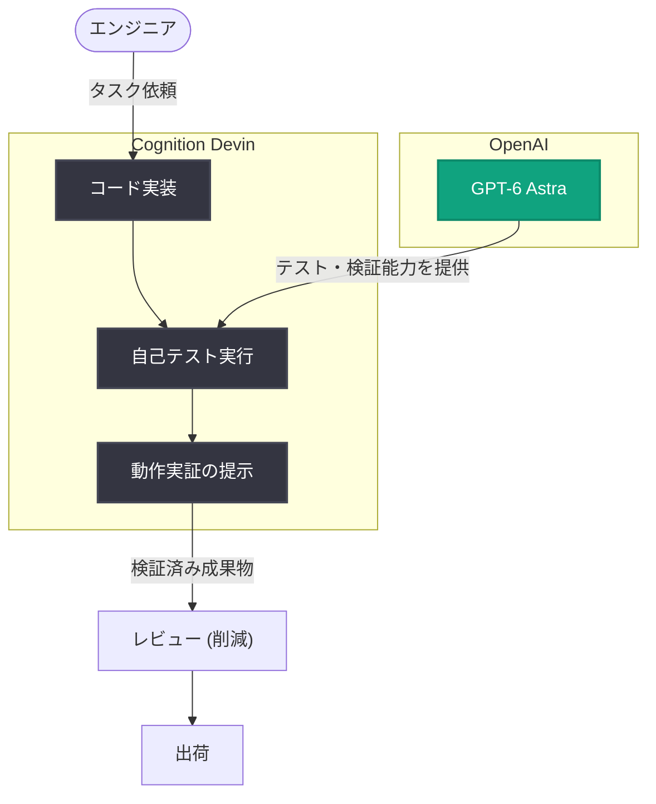

# Cognition、GPT-6 Astra で Devin による自己テストを強化

## メタデータ

| 項目 | 内容 |
|------|------|
| 発表日 | 2026-09-11 |
| ソース | OpenAI News |
| カテゴリ | 事例 |
| 公式リンク | https://openai.com/index/cognition-devin-testing-with-astra |

> **注記**: 本レポートは OpenAI 公式サイトの記事概要をもとに作成しています。記事ページへのアクセスが制限されていたため (HTTP 403)、詳細な数値や引用は公式情報での確認が必要です。

## 概要

Cognition は、自律型 AI ソフトウェアエンジニア「Devin」に GPT-6 Astra を導入し、Devin が自らの作業成果をテストし、動作することを実証する能力を強化したと発表しました。この取り組みの目的は、エンジニアがレビューするコード量を減らし、より多くの機能を出荷 (ship) できるようにすることです。

AI コーディングエージェントが生成するコードの品質保証は、人間によるレビュー負荷がボトルネックになりやすい領域です。GPT-6 Astra により Devin 自身がテストを通じて「動作の証拠」を提示できるようになることで、レビュー工数の削減と開発スループットの向上が期待されます。

## 主な内容

### GPT-6 Astra による自己テスト能力の向上

公開されている概要によると、GPT-6 Astra は Devin の以下の能力を改善します。

- **ソフトウェアのテスト**: Devin が実装したコードを自らテストする能力の向上
- **動作の実証**: コードが実際に動作することを示す (show that it works) 能力の向上

これにより、Devin は単にコードを生成するだけでなく、その正しさを検証した上で成果物を提示できるようになります。

### 目的: レビュー削減と出荷速度の向上

この取り組みのゴールは次のとおりです。

- エンジニアがレビューするコード量を減らす (review less code)
- より多くの機能を出荷できるようにする (ship more)

AI エージェントが検証済みの成果物を提示することで、人間のエンジニアは細部のコードレビューよりも設計判断や最終確認に集中できるようになる、という方向性が示されています。

### 未確認事項

以下の点は概要に含まれておらず、公式情報での確認が必要です。

- GPT-6 Astra の具体的なモデル仕様、API 提供状況、料金
- Devin のテスト成功率やレビュー時間削減率などの定量的な成果
- テスト実行の具体的な仕組み (テストフレームワーク、実行環境、検証方法など)
- 一般開発者向けの提供時期や利用条件

## アーキテクチャ

概要から推定される Devin と GPT-6 Astra の連携イメージです (詳細な構成は公式情報での確認が必要)。

## 開発者への影響

- **レビュー負荷の軽減**: AI エージェントが自己テストと動作実証を行うことで、人間のコードレビュー工数が削減される可能性があります
- **AI エージェント活用の信頼性向上**: 「動作することを示す」プロセスが組み込まれることで、AI 生成コードを本番投入する際の心理的・実務的な障壁が下がることが期待されます
- **エージェント設計の参考事例**: 実装だけでなく検証までをエージェントの責務とする設計は、独自の AI コーディングエージェントを構築する開発者にとって参考になります
- **GPT-6 Astra の動向**: GPT-6 Astra が一般の API として利用可能かどうかは概要からは不明であり、公式情報での確認が必要です

## 関連リンク

- [記事原文 (OpenAI)](https://openai.com/index/cognition-devin-testing-with-astra)
- [OpenAI News](https://openai.com/news)
- [OpenAI 公式ドキュメント](https://platform.openai.com/docs)
- [Cognition (Devin)](https://cognition.ai/)

## まとめ

Cognition は GPT-6 Astra を活用し、Devin がソフトウェアを自らテストして動作を実証する能力を強化しました。目的はエンジニアのコードレビュー負荷を減らし、出荷速度を高めることです。AI コーディングエージェントが「実装」から「検証」までを担う流れを示す事例であり、具体的な仕組みや定量的成果、GPT-6 Astra の提供形態については公式情報での確認が必要です。
