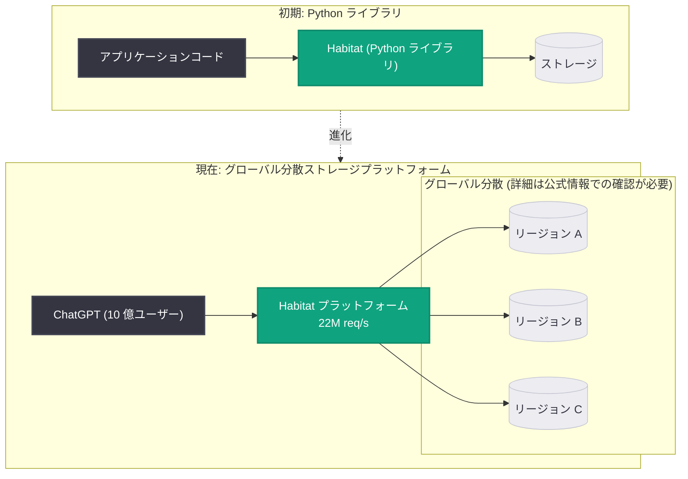

# 10 億人の ChatGPT ユーザーを支えるオンラインストレージの急速なスケーリング (Part 1)

## メタデータ

| 項目 | 内容 |
|------|------|
| 発表日 | 2026-09-11 |
| ソース | OpenAI News |
| カテゴリ | エンジニアリング |
| 公式リンク | https://openai.com/index/scaling-storage-one-billion-users-part-one |

> **注**: 本レポート作成時点で記事ページへのアクセスが制限されていた (HTTP 403) ため、公式に公開されている概要をもとに作成しています。概要に含まれない技術的詳細については推測を避け、「公式情報での確認が必要」と明示しています。

## 概要

OpenAI は、社内ストレージ基盤「Habitat」がどのように進化してきたかを解説するエンジニアリング記事 (シリーズ Part 1) を公開しました。Habitat は当初 Python ライブラリとして始まりましたが、現在では 10 億人の ChatGPT ユーザーを支え、秒間 2,200 万リクエスト (22M req/s) を処理するグローバル分散ストレージプラットフォームへと成長しています。

本記事は、世界最大級のコンシューマー向け AI サービスを支えるストレージ層のスケーリングの実践知を共有するものであり、大規模分散システムを設計・運用するエンジニアにとって貴重な一次情報となります。

## 主な内容

### Habitat とは

公式概要によると、Habitat は以下の変遷をたどったストレージ基盤です。

- **出発点**: Python ライブラリとして誕生
- **現在**: グローバルに分散されたストレージプラットフォーム
- **規模**: 10 億人の ChatGPT ユーザーを支え、秒間 2,200 万リクエストを処理

ライブラリからプラットフォームへの進化という点は、多くの組織で見られる「アプリケーション内のデータアクセス層が、成長に伴い独立した基盤サービスへ昇格する」パターンに合致します。ただし、具体的な内部アーキテクチャ (使用データベース、レプリケーション方式、シャーディング戦略など) は概要に含まれていないため、公式情報での確認が必要です。

### シリーズ記事としての位置づけ

URL に「part-one」と含まれていることから、本記事は複数回にわたるシリーズの第 1 回であると考えられます。続編ではさらに踏み込んだ技術詳細が公開される可能性がありますが、続編の公開時期・内容は公式情報での確認が必要です。

## 技術的な詳細

概要から確認できる定量的な事実は以下のとおりです。

| 指標 | 数値 |
|------|------|
| 対象ユーザー数 | 10 億人以上 (ChatGPT) |
| リクエスト処理量 | 秒間 2,200 万リクエスト (22M req/s) |
| 基盤の名称 | Habitat |
| 起源 | Python ライブラリ |

秒間 2,200 万リクエストという規模は、単純計算で 1 日あたり約 1.9 兆リクエストに相当します。この規模では、一般に以下のような課題への対応が求められますが、Habitat が実際にどの手法を採用しているかは公式情報での確認が必要です。

- ホットパーティション (特定ユーザー・会話へのアクセス集中) の回避
- グローバルなデータ配置とレイテンシの最適化
- 障害時のフェイルオーバーとデータ耐久性の担保
- スキーマ変更やマイグレーションの無停止実施

## アーキテクチャ

以下は概要に記載された情報 (Python ライブラリからグローバル分散プラットフォームへの進化) を図示した概念図です。内部の詳細構成は公式記事での確認が必要です。

## 開発者への影響

本記事は API の変更ではなくエンジニアリング事例の共有であるため、OpenAI API 利用者への直接的な影響はありません。一方、大規模システムを設計・運用するエンジニアには以下の示唆があります。

- **段階的な進化の妥当性**: 最初から巨大な分散プラットフォームを構築するのではなく、ライブラリとして小さく始めてから基盤化するアプローチが、世界最大級のサービスでも有効であったことを示す事例となる
- **スケール指標のベンチマーク**: 10 億ユーザー・22M req/s という具体的な数値は、自社システムのキャパシティプランニングにおける参照点として有用
- **設計判断の学習材料**: グローバル分散、レイテンシ、耐久性などのトレードオフを OpenAI がどう解決したかは、記事本文および続編で確認することで自社設計に活かせる (詳細は公式情報での確認が必要)

## 関連リンク

- [記事本文: Rapidly scaling online storage to serve over 1 billion ChatGPT users](https://openai.com/index/scaling-storage-one-billion-users-part-one)
- [OpenAI News](https://openai.com/news)
- [OpenAI 公式ドキュメント](https://platform.openai.com/docs)

## まとめ

- OpenAI が社内ストレージ基盤「Habitat」のスケーリングを解説するエンジニアリング記事 (Part 1) を公開した
- Habitat は Python ライブラリから、10 億人の ChatGPT ユーザーと秒間 2,200 万リクエストを支えるグローバル分散ストレージプラットフォームへ進化した
- 内部アーキテクチャの詳細 (データベース技術、レプリケーション、シャーディングなど) は概要に含まれておらず、公式記事本文および続編での確認が必要である
