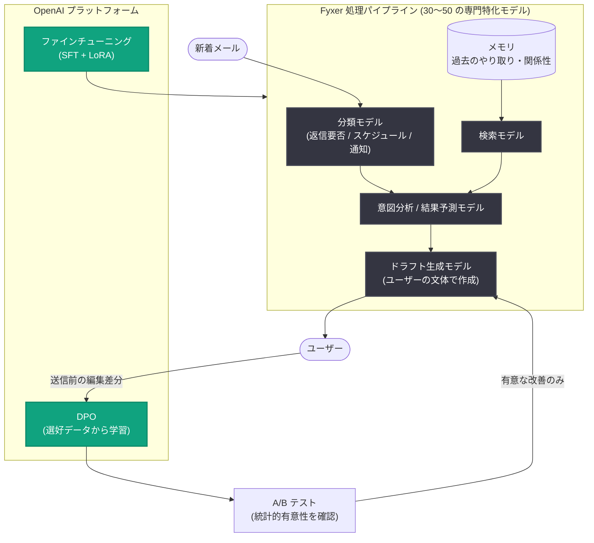

# Fyxer が信頼される AI エグゼクティブアシスタントを構築した方法

## メタデータ

| 項目 | 内容 |
|------|------|
| 発表日 | 2026-09-14 |
| ソース | OpenAI News |
| カテゴリ | 導入事例 |
| 公式リンク | https://openai.com/index/fyxer |

## 概要

AI エグゼクティブアシスタントを開発する Fyxer が、OpenAI のモデル、ファインチューニング、メモリ機構、そして実ユーザーからのフィードバックを組み合わせ、受信トレイの整理と各ユーザーの文体に合わせたメールドラフト作成を実現した事例が公開された。ドラフトの無修正採用率は 53% に達し、ARR (年間経常収益) は 2025 年に 100 万ドルから 3,200 万ドルへと急成長、90 日時点の継続率は 90% を超える。

Fyxer は AI 製品化の前に人間によるエグゼクティブアシスタント (EA) サービスを長年運営しており、50 万時間を超える注釈付きワークフローデータを蓄積していた。この実務データを土台に、メール処理を 30〜50 の専門特化モデルに分割するアーキテクチャと、ユーザーの編集行動から自動的に学習する自己学習ループを構築した点が特徴となる。

## 主な内容

### 会社と製品の背景

Fyxer の AI エグゼクティブアシスタントは、メール・会議・メッセージなど複数のツールにまたがる仕事の文脈を追跡する。同社は AI 製品を開発する以前に人間による EA サービスを運営しており、その過程で蓄積した 50 万時間超の注釈付きワークフローデータが、モデルの学習と評価の基盤となっている。

### OpenAI モデルの活用範囲と選定理由

Fyxer は、メール内容の理解、関連コンテキストの取得と再ランキング、返信文の生成に至るまで、幅広い工程で OpenAI モデルを使用している。選定理由として以下が挙げられている。

- **性能**: 社内ベンチマークで最高性能を記録
- **ファインチューニング**: トーンや意図といった主観的タスクに対応するファインチューニング機能
- **エンジニアリング支援**: Slack での迅速な回答やオフィス訪問を含む密な協働体制

共同創業者の Hollingsworth 氏は "We chose OpenAI because they have the best models" (最高のモデルを持つから OpenAI を選んだ) と述べている。

### タスクを分割するアーキテクチャ

Fyxer はメール処理を単一の生成タスクとして扱わず、30〜50 の専門特化モデルに分割している。

1. **分類**: 新着メールをまず「返信要否・スケジュール操作・情報通知」に分類するモデルが判定
2. **意図分析**: 返信が必要な場合、意図分析やインタラクションの結果予測を行う追加モデルが動作 (会議調整に向かうか、依頼の解決か、長期的な関係の継続かなど)

### メモリシステム

メモリシステムは、どの情報を会話をまたいで保持し、どれを一回限りで破棄するかを判断する。新着メールが届くと、検索モデルが過去のやり取りと照合し、その人物・スレッドに最も関連する記憶を提示する。これにより、関係性や進行中の仕事の文脈を踏まえたドラフト生成が可能になる。

### ファインチューニング手法

- **手法**: 教師ありファインチューニング (SFT) と LoRA を組み合わせ、タスク特化のモデル変種を作成しコストを制御
- **プラットフォーム**: 初期は OpenAI のファインチューニングプラットフォームを高精度タスクに使用し、最近では OpenAI のマネージドファインチューニングチームと協力して新チェックポイントを本番投入
- **評価**: デプロイ前に自社メールタスク (ドラフト作成・分類・優先度付け) の検証セットで評価し、精度に加えて応答時間とコストも考慮

### ユーザー編集から学ぶ自己学習ループ

Fyxer の学習パイプラインの中核は、ユーザーの自然な編集行動を学習データに変換する仕組みにある。

1. ユーザーが送信前にドラフトを編集すると、元の文と編集後の文の差分が選好データになる
2. DPO (Direct Preference Optimization) により、手動ラベリングなしにペア比較から学習
3. すべての変更は A/B テストを経由し、統計的に有意な改善がある場合のみリリース
4. ユーザー数の多さにより、1 日以内に統計的有意性の閾値へ到達することも可能

## 技術的な詳細

### アーキテクチャ

### 成果指標

| 指標 | 数値 |
|------|------|
| ドラフト無修正採用率 | 53% |
| ARR 成長 (2025 年) | 100 万ドル → 3,200 万ドル |
| 90 日時点の継続率 | 90% 超 |

Hollingsworth 氏は "retention is the real flex" (継続率こそが真の実力) と語っており、一時的な話題性ではなく、日々の業務で使い続けられることを製品の価値の証明と位置づけている。

### 今後の方向性

Fyxer はドラフト作成にとどまらず、関係性・好み・進行中の仕事スレッドの理解を深め、コミュニケーションと調整業務全体を管理するプロアクティブなアシスタントを目指している。記事では「モラベックのパラドックス」(人間には簡単だが機械には難しいタスクが存在するという逆説) にも言及されており、各ユーザーの働き方を学習することでこの複雑さに対処するアプローチを取っている。

## 開発者への影響

- **タスク分割の設計指針**: 複雑なワークフローを単一の巨大プロンプトで処理するのではなく、分類・意図分析・生成など 30〜50 の専門特化モデルに分割するアプローチは、精度・コスト・レイテンシの最適化に有効な設計パターンとなる
- **暗黙的フィードバックの活用**: ユーザーの編集差分を DPO の選好データとして利用することで、手動ラベリングなしに継続的なモデル改善が可能になる
- **ファインチューニングのコスト制御**: SFT と LoRA の組み合わせにより、タスク特化モデルを低コストで量産できる
- **評価とリリースの規律**: 独自の検証セットによるデプロイ前評価と、統計的有意性を条件とした A/B テストの組み合わせは、品質を担保しながら高速に改善を回す運用モデルの参考になる
- **ドメインデータの価値**: AI 製品化以前に蓄積した 50 万時間超の実務データが差別化の源泉となっており、既存業務データの資産化の重要性を示している

## 関連リンク

- [How Fyxer built an AI executive assistant people trust (公式記事)](https://openai.com/index/fyxer)
- [OpenAI ファインチューニングガイド](https://platform.openai.com/docs/guides/fine-tuning)
- [OpenAI API リファレンス](https://platform.openai.com/docs/api-reference)
- [OpenAI News](https://openai.com/news)

## まとめ

Fyxer は、OpenAI モデルを基盤に、メール処理を 30〜50 の専門特化モデルへ分割するアーキテクチャ、会話をまたぐメモリシステム、SFT + LoRA によるコスト効率の高いファインチューニング、そしてユーザーの編集差分を DPO で学習する自己学習ループを組み合わせ、信頼される AI エグゼクティブアシスタントを構築した。ドラフト無修正採用率 53%、ARR の 32 倍成長、90 日継続率 90% 超という成果は、実ユーザーのフィードバックを継続的にモデル改善へ還元する仕組みの有効性を示している。
