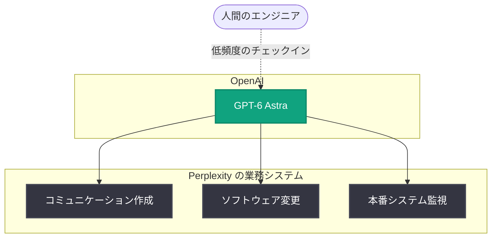

# Perplexity が GPT-6 Astra にエンドツーエンドのシステム運用を委任

## メタデータ

| 項目 | 内容 |
|------|------|
| 発表日 | 2026-09-14 (RSS フィード上の日付。レポート作成日 2026-09-12 時点でフィードに掲載済み) |
| ソース | OpenAI News |
| カテゴリ | 事例 |
| 公式リンク | https://openai.com/index/perplexity-improving-accuracy-with-astra |

> **注記**: 本レポート作成時点で公式記事ページへのアクセスが制限されていた (HTTP 403) ため、内容は RSS フィードの概要に基づいています。詳細な数値や引用については公式情報での確認が必要です。

## 概要

AI 検索エンジンを提供する Perplexity が、OpenAI の GPT-6 Astra を業務システムのエンドツーエンドな運用に活用している事例が紹介されました。Perplexity は Astra を、コミュニケーション文書の作成、ソフトウェアの変更、本番環境 (プロダクション) システムの監視に利用しており、従来のモデルと比較して人間による確認 (チェックイン) の頻度が大幅に減少したとされています。

これは、AI モデルが単発のタスク支援にとどまらず、企業の実運用ワークフローを継続的かつ自律的に担う段階に入りつつあることを示す事例です。

## 主な内容

### Astra が担う 3 つの業務領域

RSS フィードの概要によると、Perplexity は Astra を以下の 3 領域で活用しています。

1. **コミュニケーションの作成**: 社内外向けの文書やコミュニケーションの執筆
2. **ソフトウェアの変更**: コードベースに対する変更作業
3. **本番システムの監視**: プロダクション環境の継続的なモニタリング

各領域での具体的な運用フロー、使用しているツール連携、ガードレールの詳細については、概要に含まれていないため公式情報での確認が必要です。

### 人間による確認頻度の低減

概要では、従来のモデルを利用していた時期と比較して、Perplexity のチームが Astra の作業を確認する頻度が「大幅に少なくなった」と述べられています。これは、モデルの出力精度と信頼性が向上し、より長いスパンでの自律的なタスク遂行を任せられるようになったことを示唆します。

ただし、具体的な確認頻度の変化 (定量的な数値) や、どのようなケースで人間の介入が残っているかは概要に含まれておらず、公式情報での確認が必要です。

### 想定される運用イメージ

以下は概要から推測される運用イメージです (詳細は公式情報での確認が必要)。

## 技術的な詳細

GPT-6 Astra のモデル仕様、API での提供形態、料金、コンテキスト長などの技術詳細は本記事の概要には含まれていません。これらについては OpenAI の公式ドキュメントおよび公式発表での確認が必要です。

## 開発者/企業への影響

- **自律運用の実例**: コミュニケーション作成・コード変更・本番監視という異なる性質の業務を単一モデルに委任する事例が公開されたことで、同様のワークフロー構築を検討する際の参考になります
- **監督コストの削減**: 人間によるチェックイン頻度の低減は、AI 導入における運用コスト (レビュー工数) の見積もりに影響する可能性があります
- **本番環境での利用**: 監視というミッションクリティカルな領域での採用事例は、AI エージェントの信頼性評価の指標となり得ます。ただし、Perplexity がどのようなフォールバックや安全策を講じているかは公式情報での確認が必要です

## 関連リンク

- [記事本文 (OpenAI News)](https://openai.com/index/perplexity-improving-accuracy-with-astra)
- [OpenAI News](https://openai.com/news)
- [OpenAI 公式ドキュメント](https://platform.openai.com/docs)
- [Perplexity 公式サイト](https://www.perplexity.ai/)

## まとめ

Perplexity が GPT-6 Astra をコミュニケーション作成、ソフトウェア変更、本番システム監視というエンドツーエンドの業務に活用し、従来モデルよりも人間の確認頻度を大幅に減らして運用している事例が紹介されました。AI モデルが実運用の中核業務を自律的に担う流れを示す事例ですが、具体的な運用体制や定量的な効果については公式記事での確認が必要です。
