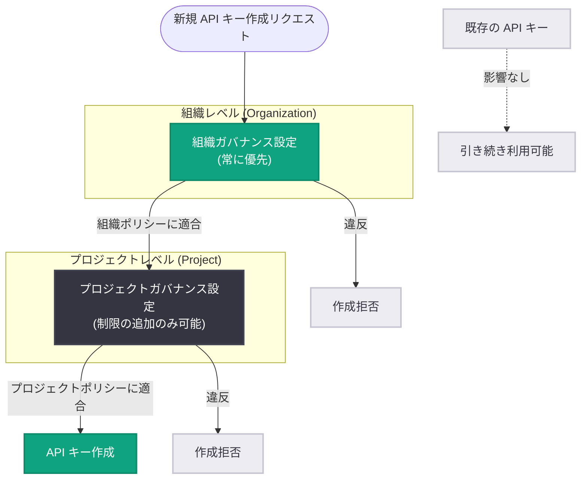

# API キー作成のガバナンス管理: 組織・プロジェクトレベルで作成可能なキー種別を制限可能に

## メタデータ

| 項目 | 内容 |
|------|------|
| 発表日 | 2026-09-15 |
| ソース | OpenAI API Changelog |
| カテゴリ | API 更新 (セキュリティ / ガバナンス) |
| 公式リンク | https://platform.openai.com/docs/changelog |

## 概要

2026 年 9 月 15 日、OpenAI は組織 (Organization) レベルとプロジェクト (Project) レベルの両方で、API キー作成に関するガバナンス管理機能 (API Key Creation Governance Controls) を追加した。管理者は「サービスアカウントキーのみ許可」「ユーザー所有のプロジェクトキーのみ許可」「新規 API キー作成の全面無効化」の 3 つの制限から選択できる。

この機能により、エンタープライズ環境で問題になりがちな「個人に紐付いた API キーの乱立」や「退職者のキーが残り続けるリスク」に対して、組織全体で一貫したポリシーを強制できるようになった。組織レベルの制限は常にプロジェクト設定に優先し、既存の API キーには影響しない点が重要なポイントである。

## 主な内容

### 3 つのガバナンス制限オプション

管理者は Platform settings の「API Key Governance」セクションから、以下のいずれかの制限を設定できる。

| オプション | 内容 | 主な用途 |
|-----------|------|---------|
| サービスアカウントキーのみ許可 | 個人ユーザーに紐付かない、サービスアカウント所有のキーのみ作成可能 | 本番環境の運用。人の異動・退職に影響されないキー管理 |
| ユーザー所有キーのみ許可 | ユーザー個人に紐付いたプロジェクトキーのみ作成可能 | 個人単位での利用追跡・監査を重視する環境 |
| 新規作成の全面無効化 | 新規 API キーの作成を一切禁止 | キー発行の凍結、移行期間中の統制、インシデント対応 |

### 組織設定とプロジェクト設定の優先関係

このガバナンス管理は組織レベルとプロジェクトレベルの両方で設定できるが、優先関係には明確なルールがある。

- **組織レベルの制限が常に優先される**: 公式ドキュメントでは "Organization-level restrictions always take precedence" と明記されている
- **プロジェクト側は制限の追加のみ可能**: プロジェクト設定でより厳しい制限を追加することはできるが、組織レベルの制限を緩和することはできない
- **既存キーへの影響なし**: 制御は新規キー作成にのみ適用され、既存の API キーは無効化されない

### 既存のキー管理機能との組み合わせ

今回の機能は、既存の API キー管理機能と組み合わせることで効果を発揮する。

- **有効期限の強制**: 管理者は組織またはプロジェクトレベルで最大キー有効期間を設定でき、新規キーは設定された上限内で有効期限を持つ必要がある (プロジェクトの上限は組織の上限を超えられない)
- **キーローテーション**: 期限切れ前に代替キーを作成し、アプリケーション更新後に古いキーを無効化する運用が推奨されている
- **使用状況の追跡**: 2023 年 12 月 20 日以降に生成されたキーは使用状況の追跡が有効化されている

## 技術的な詳細

設定は OpenAI Platform の管理画面 (Platform settings) から行う。組織管理者は組織全体のポリシーを、プロジェクト管理者はプロジェクト単位のポリシーを設定できる。

キー作成時の動作は以下のようになる。

1. ユーザーまたはサービスアカウントが新規 API キーの作成を要求
2. まず組織レベルのガバナンス設定を評価 (違反する場合は作成拒否)
3. 次にプロジェクトレベルの設定を評価 (違反する場合は作成拒否)
4. 両方の制限を満たす場合のみキーが作成される

たとえば、組織レベルで「サービスアカウントキーのみ許可」が設定されている場合、いずれかのプロジェクトで「ユーザー所有キーを許可」と設定しても、ユーザー所有キーは作成できない。

## アーキテクチャ

組織設定とプロジェクト設定の優先関係を以下に示す。

## 開発者への影響

- **本番環境のキー統制が容易に**: 「サービスアカウントキーのみ許可」を組織全体に適用することで、個人アカウントに紐付いたキーが本番環境で使われる事態を仕組みとして防止できる
- **既存ワークフローは影響なし**: 既存の API キーは無効化されないため、制限を有効化しても稼働中のアプリケーションは動作し続ける。ただし、次回のキーローテーション時には新しいポリシーに従う必要がある
- **プロジェクト側での緩和は不可**: 組織レベルの制限が設定されている環境では、プロジェクト管理者が独自にキー作成ポリシーを緩めることはできないため、キー作成の運用フローを組織ポリシーに合わせて見直す必要がある
- **インシデント対応の選択肢が増加**: 「新規作成の全面無効化」により、セキュリティインシデント発生時にキー発行を即座に凍結する運用が可能になる

## 関連リンク

- [OpenAI API Changelog](https://platform.openai.com/docs/changelog)
- [Production Best Practices - API Keys](https://developers.openai.com/api/docs/guides/production-best-practices#api-keys)
- [OpenAI API リファレンス](https://platform.openai.com/docs/api-reference)

## まとめ

今回の API キー作成ガバナンス管理の追加により、組織・プロジェクトの管理者は「サービスアカウントキーのみ」「ユーザー所有キーのみ」「新規作成の無効化」の 3 つの制限で API キーの作成ポリシーを統制できるようになった。組織レベルの制限が常に優先され、プロジェクト側は制限の追加しかできないという設計により、大規模組織でも一貫したセキュリティポリシーを強制できる。既存キーには影響しないため、段階的な導入が可能であり、有効期限の強制やキーローテーションと組み合わせることで、エンタープライズ水準のキー管理体制を構築できる。
