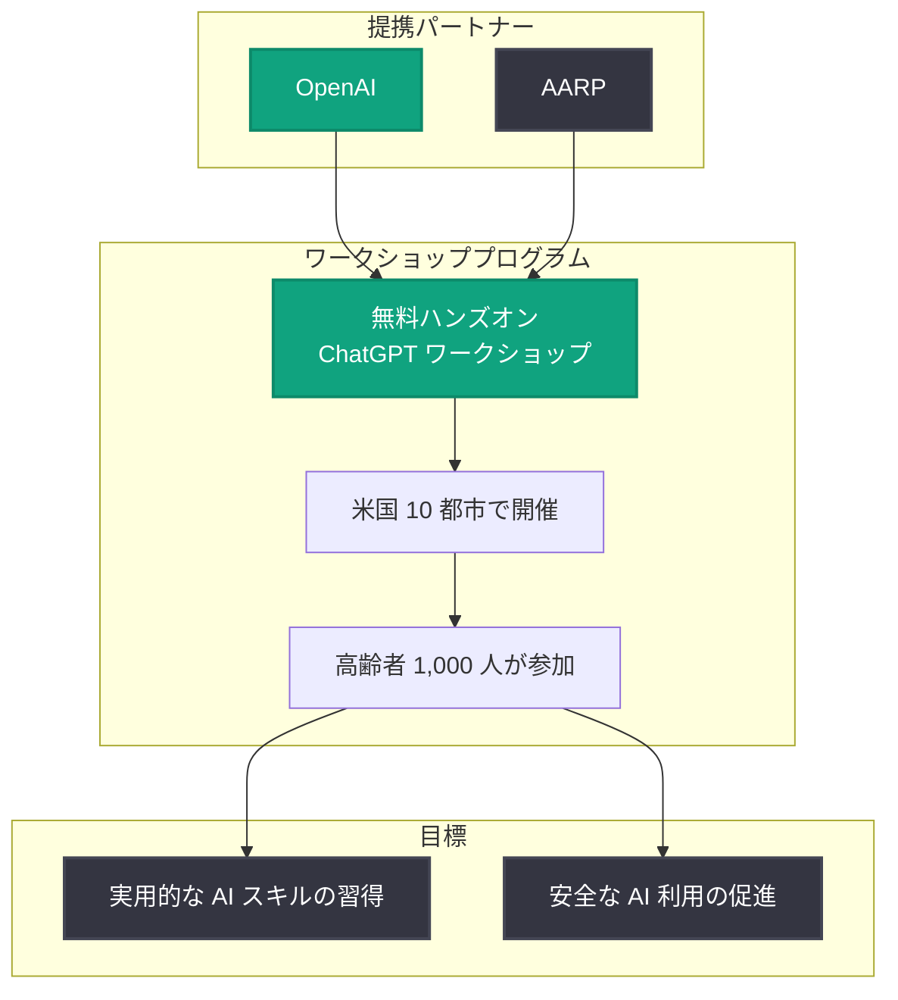

# 高齢者の日常生活での AI 活用を支援: OpenAI と AARP が実践型 ChatGPT ワークショップを展開

## メタデータ

| 項目 | 内容 |
|------|------|
| 発表日 | 2026-09-16 |
| ソース | OpenAI News |
| カテゴリ | 企業・教育 (Global Affairs) |
| 公式リンク | https://openai.com/index/helping-older-adults-use-ai-in-everyday-life |

> **注記**: 本レポート作成時点で、公式詳細ページはボット対策 (アクセス制限) により取得できませんでした。そのため、本レポートは OpenAI News の RSS フィードに掲載された概要、および関連する過去の公式発表 (2025 年 9 月の AARP 提携発表) の情報に基づいて作成しています。

## 概要

OpenAI と AARP (全米退職者協会) は、米国 10 都市の高齢者 1,000 人を対象に、無料の実践型 (ハンズオン) ChatGPT ワークショップを提供する取り組みを発表しました。このプログラムは、高齢者が安全に実用的な AI スキルを身につけられるようにすることを目的としています。

本取り組みは、2025 年 9 月 26 日に発表された OpenAI と AARP の提携 ([Partnering with AARP to help keep older adults safe online](https://openai.com/index/aarp-partnership-older-adults-online-safety)) の延長線上にあるものです。当初の提携では、AI トレーニング、詐欺検知ツール、OpenAI Academy および OATS (Older Adults Technology Services) の Senior Planet イニシアチブを通じた全国規模のプログラムが柱とされており、今回の発表はその具体的な展開として、対面型ワークショップの実施を打ち出したものと位置づけられます。

## 主な内容

### ワークショップの概要

RSS フィードの概要によると、今回のプログラムの骨子は以下のとおりです。

- **対象**: 米国の高齢者 1,000 人
- **展開地域**: 米国 10 都市
- **費用**: 無料
- **形式**: 実践型 (ハンズオン) の ChatGPT ワークショップ
- **目的**: 実用的な AI スキルを安全に習得できるようにすること

### 背景: OpenAI と AARP の提携

2025 年 9 月の提携発表では、高齢者のオンライン安全を支援するため、以下の取り組みが示されていました。

- **AI トレーニング**: 高齢者向けの新しい AI 教育プログラムの提供
- **詐欺対策ツール**: AI を悪用した詐欺などから身を守るためのスキャム検知支援
- **全国規模の展開**: OpenAI Academy と OATS の Senior Planet イニシアチブを通じたプログラム提供

今回の 10 都市でのワークショップ展開は、この提携をオンライン教材の提供から対面での実践指導へと発展させる動きといえます。

### プログラムの構造

## 意義と影響

### 高齢者にとっての意義

- **デジタルデバイドの縮小**: AI 技術の恩恵が特定の世代に偏らないよう、高齢者層への普及を後押しします
- **安全性の重視**: 単なる操作方法の習得にとどまらず、詐欺対策を含む「安全な使い方」に焦点を当てています
- **実践重視**: 座学ではなくハンズオン形式のため、日常生活 (調べ物、文章作成、健康情報の整理など) にすぐ活かせるスキルの習得が期待できます

### 開発者・業界への示唆

- **アクセシビリティの重要性**: 高齢者を含む幅広いユーザー層を想定した UI/UX 設計の重要性が高まります
- **AI リテラシー教育の広がり**: OpenAI Academy などの教育プログラムが、開発者向けだけでなく一般消費者向けにも拡大していることを示しています
- **信頼構築の取り組み**: AI 企業が非営利団体と連携し、脆弱になりやすいユーザー層の保護に投資する事例として注目されます

## 関連リンク

- [Helping older adults use AI in everyday life (公式発表)](https://openai.com/index/helping-older-adults-use-ai-in-everyday-life)
- [Partnering with AARP to help keep older adults safe online (2025 年 9 月の提携発表)](https://openai.com/index/aarp-partnership-older-adults-online-safety)
- [OpenAI Academy](https://academy.openai.com/)
- [OpenAI News](https://openai.com/news)

## まとめ

OpenAI と AARP は、米国 10 都市で高齢者 1,000 人を対象とした無料の実践型 ChatGPT ワークショップを展開します。2025 年 9 月に始まった両者の提携を具体化する取り組みであり、高齢者が安全かつ実用的に AI を日常生活に取り入れられるよう支援するものです。AI の普及が進む中で、世代間のデジタルデバイドを縮小し、脆弱になりやすいユーザー層を保護する社会的取り組みとして意義のある発表です。
