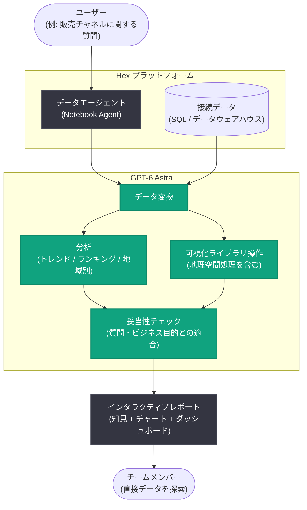

# Hex が GPT-6 Astra で複雑な分析をビジュアルレポートに変換

## メタデータ

| 項目 | 内容 |
|------|------|
| 発表日 | 2026-09-16 |
| ソース | OpenAI News/Blog |
| カテゴリ | 導入事例 (Customer Story) |
| 公式リンク | https://openai.com/index/hex-gpt-6-astra |

> **注記**: 本レポート作成時点で、公式記事 (https://openai.com/index/hex-gpt-6-astra) は Cloudflare によるアクセス制限 (HTTP 403) のため直接取得できなかった。本レポートは、同記事の内容を報じた二次ソース ([AI Pricing Guru](https://www.aipricing.guru/news/hex-gpt-6-astra-visual-reports-pricing-impact-september-2026/)、[AIToolly](https://aitoolly.com/ai-news/article/2026-09-19-hex-leverages-openai-gpt-6-astra-to-transform-complex-data-analysis-into-interactive-visual-reports)) で確認できた範囲の情報に基づいて記述しており、確認できなかった項目は記載していない。

## 概要

OpenAI は 2026 年 9 月 16 日、データ分析プラットフォームを提供する Hex 社の導入事例を公開した。Hex は自律的な「データエージェント」を運用しており、最新モデルである GPT-6 Astra を組み込むことで、複雑な分析結果を表形式や未整形のサマリーではなく、文章化された知見 (written findings)、チャート、地域別ビュー、インタラクティブなレポートへと構造化して出力できるようになった。

この事例は、大規模言語モデルの役割がテキストやコードの生成にとどまらず、データ変換から可視化、そしてビジネスコミュニケーションまでを一貫して担う「プレゼンテーション・可視化エンジン」へと拡張していることを示すものである。

## 主な内容

### Hex のデータエージェントと GPT-6 Astra

Hex はデータ分析プラットフォーム上で、ユーザーの質問を解析し回答を生成する自律的なデータエージェントを提供している。GPT-6 Astra はこのエージェントの中核として、以下の役割を担うとされる。

- **データ変換の実行**: 可視化に必要なデータの結合・変換処理
- **可視化ライブラリの操作**: 高度な可視化に必要なライブラリを直接扱い、インタラクティブな成果物を構築
- **分析の実施**: 時系列のトレンド比較、ランキング、チャネル別・地域別の内訳の作成
- **結果の妥当性チェック**: 算出された数値が意味を成しているか、ユーザーの実際の質問やビジネス上の目的に答えているかを検証する「判断」のステップ

### 具体例: 販売チャネルに関する質問からダッシュボードまで

OpenAI の記事では、販売チャネルに関する 1 つの質問から始まるワークフローが紹介されている。時系列でのパフォーマンス分析に始まり、文章化された知見、トレンド比較、ランキング、地域別内訳を経て、最終的にインタラクティブなダッシュボードに至るまでを、エージェントが一貫して生成する。

Hex の CTO である Caitlin Colgrove 氏は、GPT-6 Astra が地理空間 (geospatial) 処理を含む高度な可視化に必要なライブラリやデータ変換を扱えると述べている。

### 静的な数値からインタラクティブな探索へ

生成されるレポートはインタラクティブであり、チームメンバーは静的な数値を眺めるのではなく、レポート上で直接データを探索できる。共有性も重視されており、組織全体に自信を持って共有できる (proud to share) レポートの生成を目指した設計だとされる。

## 技術的な詳細

二次ソースで確認できた範囲では、ワークフローの各段階における GPT-6 Astra の役割は以下のように整理される。

| 段階 | GPT-6 Astra の役割 |
|------|------------------|
| データ準備 | 可視化に必要なデータ変換 (結合、フィルタリングなど) |
| 可視化構築 | 可視化ライブラリを使ったインタラクティブな成果物の作成 (地理空間ビューを含む) |
| 分析 | トレンド、ランキング、チャネル別・地域別の比較 |
| 妥当性チェック | 結果がユーザーの質問とビジネス目的に適合しているかの検証 |

なお、Hex のドキュメントでは、同社の Notebook Agent は提案された SQL やコードを監査できる技術ユーザー向けと位置づけられている。また、エンタープライズプランでは OpenAI / Anthropic の API キーを持ち込む BYOK (Bring Your Own Key) に対応している。

本発表において、OpenAI と Hex はレイテンシ、精度、レポート単価などの定量的なベンチマーク結果は公開していない。

## アーキテクチャ

## 開発者・企業への影響

- **可視化までを含むエージェント設計の参照事例**: LLM をデータ変換・分析だけでなく、可視化ライブラリの操作とインタラクティブレポートの構築まで担わせる設計の実例であり、データ分析系エージェントを開発するチームの参考になる
- **「判断」ステップの組み込み**: 数値の妥当性やビジネス目的との適合性をモデル自身に検証させるステップを設けており、分析エージェントの信頼性を高めるパターンとして注目される。ただし、チャートの見た目の良さは結合・フィルタ・結論の正しさを保証しないため、人間によるレビュー体制は引き続き重要である
- **技術とビジネスの橋渡しの自動化**: 技術的な分析結果を、組織全体で共有可能なビジュアルレポートへ自動変換する流れが広がることで、データチームの成果物の伝達コストが下がる可能性がある
- **コスト設計の検討が必要**: 定量的なベンチマークは公開されていないため、フロンティアモデルを分析ワークフローに導入する際は、自社のデータとツールでの検証 (同一データ・受け入れ基準での比較テスト) を行ったうえで採否を判断することが望ましい

## 関連リンク

- [Hex turns complex analysis into visual reports with GPT-6 Astra (公式記事)](https://openai.com/index/hex-gpt-6-astra)
- [Hex 公式サイト](https://hex.tech/)
- [OpenAI News](https://openai.com/news)
- [参照した二次ソース: AI Pricing Guru](https://www.aipricing.guru/news/hex-gpt-6-astra-visual-reports-pricing-impact-september-2026/)
- [参照した二次ソース: AIToolly](https://aitoolly.com/ai-news/article/2026-09-19-hex-leverages-openai-gpt-6-astra-to-transform-complex-data-analysis-into-interactive-visual-reports)

## まとめ

Hex は GPT-6 Astra をデータエージェントに組み込み、販売チャネル分析のような複雑な質問に対して、データ変換から可視化ライブラリの操作、トレンド・ランキング・地域別の分析、結果の妥当性チェックまでを一貫して実行し、チームがそのまま探索・共有できるインタラクティブなビジュアルレポートを生成している。LLM が分析パイプラインの「最後の 1 マイル」であるビジネスコミュニケーションまで担う事例として、データ分析エージェントの設計に示唆を与える発表である。
