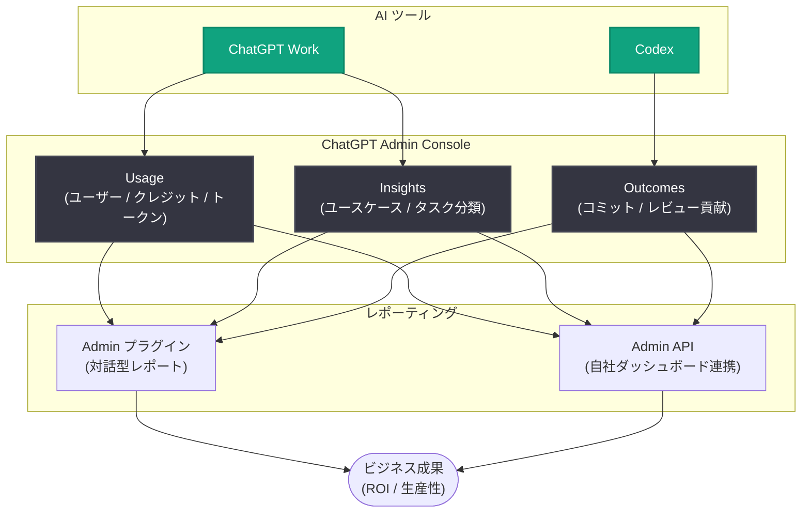

# AI 利用状況をビジネス価値に結びつける方法 : ChatGPT Work と Codex のアナリティクス活用ガイド

## メタデータ

| 項目 | 内容 |
|------|------|
| 発表日 | 2026-09-16 |
| ソース | OpenAI News |
| カテゴリ | News (Product / Business) |
| 公式リンク | https://openai.com/index/how-to-connect-ai-usage-to-business-value |

## 概要

OpenAI は、ChatGPT Work と Codex のアナリティクス機能を活用して、組織内の AI 利用状況とコストを把握し、トレーニングが必要な領域を特定し、AI 導入をビジネス成果に結びつける方法を解説するガイドを公開した。ChatGPT Admin Console に統合されたアナリティクスにより、利用状況 (Usage)、タスク分析 (Insights)、成果指標 (Outcomes) を一元的に確認できる。

本ガイドでは、機能の説明にとどまらず、ビジネス価値を評価するための 5 つの質問や、営業チームのアカウントリサーチを例にした ROI 計算モデル、1Password などの顧客事例も紹介されており、AI 投資の効果測定に取り組む管理者やリーダーにとって実践的な内容となっている。

## 主な内容

### Usage ビュー : 利用状況とコストの把握

Admin Console の Usage ビューでは、以下の指標を確認できる。

- アクティブユーザー数
- クレジット消費量
- トークン使用量

グループやユーザー単位でフィルタリングできるため、導入が進んでいない部門を特定し、トレーニング需要の検討につなげることができる。

### Insights : タスク分類によるユースケース分析

Insights 機能は、メッセージのサンプルをユースケースとタスクに自動分類する。

- **分類例**: ソフトウェアエンジニアリング (機能開発、コード保守)、営業 (アカウントリサーチ・計画) など
- **Overview タブ**: 組織全体の作業内訳を表示
- **Use cases タブ**: クレジット、メッセージ数、アクティブユーザーを含む詳細テーブルを表示

### トレーニング・サポートが必要な領域の特定

タスク詳細画面では、Models / Reasoning / Speed の設定別クレジット割合を確認できる。また、以下のビューでツール活用状況を把握できる。

- **Plugin leaderboard**: プラグインの利用ランキング (記事内の例では Google Drive プラグインが 308.1K 回の呼び出し)
- **Skills ビュー**: スキルの利用状況 (例では Account Brief スキルが 96K 回の呼び出し)

これらのデータから、活用が進んでいる機能と、追加トレーニングやサポートが必要な領域を判断できる。

### Outcomes ビュー : Codex の成果測定

Codex 向けの Outcomes ビューでは、次の指標を追跡できる。

- マージされたコミットへの Codex の貢献
- コード行数への貢献
- コードレビュー活動

グループ・ユーザー・リポジトリ別のフィルタが用意されており、レビュー時間、欠陥数、手戻りといった既存指標と比較することで、Codex 導入の効果を評価できる。

### Admin プラグインと Admin API

- **Admin プラグイン**: 予算策定や展開判断向けのレポート、リーダーシップ向け資料を対話的に作成できる (記事内の例示データ : 681 万クレジット、45.3% 増、2026 年 8 月 12 日〜9 月 10 日)
- **Admin API**: 自社ダッシュボードへの自動レポート連携や、ビジネスデータとの統合が可能

## アーキテクチャ

## ビジネス価値評価のフレームワーク

### 5 つの質問

AI 投資のビジネス価値を評価するために、以下の 5 つの質問が提示されている。

1. **何を改善したいか**: 準備の高速化、品質向上、コスト削減、売上増など
2. **現在のプロセスはどうか**: 頻度、所要時間、良い結果の基準
3. **AI で何が変わるか**: レビュー・修正時間も含めて比較する
4. **チームに何が可能になるか**: 削減された時間で何ができるようになるか
5. **投資に見合う利益か**: コストとリターンの比較

### ROI 計算の例 (営業アカウントリサーチ)

記事では、営業チームのアカウントブリーフ作成を例にした試算が示されている (すべて仮定の数値)。

| 項目 | 数値 |
|------|------|
| ブリーフ作成時間 | 手作業 4 時間 → AI 利用で 1 時間 (3 時間削減) |
| 年間削減時間 | 20 人 × 週 2 件 × 3 時間 × 46 週 = 5,520 時間 |
| 推定年間キャパシティ価値 | 5,520 時間 × 50% × 時給 $75 = $207,000 |
| 初年度総コスト | $60,000 (AI、セットアップ、トレーニング、サポート) |
| ROI | ($207,000 − $60,000) ÷ $60,000 = 245% |

なお、この試算には勝率向上や案件規模拡大といった間接効果は含まれていない。

## 顧客事例

- **1Password**: Codex でソフトウェアの構築・レビュー・テストを実施。推定 ROI 553%、年間エンジニアリング価値 $0.8M
- **ATV Big Air Tour**: ChatGPT Work によりリスティング確認が週 8 時間から 1 時間へ、在庫作業が 2〜3 日から 2〜3 時間へ短縮
- **Playco**: GPT-6 Astra を API 経由で使用し、1 つの基盤から 3 つのテーマ別プロトタイプを作成。手動修正が 50% 減少

## 開発者・管理者への影響

- **利用状況の可視化**: Admin Console だけで組織全体の AI 利用状況とコストを把握でき、部門別の導入格差を特定できる
- **データドリブンなトレーニング計画**: Insights のタスク分類やプラグイン・スキルの利用データに基づいて、トレーニング投資の優先順位を決められる
- **Codex 導入効果の定量化**: Outcomes ビューにより、エンジニアリング組織における AI コーディング支援の貢献をコミット・レビュー単位で測定できる
- **既存 BI 基盤との統合**: Admin API を使えば、自社のダッシュボードやビジネスデータと AI 利用データを統合し、継続的なレポーティングを自動化できる

## 始め方

記事では、次のステップが推奨されている。

1. Admin Console の Insights で、ビジネス優先事項に関わる一般的なタスクを選ぶ
2. ビジネスオーナーとベースラインと測定指標について合意する
3. 進捗レビューの日程を設定する

## 関連リンク

- [How to connect AI usage to business value (公式記事)](https://openai.com/index/how-to-connect-ai-usage-to-business-value)
- [OpenAI 公式ドキュメント](https://platform.openai.com/docs)
- [OpenAI News](https://openai.com/news)

## まとめ

本ガイドは、ChatGPT Work と Codex のアナリティクス機能 (Usage / Insights / Outcomes) を活用して、AI 導入を「使われているか」の確認から「ビジネス成果につながっているか」の評価へと進めるための実践的な方法論を示している。5 つの質問と ROI 計算モデルは、AI 投資の意思決定を行うリーダーにとって具体的な出発点となる。Admin プラグインと Admin API により、レポーティングの自動化や既存ビジネスデータとの統合も可能であり、組織的な AI 活用の PDCA を回す基盤が整いつつあることがうかがえる。
