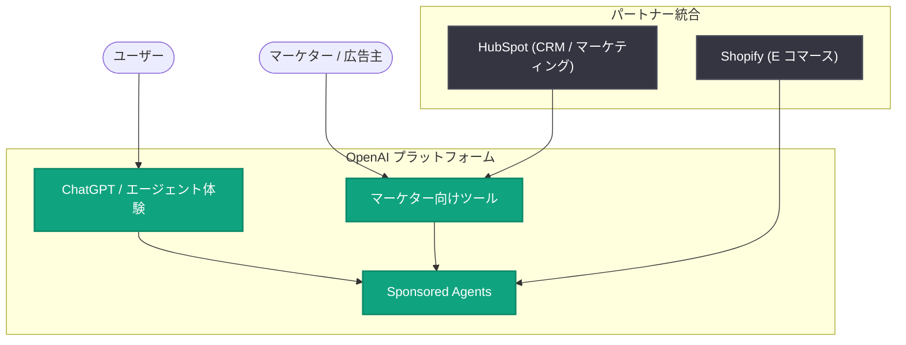

# AI で広告を再構築する: Sponsored Agents とマーケター向けツールの発表

## メタデータ

| 項目 | 内容 |
|------|------|
| 発表日 | 2026-09-16 |
| ソース | OpenAI News |
| カテゴリ | 新機能 (Product / Business) |
| 公式リンク | https://openai.com/index/reimagining-advertising-with-ai |

> **注記**: 本レポート作成時点で、詳細ページの取得が Cloudflare のアクセス制限 (403 Forbidden) によりブロックされたため、RSS フィードの概要および公開されているメタ情報のみに基づいて作成しています。詳細な仕様・数値・提供時期などは、公式ページを直接参照して確認してください。

## 概要

OpenAI は 2026 年 9 月 16 日、AI を活用した新しい広告体験に関する発表「Reimagining advertising with AI」を公開しました。発表には、スポンサー付きエージェント体験である「Sponsored Agents」、マーケター向けの各種ツール、そして HubSpot および Shopify との統合が含まれています。

この発表は、ChatGPT をはじめとする対話型 AI 体験の中に、広告・マーケティングのエコシステムを組み込む OpenAI の新たな事業展開を示すものです。従来の検索連動型広告やディスプレイ広告とは異なり、エージェントが能動的にユーザーを支援する文脈の中でブランドやコマース体験を提供するアプローチと考えられます。

## 主な内容

以下は RSS 概要で言及されている 3 つの柱です。

### Sponsored Agents (スポンサード エージェント)

概要によると、新しい AI 広告体験の中核として「Sponsored Agents」が導入されます。名称から、ブランドやマーチャントが提供するエージェント体験を、スポンサーシップの形でユーザーの対話フローに組み込む仕組みと推測されます。詳細な動作仕様 (表示位置、ラベリング、課金モデルなど) は公式ページでの確認が必要です。

### マーケター向けツール

広告主・マーケター向けのツール群が提供されます。キャンペーンの作成・管理や計測に関わる機能が含まれると考えられますが、具体的なツールの構成や提供形態 (ダッシュボード、API など) は未確認です。

### HubSpot および Shopify との統合

CRM / マーケティングプラットフォームの HubSpot、および E コマースプラットフォームの Shopify との統合が発表されています。Shopify については、ChatGPT 内でのコマース体験 (商品検索や購入フロー) との連携が、HubSpot については、マーケティングデータや顧客データとの接続が想定されますが、統合の具体的な内容は公式ページを参照してください。

## 想定されるエコシステム構成

以下は、発表内容 (Sponsored Agents、マーケター向けツール、HubSpot / Shopify 統合) を基にした概念図です。詳細仕様の確認前の参考情報として捉えてください。

## 開発者・マーケターへの影響

- **マーケター**: ChatGPT などの対話型 AI 体験がユーザーとの新しいタッチポイントとなり、Sponsored Agents を通じたブランド体験の提供や、専用ツールによるキャンペーン運用が可能になると考えられます
- **HubSpot / Shopify 利用企業**: 既存のプラットフォームを起点に、OpenAI の広告・コマース体験へ接続できる可能性があります。既存のワークフローとの統合方法を早期に確認する価値があります
- **開発者**: エージェント体験にスポンサーシップの概念が導入されることで、エージェント構築時の設計 (広告表示の扱い、ユーザー体験との両立) に新たな考慮点が生じる可能性があります
- **業界全体**: 検索連動型広告に代わる「エージェント時代の広告モデル」の具体化として、広告業界・E コマース業界への影響が注目されます

## 関連リンク

- [Reimagining advertising with AI (公式発表)](https://openai.com/index/reimagining-advertising-with-ai)
- [OpenAI News](https://openai.com/news)
- [HubSpot](https://www.hubspot.com/)
- [Shopify](https://www.shopify.com/)

## まとめ

OpenAI は 2026 年 9 月 16 日、AI を活用した新しい広告体験を発表しました。中核となるのは Sponsored Agents、マーケター向けツール、HubSpot / Shopify との統合の 3 つです。対話型 AI・エージェント体験の中に広告とコマースを組み込む動きは、OpenAI の収益モデルの多様化と、広告業界における新しいパラダイムの形成を示唆しています。本レポートは詳細ページへのアクセスが制限されていたため概要情報に基づいており、具体的な仕様・提供時期・対象地域などは公式発表ページでの確認を推奨します。
