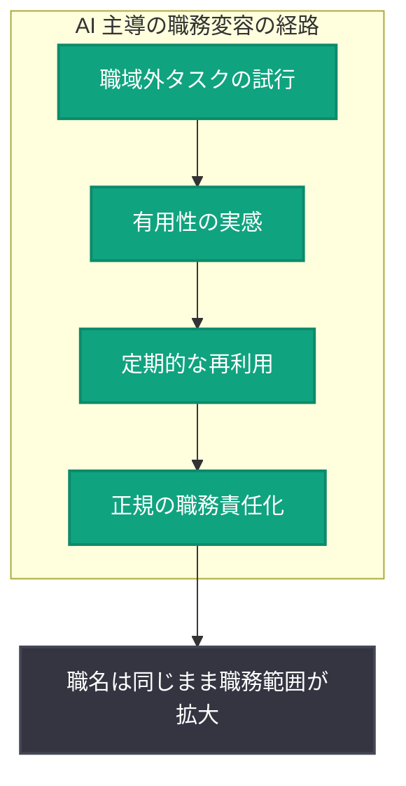

# 労働者はいかにして新しい働き方を切り開いているか: OpenAI 経済研究「Work at the Frontier」第 2 報告書

## メタデータ

| 項目 | 内容 |
|------|------|
| 発表日 | 2026-09-16 |
| ソース | OpenAI News (Economic Research) |
| カテゴリ | 研究成果 (経済研究) |
| 公式リンク | https://openai.com/index/unlocking-new-ways-of-working |

## 概要

OpenAI の経済研究チーム (OpenAI Economic Research) は、「Work at the Frontier」シリーズの第 2 報告書として、労働者が従来の職務範囲を超えて AI をどのように活用しているか、そしてどのような新しい活動が仕事の定常的な一部として定着するのかを分析した調査結果を発表しました。2026 年 4 月から 7 月にかけての 150 万件以上の仕事関連 ChatGPT メッセージを分析し、第 1 報告書で示された「タスク・クロスオーバー」(自分の職種以外のタスクを AI で実行する現象) が一時的な試行にとどまらず、継続的な業務として定着しつつあることを実証しています。

本研究は、AI が単なる既存業務の効率化ツールではなく、労働者の職務範囲そのものを拡大させる「職務変容」の起点になり得ることを、大規模な実データに基づいて示した点で重要です。

## 主な内容

### 職域外タスクにおける AI 利用パターンの特徴

労働者が自分の職域外のタスクについて ChatGPT に質問する際、職域内のタスクとは異なる利用パターンが観察されました。

- **より短いプロンプトを書く傾向**がある
- 説明・手順のガイダンス・特定の回答形式・アドバイスを**求めることが少ない**
- 一方で、例や背景情報を**提供することが多い**
- AI に対して確認・検証を**依頼することが多い**

この結果から、労働者は AI から新しい分野を一から学ぶのではなく、文書や同僚から得た情報などの文脈を持ち込み、AI の「専門知識を借りる」形で職域外の業務を遂行している可能性が示唆されています。

### 職域外タスクの定着 (リピート利用)

約 6,200 人の労働者を 2026 年 4 月から 7 月まで継続観察した結果、職域外タスクの利用は一過性ではなく、時間とともに定着していくことが確認されました。

| 指標 | 数値 |
|------|------|
| 分析対象の仕事関連 ChatGPT メッセージ | 150 万件以上 |
| 継続観察した労働者数 | 約 6,200 人 |
| 過去に使用した職域外タスクの割合 (2026 年 4 月) | 13.1% |
| 過去に使用した職域外タスクの割合 (2026 年 7 月) | 25.9% |
| 前月に職域外タスクを使った労働者が同タスクに戻る確率 | 23.6% |
| 未使用の同等労働者が同タスクを使う確率 | 8.4% |

前月に職域外タスクを利用した労働者は、利用していない同等の労働者と比べて約 3 倍の確率 (23.6% 対 8.4%) で同じタスクに戻ってくることが分かりました。

### タスク別の再利用率: 定着しやすい活動と定着しにくい活動

職域外タスクの中でも、定着のしやすさには大きな差があることが明らかになりました。

| タスク | 翌月の再利用率 |
|--------|--------------|
| 顧客との商品・サービスに関する対話 | 54% |
| 広告・プロモーション文章の作成 | 44% |
| マーケティング資料の作成 | 37% |
| 職域外タスク全体の平均 | 18.5% |
| 財務情報の説明 | 約 15% |

顧客対応やマーケティング関連の文章作成は高い再利用率を示す一方、財務情報の説明などは定着しにくい傾向があります。この差は、AI が組み込みやすいワークフローの違いに加え、職場の規範、業務への慎重さ、ミスが与える影響の大きさについての認識を反映している可能性があると分析されています。

## 職務変容のメカニズム

本報告書が示した AI 主導の職務変容の経路は次のように整理できます。

肩書きが変わる前に仕事の中身が変化しうる、というのが本研究の核心的な発見です。労働者は職域外の活動を試し、有用と感じ、定期的に戻ってくる。これらの活動がやがて正規の責任になれば、職名は同じでも職務範囲が実質的に拡大することになります。

## 企業・開発者への影響

- **企業の AI 戦略の再考**: 報告書は、AI ツールへのアクセス提供だけでなく「仕事の設計 (work design)」そのものを重視すべきと提言しています。労働者が自発的に職域を拡大している実態を踏まえ、職務定義や評価制度の見直しが求められます
- **定着しやすい業務領域の把握**: 顧客対応やマーケティング文章作成など再利用率の高いタスクは、AI 導入の効果が持続しやすい領域として優先的な投資対象になり得ます
- **AI ツール設計への示唆**: 職域外タスクでは労働者が文脈を持ち込み検証を求める傾向があるため、背景情報の取り込みやファクトチェック機能を強化した AI ツールの設計が有効と考えられます
- **人材育成への応用**: AI を通じた「専門知識の借用」が職務拡大の入り口になっているため、リスキリング施策と AI 活用を組み合わせる戦略が有効です

## 関連リンク

- [How workers are unlocking new ways of working (公式記事)](https://openai.com/index/unlocking-new-ways-of-working)
- [OpenAI News](https://openai.com/news)
- [ChatGPT](https://chatgpt.com/)

## まとめ

- OpenAI 経済研究の「Work at the Frontier」第 2 報告書は、2026 年 4 月〜7 月の 150 万件以上の仕事関連 ChatGPT メッセージを分析し、労働者の職域外タスク利用の実態を明らかにした
- 職域外タスクの利用割合は 4 月の 13.1% から 7 月には 25.9% へとほぼ倍増し、一度使った労働者は約 3 倍の確率 (23.6% 対 8.4%) で同じタスクに戻ってくる
- 顧客対応 (54%) やマーケティング文章作成 (44%) など、定着しやすいタスクには明確な傾向がある
- AI は職名が変わる前に仕事の中身を変える「職務変容」の起点となっており、企業はツール提供にとどまらず「仕事の設計」を含めた AI 戦略を検討すべきである
