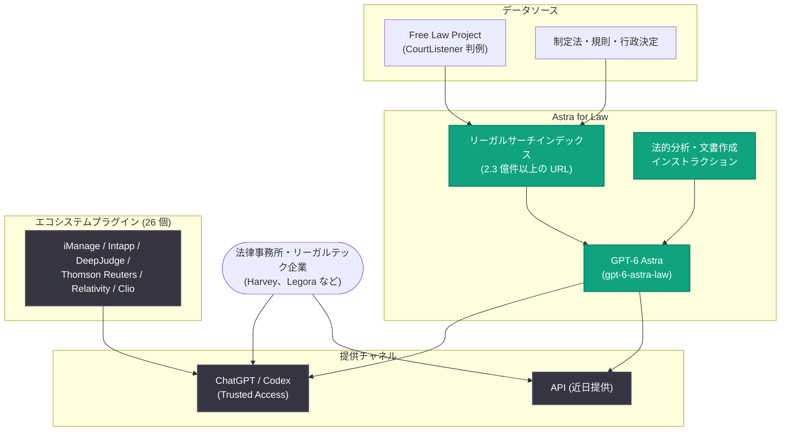

# Astra for Law の発表: 法律業務向けフロンティアインテリジェンス

## メタデータ

| 項目 | 内容 |
|------|------|
| 発表日 | 2026-09-17 |
| ソース | OpenAI News/Blog |
| カテゴリ | 新機能 |
| 公式リンク | https://openai.com/index/astra-for-law |

## 概要

OpenAI は、法律事務所やリーガルテック企業が自らの専門性を軸に AI 製品やワークフローを構築するための新しい基盤「Astra for Law」を発表した。最新かつ最も強力なモデルである GPT-6 Astra に、プロフェッショナルな法律業務向けに調整された設定、ツール、コンテキストを組み合わせたものである。

Harvey や Legora などの API 顧客は Astra for Law 上に構築し、自社の製品やワークフローにこのインテリジェンスを取り込むことができる。また、機密性の高いクライアント業務のために、法律事務所向けのプライバシーとガバナンスの管理機能を拡充し、Relativity や Clio など事務所が既に利用している専門ツールと ChatGPT を接続する 26 個の新しいエコシステムプラグインも提供する。

## 主な内容

### 法律向けフロンティアインテリジェンス

Astra for Law は、GPT-6 Astra に強力なリーガルサーチインデックスと、法的分析・文書作成のためのインストラクションを組み合わせたものである。これにより、法律実務全体で Astra の能力を増幅しつつ、事務所やリーガルテック企業が独自のアプリケーションやワークフローを自由に構築できる。

### リーガルリサーチ: 事実から根拠のある回答へ

新しいリーガルサーチインデックスは、Astra for Law が利用できるツールの 1 つである。2 億 3,000 万件以上の URL からなるコーパスを通じて、米国の判例法、制定法、規則、裁判所規則、行政決定を検索でき、情報源は毎日追加される。CourtListener を運営する非営利団体 Free Law Project との協業により、公刊された米国の先例的判例法の 99.9% 以上をカバーする判例コレクションがこのリサーチ体験に統合されている。また、Thomson Reuters などのプロバイダーが提供するライセンスコンテンツや専門製品を補完する位置づけである。

**ベンチマーク結果 (Vals AI Legal Research Bench)**:

- 米国の法律リサーチに関する 200 問のプライベート検証セットでテスト
- 最高の推論努力 (reasoning effort) 設定において、Astra for Law は全体正確性チェックで 54.0% を達成 (Web 検索のみの GPT-6 Astra は 38.7%、相対で 40% の改善)
- 判例法に焦点を当てた質問では、Web 検索のみの GPT-6 Astra と比較して 24% 多くの参照判例を発見
- 監査済みの対象パッセージセットでは、同一の推論努力設定で比較した場合、正しい判決文から最大 54% 多くの関連パッセージを取得

### エンドツーエンドの法律ワークフローの性能向上

法的分析・文書作成のためのカスタムインストラクションにより、Astra for Law はリサーチ結果をクライアントの事実関係に適用し、主張やディール条件を組み立て、弱点や不確実性を特定できる。具体的には、判決の主文 (holding) とその他の説示を区別する、主張を弱める判例に対処する、契約の例外条項が当事者間のリスクをどう移転させるかを説明する、といった作業が含まれる。類似の事実パターンを持つ有効な判例の特定においては、他のフロンティアモデルよりも優れた性能を示したとされる。

### 提供形態

Astra for Law は、まず選定された法律事務所に対して ChatGPT と Codex の Trusted Access を通じて提供され、API にも近日対応予定である。モデルピッカーでは「GPT-6 Astra Law」、API では `gpt-6-astra-law` として表示される。

### リーガルグレードの信頼性と管理機能

法律事務所はクライアントの秘密を保護し、実務における AI の利用方法を管理する必要がある。OpenAI は適格な法律事務所向けに Trusted Access Program を新設し、弁護士とその監督下で働く人々が法律業務のために Astra for Law を利用できるようにした。適格な事務所には以下が提供される。

- API における Zero Data Retention (ZDR)
- ChatGPT Enterprise の利用はデフォルトで人間によるレビュー対象から除外

また、AI ガバナンスのリーダーである Latham & Watkins と協力し、情報アクセス権限、エシカルウォール、クライアント指示、事務所による監督の設計に取り組んでいる。

### 事務所の専門性を軸にした ChatGPT の構築

OpenAI のフォワードデプロイドエンジニアは、選定された事務所と協力して、ChatGPT Enterprise にカスタムインターフェースと独自データへの統合を組み込み、各事務所のワークフローに合わせたツールを構築してきた。

- **Sullivan & Cromwell**: 事務所の交渉プレイブックと厳選された先例を新規案件のレビューに取り込む契約書アナライザーを構築。条項を組み合わせて読んだときに浮かび上がるリスクを特定し、修正案 (レッドライン) やクライアント向け助言のドラフトに変換する
- **Ropes & Gray**: 弁護士がデータルームを精査する方法に沿ったディールデューデリジェンスシステムを構築。調査結果を情報源まで遡って確認でき、主要顧客契約に通知・同意条項があるかなど、買収に影響し得る論点を特定する
- **Cooley**: キャピタルマーケッツの専門知識を企業の上場準備に活かす「GO Public」を構築。IPO 申請書類のドラフトから経営陣が注目すべきリスクの特定までを支援し、ディール内容が変わればその変更を申請書類全体に反映する

### 法律分野で最も信頼されるツールとの接続

事務所が既に利用しているツールや知識をさらに活用するため、パートナー構築の 26 個のプラグインを公開した。

- **iManage**: ChatGPT で交渉ブリーフを作成し、案件ファイルに保存
- **Intapp**: タイムエントリーが必要な可能性のある活動を抽出してレビューに提示
- **DeepJudge**: 過去のディールを比較のために取り込み
- **Thomson Reuters**: HighQ の案件コンテキストを ChatGPT に統合し、CoCounsel Legal コネクタを近日提供予定

さらに、LegalQuants、LECG、Skills.law の弁護士やリーガルエンジニアによる 9 個のコミュニティプラグイン (47 個のカスタムスキルを含む) も含まれる。同時に ChatGPT for Word が一般提供となり、弁護士は普段の文書作成ツール上で校正、修正提案、書式の問題の指摘を受けられるようになった。

### 長期的な投資

OpenAI は法律分野に長期的に投資しており、厳密な評価と弁護士・リーガルテックパートナーからのフィードバックに基づいて、Astra for Law のモデル、設定、ツール、インストラクションを継続的に改善していく。Wachtell, Lipton, Rosen & Katz との協業では、同事務所の訴訟・企業法務の専門性と OpenAI のフロンティア研究を組み合わせ、高度な法的判断を支援する AI の可能性を探求している。

## アーキテクチャ

## 開発者への影響

- **API での提供予定**: `gpt-6-astra-law` として API での提供が予定されており、リーガルテック企業は法律特化のフロンティアインテリジェンスを自社製品に組み込めるようになる
- **リサーチ精度の向上**: リーガルサーチインデックスとの組み合わせにより、Web 検索のみの構成と比べて法律リサーチの正確性が相対 40% 改善しており、法律ドメインの AI アプリケーションの品質基盤が強化される
- **エンタープライズ級のデータ保護**: 適格な事務所向けの Zero Data Retention (ZDR) と人間によるレビューのデフォルト除外により、機密性の高い法律業務でも利用しやすくなる
- **オープンで組み合わせ可能なエコシステム**: 26 個のパートナープラグインとコミュニティプラグインにより、既存の法務ツールとの統合や、事務所独自のスキル開発の余地が広がる

## 関連リンク

- [Introducing Astra for Law (公式発表)](https://openai.com/index/astra-for-law)
- [法律分野向けプラグイン一覧](https://openai.com/business/plugins/?tab=plugins-legal)
- [Free Law Project の判例カバレッジ](https://wiki.free.law/c/courtlistener/help/data-coverage/case-law)
- [Vals AI (Legal Research Bench)](https://vals.ai/)
- [OpenAI News](https://openai.com/news)

## まとめ

Astra for Law は、GPT-6 Astra を核に、2 億 3,000 万件以上の URL を対象とするリーガルサーチインデックスと法律特化のインストラクションを組み合わせた、法律業務向けの新しい AI 基盤である。Vals AI のベンチマークで Web 検索のみの構成に対し相対 40% の正確性改善を示し、Trusted Access Program による ZDR などのリーガルグレードの管理機能、26 個のエコシステムプラグイン、大手法律事務所との協業事例を伴って発表された。まず選定された法律事務所向けに ChatGPT と Codex で提供され、API (`gpt-6-astra-law`) にも近日対応予定である。
