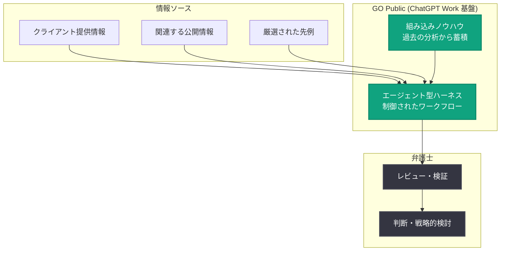

# Cooley が ChatGPT で IPO 業務を加速: 独自 AI プロダクト「GO Public」

## メタデータ

| 項目 | 内容 |
|------|------|
| 発表日 | 2026-09-17 |
| ソース | OpenAI News |
| カテゴリ | 導入事例 (リーガル / 法律業界) |
| 公式リンク | https://openai.com/index/cooley-gopublic |

## 概要

国際法律事務所の Cooley が、ChatGPT Work を基盤とした独自の AI プロダクト「GO Public」を開発し、IPO (新規株式公開) 業務のプロセス全体にインテリジェンスをもたらしている事例が紹介された。GO Public はエージェント型のハーネス (agentic harness) により膨大な情報を分析し、弁護士がその成果をレビュー・検証できるようにすることで、問題の早期発見と、判断が最も重要な領域への専門知識の集中を実現する。

Cooley はキャピタルマーケットと IPO 支援で高い実績を持つ法律事務所であり、2025 年には世界で 180 件、総額 515 億ドル超の案件に関与した。米国の発行体側 IPO 市場で 10 年にわたりトップの実績を持ち、過去 20 年以上でベンチャー支援 IPO の助言件数は業界最多である。

## 主な内容

### 法務の専門知識を AI プロダクトへ統合

キャピタルマーケット業務では、膨大な情報の統合と分析が必要となる。Cooley の Chief Innovation Officer である David Wang 氏は「IPO では、常に対応すべきことが何千件も発生する」と述べている。

従来、IPO の準備では類似企業の先例 (precedent) をベースに、クライアントの状況に合わせて修正する方法が一般的だった。GO Public はこのアプローチを転換し、クライアント自身を起点として、提供された情報・関連する公開情報・厳選された先例を統合し、弁護士のレビューに適したよりテーラーメイドな出発点を生成する。

Cooley のリーガルエンジニア、イノベーションカウンセル、実務家が協力し、同事務所のキャピタルマーケットの経験を独自のエージェントシステムへと翻訳した。Wang 氏は「GO Public と、OpenAI の技術を使って構築したエージェント型ハーネスによって、当事務所の知見を AI の時代へと引き継ぐことができた」と語っている。

### エージェント型ハーネスによる制御されたワークフロー

GO Public のハーネスは、エージェントに対する制御されたワークフローを提供する。具体的には以下を定義している。

- **自動実行可能なステップ**: エージェントが自動的に実行できる作業の範囲
- **人間によるレビューポイント**: 弁護士がレビュー・検証を必須とする箇所
- **統合方法**: 各ステップの成果をどのように統合するか

過去の分析から蓄積された情報は、Wang 氏が「組み込みのノウハウ (baked-in know-how)」と呼ぶ資産となっている。Cooley は OpenAI と密接に連携し、法務の専門知識と AI エンジニアリングの知見を組み合わせることで、適切なプロセスが適切な成果を生むよう設計している。

### 人間の労力を最も価値の高い領域に集中

Cooley のグローバルキャピタルマーケットグループ共同議長である Dave Peinsipp 氏は「IPO は企業のライフサイクルで最も重大な瞬間の 1 つであり、経営陣の多大な注意を消費し得る。GO Public により集中的な準備をより速く進められるため、弁護士と経営陣は、判断・市場経験・戦略的思考が最も重要となる意思決定により多くの時間を割ける」と述べている。

Wang 氏によれば、従来は手作業で仕分けする必要があった大量の情報に ChatGPT Work がインテリジェンスをもたらし、「最初の下処理 (first cut) が済めば、人間の労力と専門知識を最も価値の高い領域に集中できる」という。

Peinsipp 氏はこれを「speed to quality (品質への速度)」と表現している。「目的は単に同じ作業を速くこなすことではない。強力な出発点により早く到達することで、弁護士が判断を下し、開示内容を精査し、企業にとって最も重要な論点を戦略的に考える時間を増やすことだ」と説明している。また、経営陣にとっては、事業運営に集中すべき時間を IPO 準備から取り戻せるというメリットもある。

### 業界の変革

Wang 氏は「伝統的に法律業界は変化に慎重だった」としつつ、AI により、クライアントが依存する専門的判断と説明責任を維持しながら、キャピタルマーケット業務のあり方を再考する機会が生まれていると述べている。

Peinsipp 氏は GO Public を、キャピタルマーケット業務の提供方法におけるより広範な変化の始まりと位置づけ、「GO Public はキャピタルマーケット業務の未来に対する当事務所のビジョンだ。OpenAI との協業により、この業務の進め方を根本から再考できた。IPO のみならず、キャピタルマーケット取引全般に巨大な可能性がある」と語っている。

## アーキテクチャ

## 影響

本事例は、規制の厳しい専門サービス業界における AI 活用のモデルケースとして、以下の示唆を与える。

- **エージェント型ハーネスの設計パターン**: 自動化可能なステップと人間のレビューが必須のステップを明示的に定義する「制御されたワークフロー」は、高い正確性と説明責任が求められるドメインでエージェントを活用する際の実践的なアプローチとなる
- **ドメイン知識の資産化**: 過去の分析から情報をキュレーションして「組み込みノウハウ」とする手法は、企業固有の専門知識を AI システムに統合する参考例となる
- **ChatGPT Work の企業向け展開**: 法律事務所が ChatGPT Work を基盤に独自プロダクトを構築した事例であり、エンタープライズにおける OpenAI 技術のプラットフォーム的活用が進んでいることを示す
- **「speed to quality」という価値提案**: 単純な作業高速化ではなく、人間の判断をより価値の高い領域へ再配分することを AI 導入の目的とする考え方は、他業界にも適用可能である

## 関連リンク

- [How Cooley is accelerating IPO work with ChatGPT (OpenAI 公式)](https://openai.com/index/cooley-gopublic)
- [OpenAI News](https://openai.com/news)
- [ChatGPT for Work](https://openai.com/business/)

## まとめ

Cooley は ChatGPT Work を基盤とした独自 AI プロダクト「GO Public」により、IPO 準備業務を変革している。エージェント型ハーネスが膨大な情報の初期分析を担い、弁護士は問題をより早期に発見し、判断が最も重要な領域に専門知識を集中できる。先例ベースからクライアント起点のアプローチへの転換、人間によるレビューポイントを組み込んだ制御されたワークフロー、そして「speed to quality」という価値提案は、変化に慎重とされてきた法律業界における AI 活用の先進事例である。
