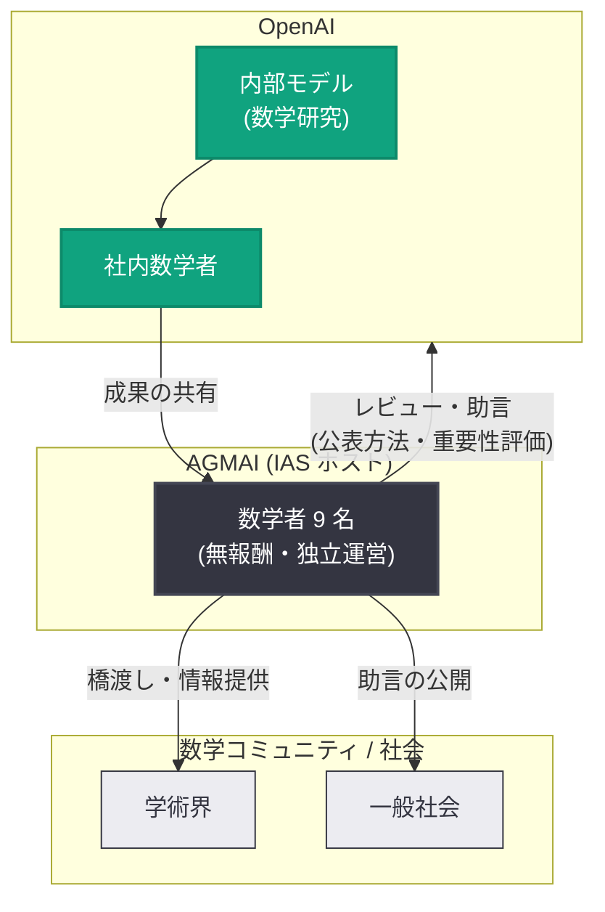

# 数学と AI に関する諮問グループ (AGMAI) の設立

## メタデータ

| 項目 | 内容 |
|------|------|
| 発表日 | 2026-09-21 |
| ソース | OpenAI News |
| カテゴリ | Company |
| 公式リンク | https://openai.com/index/advisory-group-on-mathematics-and-ai/ |

## 概要

OpenAI は 2026 年 9 月 21 日、数学コミュニティとの橋渡しを担う独立組織「Advisory Group on Mathematics and Artificial Intelligence (AGMAI)」の設立を発表した。このグループはプリンストン高等研究所 (IAS) をホスト機関とし、フィールズ賞受賞者を含む世界的な数学者 9 名で構成される。

設立の背景には、2026 年 8 月 28 日に訓練が開始された OpenAI の新しい内部モデルが、ナビエ–ストークス方程式のミレニアム懸賞問題を含む、数学のほぼ全分野にわたる 100 以上の長年の未解決問題を解決したとされる急速な進展がある。この進展の速さは OpenAI 社内の数学者をも驚かせ、成果を数学コミュニティへどのように伝えるべきかという議論を引き起こした。

## 主な内容

### 設立の背景

- **内部モデルの急速な進展**: 2026 年 8 月 28 日に訓練を開始した新しい内部モデルが、ナビエ–ストークス方程式のミレニアム懸賞問題を解決したほか、数学のほぼ全分野にわたり 100 以上の未解決問題を解決したとされる
- **社内議論の発生**: 進展の速さが OpenAI 社内の数学者たちの想定を超え、数学コミュニティへの情報提供のあり方について社内で議論が起きた
- **公開書簡の影響**: 数学者らによる公開書簡 "A Severe Misalignment of AI in Mathematics" が、未解決問題の解決を AI のベンチマークとして使うことによる負の外部性への懸念を表明したことも、設立の契機となった

### グループの目的と役割

AGMAI は数学コミュニティおよび一般社会との橋渡し役として、以下の活動を行う。

1. **成果のレビューと発表方法への助言**
   - 新たな数学的成果の重要性の評価支援
   - 成果公表の調整方法への助言
   - 数学研究の学術的・職業的基準に関する助言
2. **AI ツールの活用への助言**
   - AI ツールが数学の研究・学習をどう支援できるかについての助言

### 独立性の確保

AGMAI の独立性を担保するため、以下の条件が定められている。

| 条件 | 内容 |
|------|------|
| 運営の独立 | OpenAI から独立して運営される |
| 助言の自由 | 依頼されていない助言の提供、OpenAI の数学界への影響へのコメント、助言の公開が可能 |
| 無報酬 | メンバーは OpenAI から報酬を受け取らない |
| 自律的な構成 | メンバー構成はグループ自身が変更可能 |
| 対象外事項 | OpenAI 内部の数学研究の進行ペースについては助言の対象外 |

### 初期メンバー (9 名)

| 氏名 | 所属 |
|------|------|
| François Charles | ENS-PSL |
| Camillo De Lellis | IAS、GSSI |
| Timothy Gowers | コレージュ・ド・フランス、ケンブリッジ大学 |
| Martin Hairer | EPFL、インペリアル・カレッジ・ロンドン |
| Nikhil Srivastava | UC バークレー、Simons Institute |
| Ulrike Tillmann | オックスフォード大学、INI |
| Ravi Vakil | スタンフォード大学 |
| Edward Witten | IAS |
| Melanie Matchett Wood | ハーバード大学 |

Timothy Gowers 氏と Martin Hairer 氏はフィールズ賞受賞者であり、Edward Witten 氏は物理学者として初めてフィールズ賞を受賞した理論物理学者である。数学界を代表する著名な研究者が名を連ねている。

## 組織構造

## 数学コミュニティへの影響

この発表は API や製品の変更ではなく、AI と学術コミュニティの関係構築に関するガバナンス上の取り組みである。想定される影響は以下のとおり。

- **成果検証の枠組み**: AI が生成した数学的成果を、独立した専門家がレビュー・評価する初の本格的な枠組みとなる
- **公表プロセスの整備**: 未解決問題の解決という重大な成果を、数学界の学術的基準に沿って公表するための調整メカニズムが確立される
- **懸念への応答**: 公開書簡で示された「AI ベンチマークとしての未解決問題利用」への懸念に対し、数学者主導で答えを形作る場が提供される
- **研究・教育への波及**: AI ツールが数学の研究・学習をどう支援できるかについての助言を通じ、数学教育や研究手法への影響が期待される

## 関連リンク

- [Advisory group on mathematics and artificial intelligence (公式発表)](https://openai.com/index/advisory-group-on-mathematics-and-ai/)
- [OpenAI News](https://openai.com/news)
- [プリンストン高等研究所 (IAS)](https://www.ias.edu/)

## まとめ

OpenAI は、内部モデルによる数学の未解決問題の解決という急速な進展を受け、数学コミュニティとの橋渡しを担う独立諮問グループ AGMAI を設立した。IAS をホストとし、フィールズ賞受賞者を含む 9 名の著名な数学者で構成される同グループは、OpenAI から報酬を受けず独立して運営され、成果のレビューや公表方法、AI ツールの活用について助言を行う。OpenAI はこの協働を第一歩と位置づけ、AI が数学的理解をどう支援できるか、その恩恵をより広いコミュニティにどう届けるかという難題に対し、数学者が中心となって答えを形作ることを期待している。
