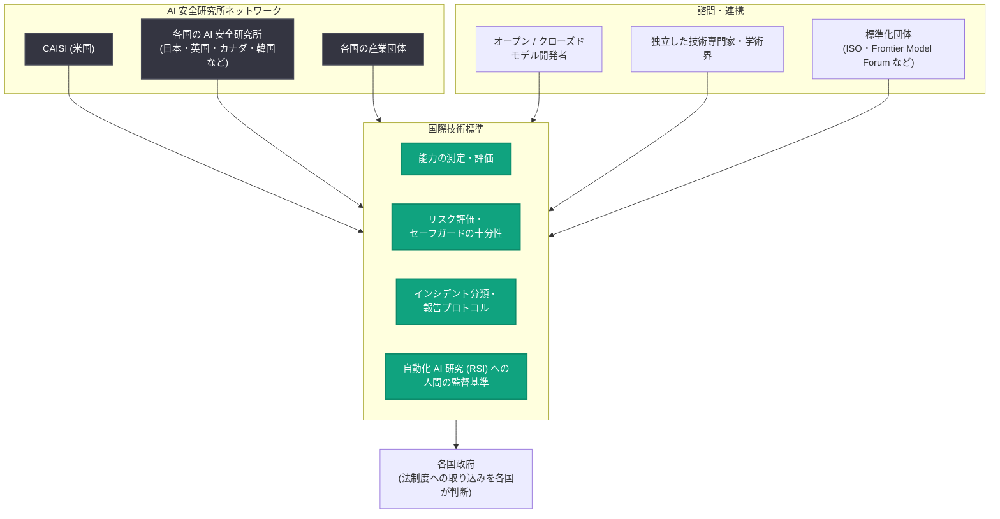

# AI の次のフェーズに向けた標準の構築 : フロンティア AI と RSI の国際標準を米国主導で

## メタデータ

| 項目 | 内容 |
|------|------|
| 発表日 | 2026-09-21 |
| ソース | OpenAI News |
| カテゴリ | Global Affairs (政策・ガバナンス) |
| 公式リンク | https://openai.com/index/building-standards-next-phase-ai |

## 概要

OpenAI は、フロンティア AI 開発における安全性・セキュリティ慣行の国際標準の構築を提言する記事「Building standards for the next phase of AI」を公開した。特に、AI が AI 研究開発そのものを担うようになる再帰的自己改善 (RSI: Recursive Self-Improvement) の進展を見据え、米国が世界各国と協力して、RSI を含むフロンティア AI のグローバル技術標準の策定を主導すべきだと主張している。

記事は、AGI (汎用人工知能) が全人類に利益をもたらすことを確実にするという OpenAI のミッションを踏まえ、AI の進歩を安全かつ有益なものにするには、アラインメント研究の進展に加えて、研究所や国をまたいで開発を導く「共有された標準」が必要になると位置づけている。

## 主な内容

### OpenAI のミッションと 3 つの目標

記事の前提として、Sam Altman と Jakub Pachocki が示した 3 つの優先目標が挙げられている。

1. **AI 進歩の次の時代を乗り切る**: 自動化された AI 研究者を構築し、それとともにアラインメント問題に反復的に取り組み、人間が自己改善ループの一部であり続ける方法を見つける
2. **科学的進歩と経済成長の恩恵を届ける**: 高度な知能を持つ機械が可能にする利益を社会に届ける
3. **一人ひとりにパーソナル AGI を**: すべての人を個人レベルでエンパワーする

AI はすでに OpenAI 自身の研究・エンジニアリングを加速しており、AI を活用した研究は数学の進展 (ナビエ・ストークス方程式のミレニアム問題を含む) につながったとしている。

### RSI (再帰的自己改善) の可能性とリスク

自動化された AI 研究には、さまざまな度合いの人間による監督があり得る。AI システムが次世代 AI の開発作業をより多く担うようになると、人間が関与し続けていても、再帰的自己改善 (RSI) のプロセスを駆動するようになり、自動化が進むほど AI 進歩のペースは急速に加速し得る。

OpenAI は RSI について、次の両面を指摘している。

- **便益**: 自動化された AI 研究は高度な知能のコストを下げ、世界中の人々に恩恵をもたらす。また「自動化された AI 研究者は、自動化された AI 安全研究者にもなり得る」として、アラインメントの大幅な改善や、重要インフラの保護、危険な AI エージェントへの防御にも寄与し得る
- **リスク**: 完全自律の RSI は現在は起きておらず、「安全に実行できると確認できない限り、またそれまでは追求すべきでない」と明言。進めるかどうかは、人間による制御の維持と、便益とリスクに関する情報に基づく民主的な選択に依存すべきとする。適切な注意なしに行えば、人間が AI 開発への実質的な制御を失い、理解できなくなった研究プロセスを監督できなくなる恐れがある

なお、OpenAI が開示した「Hugging Face インシデント」は RSI の直接の結果ではないものの、堅牢なセーフガードとアラインメントなしにははるかに深刻になり得るリスクの予兆だとしている。

### 国際標準が必要な理由

フロンティア AI 開発の安全性・セキュリティ慣行に関する国際標準は、「フロンティアのペース調整において、アラインメント研究そのものと同じくらい重要になり得る」とする。標準は、質の高い証拠の共有された定義と、技術的セーフガードの厳格さに関する合意されたベースラインを作り、「壊滅的 AI リスクの緩和において、何が良い状態なのか」という問いに答える助けになる。

米国の CAISI (Center for AI Standards and Innovation)、州法、連邦フレームワーク、官民パートナーシップも役立つが、AI の開発・展開は複数の国で進み、採用はグローバルに広がっているため、国際的な標準化の取り組みが次の課題の解決に必要だとする。

- **断片化 (Fragmentation)**: 各国の評価・報告要件・インシデント定義が衝突すると、証拠の比較、新たな能力の理解、国境を越えるリスクへの対応が困難になる
- **集合行為問題 (Collective action)**: 各国が独立に行動すると、どの国も望まない結果を生み得る。RSI は AI 研究自体を加速させ、進歩の理解・リスク評価・意味のある人間の監督という集合的能力を超える可能性がある
- **能力の偏在 (Uneven capacity)**: フロンティア開発の活動と専門知識は世界に均等に分布しておらず、上記 2 つの問題を悪化させる

これらの課題はオープンモデルとクローズドモデルの両方に当てはまるとしている。また、標準を求める根拠は「権力集中の回避」と「より良い実践的成果」にあり、標準は研究所の外のステークホルダーがこの技術のあり方に発言権を持つ手段になると説明している。

### 提言 1: 国内標準と国際標準を補完的に結ぶメカニズム

実現方法の一例として、オーストラリア、カナダ、ドイツ、フランス、ケニア、日本、韓国、シンガポール、インド、英国などにすでに設立されている AI 安全研究所 (AI safety institutes) のネットワークを活用し、CAISI と各国の産業団体を通じて標準策定を進めることを挙げている。焦点は次の 2 点。

1. 能力ベンチマークで測定されるフロンティア AI モデルと開発者
2. RSI を含む自動化 AI 研究の便益・リスク管理

米国は、CAISI が 2024 年に創設した「International Network for Advanced AI Measurement, Evaluation, and Science」を土台にできるとする。

策定される標準は、能力の測定・評価、リスク評価、セーフガードの十分性に関する共通の技術的基盤を提供するものであり、**ライセンス制、義務的な事前審査、モデルの承認要件ではない**。各国政府が自国の法制度に標準を取り込むかどうか、どう取り込むかを決定する。

また、オープンモデル・クローズドモデルの開発者、独立した技術専門家、学術界への諮問を通じて競争的な AI エコシステムを支えるべきで、特定の企業・国・ビジネスモデルを有利にしたり、新規参入者やオープンウェイト開発者の競争を難しくしたりしないよう、透明に設計されるべきとしている。航空や金融安定性の分野のように、各国が国家の権限を手放すことなく共通技術標準と信頼できる協力チャネルを構築した事例から学べるとし、ISO、Frontier Model Forum、Agentic AI Foundation、Open Secure AI Alliance などの標準化団体や、国際標準を実世界の AI 評価につなげる実装志向の組織 (Appia Foundation など) との連携も挙げている。

### 提言 2: 共通の測定基準とインシデント報告プロトコル

AI 研究の自律性の高まりと RSI の管理において、国際標準が特に重要になる領域として次を挙げている。

- **RSI 関連の AI 進歩の評価**: AI 企業内で起きている自律的研究の量の評価 (OpenAI の研究加速に関するレポートが初期の貢献)
- **自動化 AI 研究に対する人間の監督**: どのような自動化 AI 研究プロセスが即時の人間によるレビューをトリガーすべきか
- **インシデントの分類・追跡・報告・対応**: アラインメントや自動化 AI 研究の問題に関する共通のインシデント深刻度レベルや報告閾値 (OpenAI のミスアラインメント報告フレームワークが初期の貢献)

これらに加えて、重要インフラ事業者と各国政府が、国家安全保障上の懸念、新たな脆弱性・脅威、フロンティア AI 安全のベストプラクティスを共有するセキュアな通信チャネルを確立することが重要だとし、米中間の対話は前向きな一歩であり、予定されている協議は好機だと述べている。

### 米国が主導すべき理由

AI 開発のペース調整とは、あらかじめ決められた速度の維持ではなく、技術的には「アラインメント研究とその展開が能力に先行し続けること」、社会的には「標準・制度・協力を用いて、産業・社会関係・市場の力のネットワークを増幅し、ポジティブサムの成果を生むこと」だと定義している。

米国は AI 産業が技術的フロンティアにあり、金融・貿易・防衛・技術・情報システムといった重要領域でグローバルネットワーク上の優位な位置にあるため、主導するのに適している。今主導するかどうかが、米国がグローバル AI フレームワークを形作るのか、それとも断片化し不均衡で対立に満ちたシステムが周囲に形成されるのを見ているだけになるのかを決めるとする。地政学的競争は技術的な先行だけでなく、AI の採用と普及をめぐるものにもなり、後者は「現実的な協力と、企業や社会が将来を賭けられる分別あるルール」を推進する者によって決まり得ると論じている。

## 概念図

記事が提案する国際標準策定メカニズムの全体像を以下に示す。

## 影響と意義

- **AI 業界全体への影響**: 自動化 AI 研究や高度な能力を追求するすべての AI ラボは、自己責任の基本原則と既存法に従い、安全に実施する説明責任を負うべきという立場が明確化された
- **オープンモデル開発者への配慮**: 提案される標準は、新規参入者やオープンウェイト開発者の競争を妨げないよう透明に設計されるべきとされており、規制による寡占化への懸念に応える内容になっている
- **規制ではなく標準**: ライセンス制や事前承認ではなく、各国政府が採用を判断する技術標準という枠組みであり、国家の権限を保ちながら国際協調を進めるアプローチが示された
- **RSI ガバナンスの具体化**: 「完全自律の RSI は安全に実行できるまで追求すべきでない」という原則と、人間によるレビューをトリガーすべき条件の標準化など、RSI の監督に関する議論が具体化した

## 関連リンク

- [公式記事: Building standards for the next phase of AI](https://openai.com/index/building-standards-next-phase-ai)
- [OpenAI News](https://openai.com/news)
- [OpenAI Charter](https://openai.com/charter)

## まとめ

OpenAI は、AI が AI 研究を担う再帰的自己改善 (RSI) の時代を見据え、フロンティア AI の安全性・セキュリティ慣行に関するグローバル技術標準の構築を米国主導で進めるべきだと提言した。提言の柱は、(1) 各国の AI 安全研究所ネットワークと CAISI を活用した国内・国際標準の補完的な策定メカニズム、(2) RSI 関連の進歩評価・人間の監督・インシデント報告に関する共通の測定基準とプロトコルの 2 点。標準はライセンス制や事前承認ではなく、各国政府が採用を判断する技術的基盤と位置づけられ、断片化・集合行為問題・能力の偏在という国際課題への対応と、権力集中の回避を目的としている。
